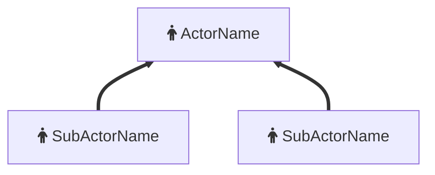
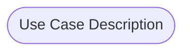
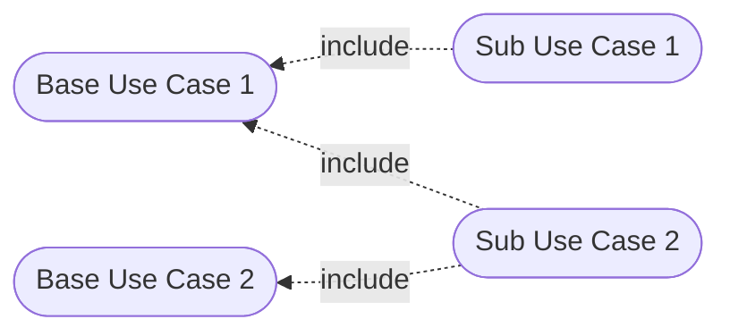
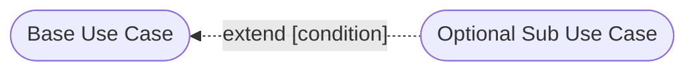
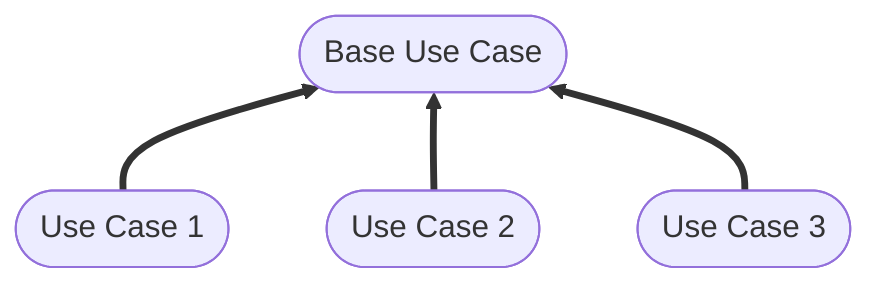

# **UML Use Case Diagram**
 

## **Table Of Contents**
 

- [**UML Use Case Diagram**](#uml-use-case-diagram)
  - [**Table Of Contents**](#table-of-contents)
  - [**Actors**](#actors)
  - [**Use Cases**](#use-cases)
    - [**Connections Between Use Cases**](#connections-between-use-cases)
      - [**Include Connections**](#include-connections)
      - [**Extend Connections**](#extend-connections)
      - [**Generalisation Connections**](#generalisation-connections)

 
 
 

## **Actors**
 

* abstraction of a group of users (human or technical)
* actors can have generalization relationships with each other

 

 
 
 

## **Use Cases**
 

A use case describes an external function of an application that returns a result for at least one actor.

 

 
 

### **Connections Between Use Cases**
 
 

#### **Include Connections**
 

* connects sub use case to one or multiple base use cases

 

 
 

#### **Extend Connections**
 

* extends base use case with optional sub use case
* specifies condition for the sub suse case

 

 
 

#### **Generalisation Connections**
 

