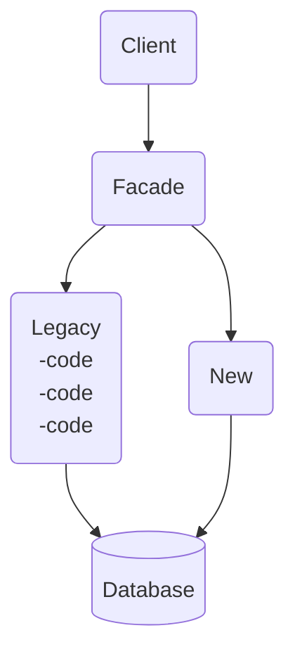
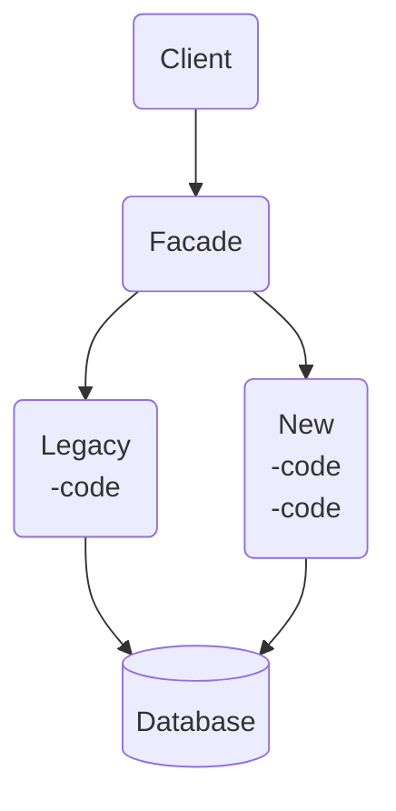
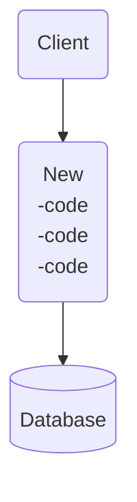

# **Strangler Fig Pattern**
 

## **Table Of Contents**

- [**Strangler Fig Pattern**](#strangler-fig-pattern)
  - [**Table Of Contents**](#table-of-contents)
  - [**Migration Process**](#migration-process)
    - [**Early Phase**](#early-phase)
    - [**Late Phase**](#late-phase)
    - [**Completed**](#completed)

 
 
 
 

## **Migration Process**
 
 

### **Early Phase**

 
 

### **Late Phase**

 
 

### **Completed**

