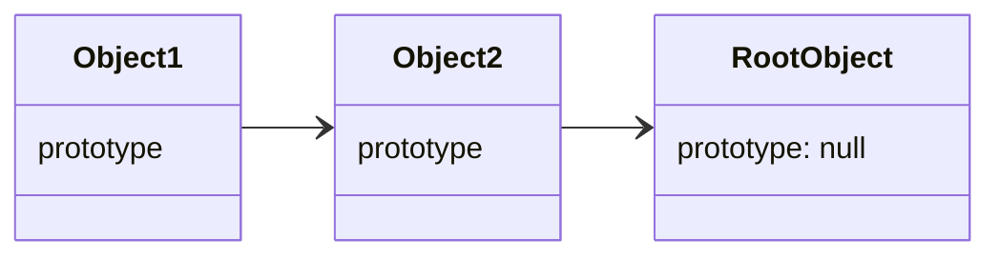

# **JavaScript Object**
<br>

## **Table Of Contents**
<br>

- [**JavaScript Object**](#javascript-object)
  - [**Table Of Contents**](#table-of-contents)
  - [**Basics**](#basics)
    - [**Objects Are One Of JavaScript´s Data Types**](#objects-are-one-of-javascripts-data-types)
    - [**Objects Are A Collection Of Properties**](#objects-are-a-collection-of-properties)
    - [**Object Properties Can Be Of Any Type Including Other Objects**](#object-properties-can-be-of-any-type-including-other-objects)
    - [**Objects Can Inherit Properties Of Other Objects Via The Prototype Chain**](#objects-can-inherit-properties-of-other-objects-via-the-prototype-chain)
    - [**Properties Can Usually Be Dynamically Added Or Deleted**](#properties-can-usually-be-dynamically-added-or-deleted)
  - [**Create Objects**](#create-objects)
    - [**Object Literal**](#object-literal)
    - [**Create From Array (_Object.fromEntries()_)**](#create-from-array-objectfromentries)
    - [**Create From Prototype Object (_Object.create()_)**](#create-from-prototype-object-objectcreate)
    - [**Create From Constructor Function**](#create-from-constructor-function)
      - [**Get Constructor Function That Created A Object**](#get-constructor-function-that-created-a-object)
    - [**Create From Class**](#create-from-class)
  - [**Prototype Chain**](#prototype-chain)
    - [**Create New Object From Prototype (_Object.create()_)**](#create-new-object-from-prototype-objectcreate)
    - [**Read Prototype (_Object.getPrototypeOf()_)**](#read-prototype-objectgetprototypeof)
    - [**Set Prototype (_Object.setPrototypeOf()_)**](#set-prototype-objectsetprototypeof)
    - [**Check If Object is Prototype Of Another Object (_object.isPrototypeOf()_)**](#check-if-object-is-prototype-of-another-object-objectisprototypeof)
  - [**Copy Own Enumerable Properties From Other Object**](#copy-own-enumerable-properties-from-other-object)
    - [**Object.assign()**](#objectassign)
    - [**Spread Operator (...)**](#spread-operator-)
  - [**Clone Object**](#clone-object)
    - [**Shallow Clone Own Enumerable Properties**](#shallow-clone-own-enumerable-properties)
      - [**Object.assign()**](#objectassign-1)
      - [**Spread Operator (...)**](#spread-operator--1)
    - [**Deep Clone (_structuredClone()_)**](#deep-clone-structuredclone)
  - [**Restrict Object Modification**](#restrict-object-modification)
    - [**Create Restriction**](#create-restriction)
      - [**Object.preventExtensions()**](#objectpreventextensions)
      - [**Object.seal()**](#objectseal)
      - [**Object.freeze()**](#objectfreeze)
    - [**Check Restriction Status**](#check-restriction-status)
      - [**Object.isExtensible()**](#objectisextensible)
      - [**Object.isSealed()**](#objectissealed)
      - [**Object.isFrozen()**](#objectisfrozen)
  - [**Check Object Equality (_Object.is()_)**](#check-object-equality-objectis)
  - [**Object.groupBy()**](#objectgroupby)
  - [**Properties**](#properties)
    - [**Property Descriptor Attributes**](#property-descriptor-attributes)
      - [**Data Descriptor Attributes**](#data-descriptor-attributes)
        - [**Value**](#value)
        - [**Writable**](#writable)
        - [**Configurable**](#configurable)
        - [**Enumerable**](#enumerable)
      - [**Accessor Descriptor Attributes**](#accessor-descriptor-attributes)
        - [**Get**](#get)
        - [**Set**](#set)
        - [**Configurable**](#configurable-1)
        - [**Enumerable**](#enumerable-1)
    - [**Add Or Modify Property**](#add-or-modify-property)
      - [**By Key**](#by-key)
      - [**By String**](#by-string)
      - [**By Symbol**](#by-symbol)
      - [**Single Property With Attributes (_Object.defineProperty()_)**](#single-property-with-attributes-objectdefineproperty)
      - [**Multiple Properties With Attributes (_Object.defineProperties()_)**](#multiple-properties-with-attributes-objectdefineproperties)
    - [**Read Property Value**](#read-property-value)
      - [**By Key**](#by-key-1)
      - [**By String**](#by-string-1)
      - [**Destructuring**](#destructuring)
    - [**Delete Property (_delete_)**](#delete-property-delete)
    - [**Check If Property Exists**](#check-if-property-exists)
      - [**On Object Or In Prototype Chain (_in_)**](#on-object-or-in-prototype-chain-in)
      - [**Only On Object (_Object.hasOwn()_)**](#only-on-object-objecthasown)
    - [**Check Property Attributes**](#check-property-attributes)
      - [**Single Property (_Object.getOwnPropertyDescriptor()_)**](#single-property-objectgetownpropertydescriptor)
      - [**All Properties (_Object.getOwnPropertyDescriptors()_)**](#all-properties-objectgetownpropertydescriptors)
  - [**Iteration**](#iteration)
    - [**For-In Loop**](#for-in-loop)
    - [**For-Of Loop**](#for-of-loop)
      - [**Iterate Over Own Enumerable Property Keys (_Object.keys()_)**](#iterate-over-own-enumerable-property-keys-objectkeys)
      - [**Iterate Over Own Enumerable Property Value (_Object.values()_)**](#iterate-over-own-enumerable-property-value-objectvalues)
      - [**Iterate Over Own Enumerable Key-Value Pairs (_Object.entries()_)**](#iterate-over-own-enumerable-key-value-pairs-objectentries)
      - [**Iterate Over All Own String Keys (_Object.getOwnPropertyNames()_)**](#iterate-over-all-own-string-keys-objectgetownpropertynames)
      - [**Iterate Over All Own Symbol Keys (_Object.getOwnPropertySymbols()_)**](#iterate-over-all-own-symbol-keys-objectgetownpropertysymbols)

<br>
<br>
<br>
<br>

## **Basics**
<br>
<br>
<br>

### **Objects Are One Of JavaScript´s Data Types**

```javascript
typeof {};     // object
```

<br>
<br>
<br>

### **Objects Are A Collection Of Properties**

```javascript
const person = {
   firstName: 'John',
   lastName: 'Doe'
};
```

<br>
<br>
<br>

### **Object Properties Can Be Of Any Type Including Other Objects**

```javascript
const obj = {
   value1: 'Some String',
   value2: 42,
   value3: false,
   value4: null,
   value5: undefined,
   value6: () => { console.log('some function'); },
   value7: { firstName: 'John', lastName: 'Doe' }
}
```

<br>
<br>
<br>

### **Objects Can Inherit Properties Of Other Objects Via The Prototype Chain**

Assume we define the following object: 

```javascript
const person = {
   firstName: 'John',
   lastName: 'Doe'
};
```

<br>

Although our object does not specify it, we can access a property `toString`:

```javascript
person.toString();         // '[object Object]'
```

<br>

We can access this property, because `person` has a reference to its prototype object `Object` which defines the property:

```javascript
const prototype = Object.getPrototypeOf(person);

/*
prototype = {
   ...
   ƒ toString()
   ...
}
*/
```

<br>
<br>
<br>

### **Properties Can Usually Be Dynamically Added Or Deleted**

```javascript
const obj = { foo: 'fooValue' };

obj.bar = 'barValue';
// obj: { foo: 'fooValue', bar: 'barValue' }

delete obj.foo;
// obj: { bar: 'barValue' }
```

<br>
<br>
<br>
<br>

## **Create Objects**
<br>
<br>

### **Object Literal**

```javascript
const obj = { 
   key1: 'value1',
   key2: 'value2'
}
```

<br>

Object literal with `getter` and `setter` methods:

```javascript
const obj = {
    _bar: 'foo',
    set bar(value) { this._bar = `Setter: ${value}` },
    get bar() { return `Getter: ${this._bar}` }
}
```

<br>
<br>
<br>

### **Create From Array (_Object.fromEntries()_)**

Creates an object based on a two-dimensional iterable (Array or Map) of key-value pairs.

```
Object.fromEntries(?iterable)
```

```javascript
const array = [['key1', 'value1'], ['key2', 'value2']];

const obj = Object.fromEntries(array);
```

<br>
<br>
<br>

### **Create From Prototype Object (_Object.create()_)**

Creates an object based on a `prototypeObject`.  
Additional properties can be added via the optional `additionalProps` argument.

```javascript
Object.create(prototypeObject, ?additionalProps)
```

```javascript
additonalProps = {
   value,
   ?writeable = false,
   ?enumerable = false,
   ?configurable = false,
   ?set,
   ?get
}
```

<br>

```javascript
const person = {
   firstName: 'John',
   lastName: 'Doe'
};

const programmer = Object.create(
   person, 
   { languages: { value: ['JavaScript', 'C#'] } }
);

programmer.firstName;      // 'John'
programmer.lastName;       // 'Doe'
programmer.languages;      // ['JavaScript', 'C#']
```

<br>
<br>
<br>

### **Create From Constructor Function**

```javascript
function Obj(value1, ...) {
   this.key1 = value1;
   ...
}
```

<br>

Simple constructor function:

```javascript
function Person(firstName, lastName) {
   this.firstName = firstName;
   this.lastName = lastName;
}

const johnDoe = new Person('John', 'Doe');
```

<br>

Constructor function with `getter` and `setter` methods:

```javascript
function Person(name) {
   this._name = name;

   Object.defineProperty(this, 'name', {
      set: (name) => { this._name = `Setter: ${name}` },
      get: () => { return `Getter: ${this._name}` }
   });
}

const johnDoe = new Person('John Doe');

johnDoe.name;                 // 'Getter: John Doe'
johnDoe.name = 'Jane Doe';
johnDoe.name;                 // 'Getter: Setter: JohnDoe'
```

<br>
<br>

#### **Get Constructor Function That Created A Object**

Returns constructor function that created the specified object.

```javascript
object.constructor();
```

<br>

```javascript
function Person(firstName, lastName) {
   this.firstName = firstName;
   this.lastName = lastName;
}

const johnDoe = new Person('John', 'Doe');

const constructor = johnDoe.constructor;
constructor === Person;                   // true
```

<br>
<br>
<br>

### **Create From Class**

A class is a syntactic alternative to constructor function.

```javascript
class ClassName {

    constructor(arg1, arg2) {
        this.attribute1 = arg1;
        this.attribute2 = arg2;
    }

    methodName() {...}
}
```

<br>

```javascript
class ClassName {
   constructor(param) {
      this._bar = param;
   }

   set bar(param) { /* implementation */ }
   get bar() { return this._bar; }
}
```

<br>

Simple Class:

```javascript
class Person {
   firstName;
   lastName;

   constructor(firstName, lastName) {
      this.firstName = firstName;
      this.lastName = lastName;
   }
}

const johnDoe = new Person('John', 'Doe');
```

<br>

Class with `getter` and `setter` methods:


```javascript
class Person {
   #name;

   constructor(name) {
      this.#name = name;
   }

   set name(name) {
      this.#name = `Setter: ${name}`;
   }

   get name() {
      return `Getter: ${this.#name}`;
   }
}

const johnDoe = new Person('John Doe');

johnDoe.name;                 // 'Getter: John Doe'
johnDoe.name = 'Jane Doe';
johnDoe.name;                 // 'Getter: Setter: JohnDoe'
```

<br>
<br>
<br>
<br>

## **Prototype Chain**

Every object (except the root object) is based on a prototype object that it inherits properties from.  
Every object holds a reference `prototype` to its prototype object.  



When a property is called on an object and it does not exist on that object, the prototype chain is searched from bottom to top for the called property.

<br>
<br>
<br>

### **Create New Object From Prototype (_Object.create()_)**

Creates an object based on a `prototype`.  
Additional properties can be added via the optional `additionalProps` argument.

```javascript
Object.create(prototype, ?additionalProps)
```

```javascript
additonalProps = {
   value,
   ?writeable = false,
   ?enumerable = false,
   ?configurable = false,
   ?set,
   ?get
}
```

<br>

```javascript
const person = {
   firstName: 'John',
   lastName: 'Doe'
};

const programmer = Object.create(
   person, 
   { languages: { value: ['JavaScript', 'C#'] } }
);

programmer.firstName;      // 'John'
programmer.lastName;       // 'Doe'
programmer.languages;      // ['JavaScript', 'C#']
```

<br>
<br>
<br>

### **Read Prototype (_Object.getPrototypeOf()_)**

Returns prototype of a specified object

```javascript
Object.getPrototypeOf(object)
```

<br>

```javascript
const prototype = { foo: 'fooValue' };

const obj = Object.create(prototype);

Object.getPrototypeOf(obj);
// { foo: 'fooValue' }
```

<br>
<br>
<br>

### **Set Prototype (_Object.setPrototypeOf()_)**

Sets prototype of a specified object to specified prototype object.

```javascript
Object.setPrototypeOf(object, prototype)
```

<br>

```javascript
const obj = {};

const prototype = { foo: 'fooValue' };

Object.setPrototypeOf(obj, prototype);

Object.getPrototypeOf(obj);
// { foo: 'fooValue' }
```

<br>
<br>
<br>

### **Check If Object is Prototype Of Another Object (_object.isPrototypeOf()_)**

Returns boolean indicating whether object is the prototype of the specified object.

```javascript
object.isPrototypeOf(object)
```

<br>

```javascript
const prototype = { foo: 'fooValue' };
const notPrototype = { bar: 'barValue' };

const obj = Object.create(prototype);

prototype.isPrototypeOf(obj);       // true
notPrototype.isPrototypeOf(obj);    // false
```

<br>
<br>
<br>
<br>

## **Copy Own Enumerable Properties From Other Object**
<br>
<br>

### **Object.assign()**

Copy all own enumerable properties including Symbols of one or multiple source objects to a target object. Existing target properties with the same key as a source property are overridden.

```javascript
Object.assign(targetObj, sourceObj1, ..., sourceObjN)
```

<br>

```javascript
const target = { foo: 'fooValue' };

const source1 = { bar: 'barValue' };
const source2 = { caz: 'cazValue' };

Object.assign(target, source1, source2);

// target = { foo: 'fooValue', bar: 'barValue', caz: 'cazValue' }
```

<br>

Target properties will be overridden when a source object has a property with the identical key:

```javascript
const target = { foo: 'fooValue', bar: 'barValue' };
const source = { bar: 'modifiedValue' };

Object.assign(target, source);

// target = { foo: 'fooValue', bar: 'modifiedValue' }
```

<br>

Copies only own enumerable properties:

```javascript
const prototype = { foo: 'fooValue' };

const source = Object.create(prototype, {
   bar: { value: 'barValue', enumerable: true },
   caz: { value: 'cazValue', enumerable: false }
});

const result = Object.assign({}, source);

// result = { bar: 'barValue' }
```

<br>

Copies properties with [Symbol](../../PrimitiveDataTypes/javascript_symbol.md) keys:

```javascript
const source = {};

source[Symbol('foo')] = 'fooValue';

const target = Object.assign({}, source);

// target = { Symbol(foo): 'fooValue' }
```

<br>
<br>
<br>

### **Spread Operator (...)**

Copy all own enumerable properties including Symbols of a source object to a target object. Existing target properties with the same key as a source property are overridden.

```javascript
...object
```

<br>

```javascript
const source = { bar: 'barValue' };

const obj = { foo: 'fooValue', ...source };

// obj = { foo: 'fooValue', bar: 'barValue' }
```

<br>

Target properties will be overridden when a source object has a property with the identical key:

```javascript
const source = { foo: 'notFooValue', bar: 'barValue' };

const obj = { foo: 'fooValue', ...source };

// obj = { foo: 'notFooValue', bar: 'barValue' }
```

<br>

Copies only own enumerable properties:

```javascript
const prototype = { foo: 'fooValue' };

const source = Object.create(prototype, {
   bar: { value: 'barValue', enumerable: true },
   caz: { value: 'cazValue', enumerable: false }
});

const obj = {...source};

// obj = { bar: 'barValue' }
```

<br>

Copies properties with [Symbol](../../PrimitiveDataTypes/javascript_symbol.md) keys:

```javascript
const source = {};
source[Symbol('foo')] = 'fooValue';

const obj = {...source};

// obj = { Symbol(foo): 'fooValue' }
```

<br>
<br>
<br>
<br>

## **Clone Object**
<br>
<br>
<br>

### **Shallow Clone Own Enumerable Properties**
<br>
<br>

#### **[Object.assign()](#objectassign)**

```javascript
const obj = { foo: 'fooValue', bar: 'barValue' };

const clone = Object.assign({}, obj);
```

<br>
<br>

#### **Spread Operator (...)**

```javascript
const obj = { foo: 'fooValue', bar: 'barValue' };

const clone = { ...obj };
```

<br>
<br>
<br>

### **Deep Clone (_structuredClone()_)**

Returns a deep clone of an object.  
Can transfer object properties of transferable objects.

```javascript
structuredClone(obj, ?{ transfer: [object1, object2, ...]})
```

<br>

Simple clone:

```javascript
const obj = {
   foo: 'fooValue',
   bar: { caz: 'cazValue'}
};

const clone = structuredClone(obj);

clone.bar.caz = 'modifiedCazValue';

// obj.bar.caz:   cazValue
// clone.bar.caz: modifiedCazValue
```

<br>
<br>
<br>
<br>

## **Restrict Object Modification**
<br>
<br>

### **Create Restriction**
<br>

|                                |[preventExtensions()](#objectpreventextensions) |[seal()](#objectseal) |[freeze()](#objectfreeze) |
|:-------------------------------|:-----------------:|:-----------------:|:------------:|
|**Reassign Object´s Prototype** |:x:                |:x:                |:x:           |
|**Add Property**                |:x:                |:x:                |:x:           |
|**Delete Property**             |:heavy_check_mark: |:x:                |:x:           |
|**Update Property Value**       |:heavy_check_mark: |:heavy_check_mark: |:x:           |
|**Update Property Attributes**  |:heavy_check_mark: |:x:                |:x:           |

<br>
<br>

#### **Object.preventExtensions()**

Prevents the future **addition** of properties to an object and the the reassignment of the object´s prototype. Returns the object.

In `strict mode` the attempt to add a property will throw a `TypeError`. Otherwise the attempt will simply be ignored.

```javascript
Object.preventExtensions(object)
```

<br>

```javascript
const obj = {};

obj.foo = 'fooValue';

Object.preventExtensions(obj);

obj.bar = 'barValue';

// TypeError: Can't add property bar, object is not extensible
// obj = { foo: 'fooValue' }
```

<br>
<br>

#### **Object.seal()**

Prevents the future **addition** and **deletion** of object properties.  
Prevents future changes of the property attributes [enumerable](#enumerable), [writeable](#writable) and [configurable](#configurable).  
Prevents the future reassignment of the object´s prototype.  
Returns the object.

```javascript
Object.seal(obj)
```

<br>

```javascript
const obj = {};

obj.foo = 'fooValue';

Object.seal(obj);

obj.bar = 'barValue';
// ignored or TypeError

delete obj.foo;
// ignored

Object.defineProperty(obj, 'foo', {
   value: 'modifiedFooValue',
   writeable: false
});
// changing value is allowed, modification of property attribute writeable is ignored
```

<br>
<br>

#### **Object.freeze()**

Prevents the future **addition** and **deletion** of object properties.  
Prevents future changes to the value of object properties.  
Prevents future changes of the property attributes [enumerable](#enumerable), [writeable](#writable) and [configurable](#configurable).  
Prevents the future reassignment of the object´s prototype.  
Returns the object.

```javascript
Object.freeze(object)
```

<br>

```javascript
const obj = {};

obj.foo = 'fooValue';

Object.freeze(obj);

obj.bar = 'barValue';
// ignored or TypeError

delete obj.foo;
// ignored

Object.defineProperty(obj, 'foo', {
   value: 'modifiedFooValue',
   writeable: true,
   enumerable: true,
   configurable: true
});
// TypeError: Cannot redefine property: foo
```

<br>
<br>
<br>

### **Check Restriction Status**
<br>
<br>

#### **Object.isExtensible()**

Returns a boolean indicating whether the object can be [extended](#objectpreventextensions).

```javascript
Object.isExtensible(object)
```

<br>

```javascript
const obj = { foo: 'fooValue' };

Object.isExtensible(obj);        // true

Object.preventExtensions(obj);

Object.isExtensible(obj);        // false
```

<br>
<br>

#### **Object.isSealed()**

Returns a boolean indicating whether the object is [sealed](#objectseal).

```javascript
Object.isSealed(object)
```

<br>

```javascript
const obj = { foo: 'fooValue' };

Object.isSealed(obj);        // false

Object.seal(obj);

Object.isSealed(obj);        // true
```

<br>
<br>

#### **Object.isFrozen()**

Returns a boolean indicating whether the object is [frozen](#objectfreeze).

```javascript
Object.isFrozen(object)
```

<br>

```javascript
const obj = { foo: 'fooValue' };

Object.isFrozen(obj);        // false

Object.freeze(obj);

Object.isFrozen(obj);        // true
```

<br>
<br>
<br>
<br>

## **Check Object Equality (_Object.is()_)**

Returns a boolean indicating whether the two specified objects are strictly equal.

```javascript
Object.is(object1, object2)
```

<br>

```javascript
const obj1 = { foo: 'fooValue' };
const obj2 = { foo: 'fooValue' };

Object.is(obj1, obj1);     // true

Object.is(obj1, obj2);     // false
```

<br>
<br>
<br>
<br>

## **Object.groupBy()**

Partitions array with specified group function that returns the group value as a string. Returns object that contains all partitions with groups name as properties.

```javascript
Object.groupBy(array, (element, ?index) => groupString)
```

<br>

**Group By Element Value**

```javascript
const array = ['foo', 'bar', 'foo', 'bar', 'baz'];

const groupedObject = Object.groupBy(array, (element) => element);

// groupedObject = {
//   bar: ['bar', 'bar'],
//   baz: ['baz'],
//   foo: ['foo', 'foo']
// }
```

<br>

**Group By Element Property**

```javascript
const array = [
  { firstName: 'John', lastName: 'Doe' },
  { firstName: 'Jane', lastName: 'Smith' },
  { firstName: 'Alice', lastName: 'Doe' },
  { firstName: 'Bob', lastName: 'Smith' }
];

const groupedObject = Object.groupBy(array, ({ lastName }) => lastName);

// groupedObject = {
//   Doe: [
//     { firstName: 'John', lastName: 'Doe' },
//     { firstName: 'Alice', lastName: 'Doe' }
//   ]
//   Smith: [
//     { firstName: 'Jane', lastName: 'Smith' },
//     { firstName: 'Bob', lastName: 'Smith' }
//   ]
// } 
```

<br>
<br>
<br>
<br>

## **Properties**
<br>
<br>

### **Property Descriptor Attributes**

A property of an object is described with different attributes. There are two types of property descriptions:

<br>
<br>

#### **Data Descriptor Attributes**
<br>
<br>

##### **Value**

Value of the property.

<br>
<br>

##### **Writable**

Specifies whether property can be assigned a new `value`.  

Default: **false**

<br>
<br>

##### **Configurable**

Specifies whether property can be deleted.  
Specifies whether property attributes (except `value`) can be changed.  

Default: **false**

<br>
<br>

##### **Enumerable**

Specifies whether property will show up during enumeration (for-in loop, object.keys()) of the object properties.  

Default: **false**

<br>
<br>

#### **Accessor Descriptor Attributes**
<br>
<br>

##### **Get**

Getter function for the property attribute `value`.  
Get current value via `this.value`. 

Default: `undefined`

<br>
<br>

##### **Set**

Setter function for the property attribute `value`.  
Gets passed an input argument and can update `this.value`.  

Default: `undefined`

<br>
<br>

##### **Configurable**

Specifies whether property can be deleted.  
Specifies whether property attributes (except `value`) can be changed.  

Default: **false**

<br>
<br>

##### **Enumerable**

Specifies whether property will show up during enumeration (for-in loop, object.keys()) of the object properties.  

Default: **false**

<br>
<br>
<br>

### **Add Or Modify Property**
<br>
<br>

#### **By Key**

Adds a new property with specified name and value to the object if it does not already exist.  
Otherwise updates the value of the existing property. 

```javascript
obj.propertyName = 'value';
```

A new property added in this way has the following attributes:

```javascript
{
   value: 'value',
   writeable: true,
   configurable: true,
   enumerable: true,
}
```

<br>
<br>

#### **By String**

Adds a new property with specified string and value to the object if it does not already exist.  
Otherwise updates the value of the existing property.

```javascript
object['propertyName'] = 'value';
```

A new property added in this way has the following attributes:

```javascript
{
   value: 'value',
   writeable: true,
   configurable: true,
   enumerable: true,
}
```

<br>
<br>

#### **By Symbol**

Adds a new property with specified [symbol](../../PrimitiveDataTypes/javascript_symbol.md) and value  to the object if it does not already exist.  
The added property is not enumerable.

```javascript
object[Symbol('propertyName')] = 'value';
```

<br>
<br>

#### **Single Property With Attributes (_Object.defineProperty()_)**

Adds a new property with specified name, value and attributes to the object if it does not already exist.  
Otherwise updates the existing property.

```javascript
Object.defineProperty(object, propertyName, descriptor)
```

```javascript
accessorDescriptor = {
   get,
   set,
   ?configurable,
   ?enumerable
};

dataDescriptor = {
   value,
   ?writeable,
   ?configurable,
   ?enumerable
}
```

<br>

**Add Accessor Property**

```javascript
const obj = {};

Object.defineProperty(obj, 'foo', {
   get: () => `Getter: "${this.value}"`,
   set: (value) => this.value = `Setter: ${value}`
});

obj.foo;             // 'Getter: "undefined"'
obj.foo = 'value';
obj.foo;             // 'Getter: "Setter: value"'
```

<br>

**Add Non-Writable Data Property**

```javascript
const obj = {};

Object.defineProperty(obj, 'foo', {
   value: 'foo'
});

obj.foo;                 // 'foo'
obj.foo = 'newValue';    // ignored, because writable = false
obj.foo;                 // 'foo'
```

<br>

**Add Writable Data Property**

```javascript
const obj = {};

Object.defineProperty(obj, 'foo', {
   value: 'foo',
   writable: true
});

obj.foo;                 // 'foo'
obj.foo = 'newValue';    
obj.foo;                 // 'newValue'
```

<br>
<br>

#### **Multiple Properties With Attributes (_Object.defineProperties()_)**

Alternative to [Object.defineProperty()](#single-property-with-attributes-objectdefineproperty) to add multiple properties at once.

```javascript
Object.defineProperties(object, {
   propertyName1: descriptor,
   propertyName1: descriptor,
   ...
})
```

```javascript
accessorDescriptor = {
   get,
   set,
   ?configurable,
   ?enumerable
};

dataDescriptor = {
   value,
   ?writeable,
   ?configurable,
   ?enumerable
}
```

<br>
<br>
<br>

### **Read Property Value**
<br>
<br>

#### **By Key**

Returns value of property with specified `propertyName`.

```javascript
object.propertyName;

object.methodName();
```

<br>

```javascript
const object = {
   foo: 'value1',
   bar: () => { console.log('value2')}
}

object.foo;       // 'value1'
object.bar();     // value2
```

<br>
<br>

#### **By String**

Returns value of property whose key matches the specified string.

```javascript
object['propertyName'];

object['methodName']();
```

<br>

```javascript
const object = {
   foo: 'value1',
   bar: () => { console.log('value2')}
}

object['foo'];       // 'value1'
object['bar']();     // value2
```

<br>
<br>

#### **Destructuring**

Assign property values to variables.

```javascript
const { propertyName1: ?optionalAlias, ...} = obj;
```

<br>

**Read Properties**

```javascript
const obj = {
   foo: 'fooValue',
   bar: 'barValue',
   baz: 'bazValue'
};

const { foo, bar } = obj;

// foo = 'fooValue'
// bar = 'barValue'
```

<br>

**Read Properties Using Alias**

```javascript
const obj = {
   foo: 'fooValue',
   bar: 'barValue',
   baz: 'bazValue'
};

const { foo: firstProp, bar: secondProp } = obj;

// firstProp = 'fooValue'
// secondProp = 'barValue'
```

<br>

**Read Properties Using Rest Variable**

```javascript
const obj = {
   foo: 'fooValue',
   bar: 'barValue',
   baz: 'bazValue'
};

const { foo, ...props } = obj;

// foo = 'fooValue'
// props = { bar: 'barValue', baz: 'bazValue'}
```

<br>

**Read Properties Of Nested Object**

```javascript
const nestedObj = {
   foo: 'fooValue',
   bar: {
      baz: 'bazValue',
      caz: 'cazValue'
   }
};

const {foo, bar: { baz, caz }} = nestedObj;

// foo = 'fooValue'
// baz = 'bazValue'
// caz = 'cazValue'
```

<br>
<br>
<br>

### **Delete Property (_delete_)**

Removes specified property from object.  
Returns `false` if property could not be removed because it was marked as [non-configurable](#configurable).

```javascript
delete object.propertyName

delete object['propertyName']
```

<br>

**Successful Deletion**

```javascript
const obj = { foo: 'fooValue', bar: 'barValue' };

delete obj.foo;      // true

// obj = { bar: 'barValue' }
```

<br>

**Failed Deletion**

```javascript
const obj = { bar: 'barValue' };

Object.defineProperty(obj, 'foo', {
   value: 'fooValue',
   configurable: false
});

delete obj.foo;      // false

// obj = { foo: 'fooValue', bar: 'barValue }
```

<br>
<br>
<br>

### **Check If Property Exists**
<br>
<br>

#### **On Object Or In Prototype Chain (_in_)**

Returns boolean indicating whether specified property exists on the specified object or in its prototype chain.

```javascript
'propertyName' in object

'#privateMethod' in object
```

<br>

```javascript
const obj = { foo: 'fooValue', bar: undefined };

'foo' in obj;        // true
'bar' in obj;        // true
'toString' in obj;   // true, because in prototype chain
'baz' in obj;        // false
```

<br>
<br>

#### **Only On Object (_Object.hasOwn()_)**

Returns boolean indicating whether the specified property is defined (**not inherited**) on the specified object.

```javascript
Object.hasOwn(object, propertyName)
```

<br>

```javascript
const obj = { foo: 'fooValue', bar: undefined };

Object.hasOwn(obj, 'foo');       // true
Object.hasOwn(obj, 'bar');       // true
Object.hasOwn(obj, 'toString');  // false, because in prototype chain
Object.hasOwn(obj, 'baz');       // false
```

<br>
<br>
<br>

### **Check Property Attributes**
<br>
<br>

#### **Single Property (_Object.getOwnPropertyDescriptor()_)**

Returns copy object of the configuration of the specified property on the specified object.

```javascript
Object.getOwnPropertyDescriptor(object, propertyName)
```

<br>

```javascript
const obj = {};

Object.defineProperty(obj, 'foo', {
   value: 'foo',
   writable: true,
   enumerable: true,
   configurable: false
});

const config = Object.getOwnPropertyDescriptor(obj, 'foo');

// config = {
//    value: 'foo',
//    writable: true,
//    enumerable: true,
//    configurable: false
// }
```

<br>
<br>

#### **All Properties (_Object.getOwnPropertyDescriptors()_)**

Returns copy object of the configurations of all **own** properties of the specified object.

```javascript
Object.getOwnPropertyDescriptors(object);
```

<br>

```javascript
const obj = {};

Object.defineProperty(obj, 'foo', {
   value: 'foo',
   writable: true,
   enumerable: true,
   configurable: false
});

Object.defineProperty(obj, 'bar', {
   value: 'bar',
   writable: false,
   enumerable: false,
   configurable: true
});

const config = Object.getOwnPropertyDescriptors(obj);

// config = {
//    foo: {
//       value: 'foo',
//       writable: true,
//       enumerable: true,
//       configurable: false
//    },
//    bar: {
//       value: 'bar',
//       writable: false,
//       enumerable: false,
//       configurable: true
//    }
// }
```

<br>
<br>
<br>
<br>

## **Iteration**
<br>
<br>
<br>

### **For-In Loop**

Iterates over all properties of the current object and in the prototype chain that are [**enumerable**](#enumerable) and whose keys are not [**Symbols**](../../PrimitiveDataTypes/javascript_symbol.md).

```javascript
const prototype = { foo: 'fooValue' };

const obj = Object.create(prototype, { 
   bar: { value: 'barValue', enumerable: true },
   caz: { value: 'cazValue', enumerable: false }
});

for (const key in obj) {
   console.log(key);
}

// foo
// bar
```

<br>
<br>
<br>

### **For-Of Loop**
<br>
<br>

#### **Iterate Over Own Enumerable Property Keys (_Object.keys()_)**

Returns an array of all **own** [**enumerable**](#enumerable) property keys that are not [**Symbols**](../../PrimitiveDataTypes/javascript_symbol.md).  
Does not include any property keys inherited from the prototype chain.

```javascript
Object.keys(object)
```

```javascript
const prototype = { foo: 'fooValue' };

const obj = Object.create(prototype, { 
   bar: { value: 'barValue', enumerable: true },
   caz: { value: 'cazValue', enumerable: false }
});

for (const key of Object.keys(obj)) {
   console.log(key);
}

// bar
```

<br>
<br>

#### **Iterate Over Own Enumerable Property Value (_Object.values()_)**

Returns an array of all own [**enumerable**](#enumerable) property values.  

```javascript
Object.values(object)
```

Iterates over all **own** properties of the current object that are [**enumerable**](#enumerable) and whose keys are not [**Symbols**](../../PrimitiveDataTypes/javascript_symbol.md). Does not iterate over any property in the prototype chain.

```javascript
const prototype = { foo: 'fooValue' };

const obj = Object.create(prototype, { 
   bar: { value: 'barValue', enumerable: true },
   caz: { value: 'cazValue', enumerable: false }
});

for (const value of Object.values(obj)) {
   console.log(value);
}

// barValue
```

<br>
<br>

#### **Iterate Over Own Enumerable Key-Value Pairs (_Object.entries()_)**

Returns an array of all own [**enumerable**](#enumerable) property key-value pairs.

```javascript
Object.entries(object)
```

Iterates over all **own** properties of the current object that are [**enumerable**](#enumerable) and whose keys are not [**Symbols**](../../PrimitiveDataTypes/javascript_symbol.md). Does not iterate over any property in the prototype chain.

```javascript
const prototype = { foo: 'fooValue' };

const obj = Object.create(prototype, { 
   bar: { value: 'barValue', enumerable: true },
   caz: { value: 'cazValue', enumerable: false }
});

for (const [key, value] of Object.entries(obj)) {
   console.log(`${key}: ${value}`);
}

// bar: barValue
```

<br>
<br>

#### **Iterate Over All Own String Keys (_Object.getOwnPropertyNames()_)**

Returns an array of all own property keys including non-enumerables. Does not include [**Symbols**](../../PrimitiveDataTypes/javascript_symbol.md).  
Does not include any property keys inherited from the prototype chain.

```javascript
Object.getOwnPropertyNames(object)
```

```javascript
const prototype = { foo: 'fooValue' };

const obj = Object.create(prototype, { 
   bar: { value: 'barValue', enumerable: true },
   caz: { value: 'cazValue', enumerable: false }
});

for (const key of Object.getOwnPropertyNames(obj)) {
   console.log(key);
}

// bar
// caz
```

<br>
<br>

#### **Iterate Over All Own Symbol Keys (_Object.getOwnPropertySymbols()_)**

Returns an array of all own property keys including non-enumerables. Does not include [**Symbols**](../../PrimitiveDataTypes/javascript_symbol.md).  
Does not include any property keys inherited from the prototype chain.

```javascript
Object.getOwnPropertySymbols(object)
```

```javascript
const prototype = { foo: 'fooValue' };

const obj = Object.create(prototype);
obj.bar = 'barValue';
obj[Symbol('caz')] = 'cazValue';

for (const key of Object.getOwnPropertySymbols(obj)) {
   console.log(key);
   console.log(obj[key]);
}

// Symbol(caz)
// cazValue
```