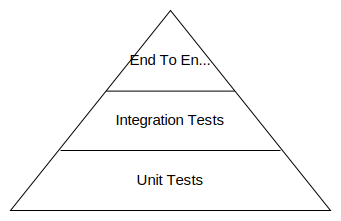
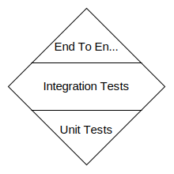
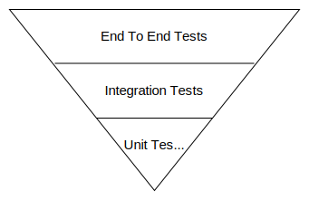

# **Software Testing Basics**
 

## **Table Of Contents**
 

- [**Software Testing Basics**](#software-testing-basics)
  - [**Table Of Contents**](#table-of-contents)
  - [**Basic Terminology**](#basic-terminology)
  - [**Testing Strategies**](#testing-strategies)
    - [**Testing Pyramid**](#testing-pyramid)
    - [**Testing Diamond**](#testing-diamond)
    - [**Reverse Testing Pyramid**](#reverse-testing-pyramid)

 
 
 

## **Basic Terminology**
 

|Terminology |Definition
|:-----------|:-----------------------------------------------------------------------------
|Error       |Deviation of the actual function of a piece of software from the target state
|Fixture     |collection of predefined test data objects

 
 
 

## **Testing Strategies**
 

> A **testing strategy** describes the weighting of the different test types.

 
 

### **Testing Pyramid**

 
 

### **Testing Diamond**

 
 

### **Reverse Testing Pyramid**

