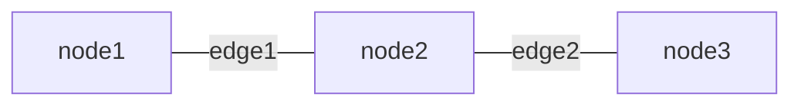

# **Markdown Cheatsheet**
<br>

## **Table Of Contents**
<br>

- [**Markdown Cheatsheet**](#markdown-cheatsheet)
  - [**Table Of Contents**](#table-of-contents)
  - [**Headers**](#headers)
  - [**Text Formatting**](#text-formatting)
  - [**Different Type Of Links**](#different-type-of-links)
  - [**Line Breaks**](#line-breaks)
  - [**Lists**](#lists)
  - [**Code Quote (GitHub Extension)**](#code-quote-github-extension)
  - [**Table (GitHub Extension)**](#table-github-extension)
  - [**Symbols And Emoticons (GitHub Extension)**](#symbols-and-emoticons-github-extension)
  - [**Charts And Diagrams With Mermaid (GitHub/GitLab Extension)**](#charts-and-diagrams-with-mermaid-githubgitlab-extension)

<br>
<br>
<br>

## **Headers**
<br>

```markdown
# Header 1
## Header 2
### Header 3
#### Header 4
##### Header 5
###### Header 6
```

<br>
<br>
<br>

## **Text Formatting**
<br>

```markdown
This is _italic_.


This is **bold**.


This sentence is above a horizontal rule.
---
This sentence is under a horizontal rule.


> This sentence is within a blockquote
>
> This sentence is within the same blockquote
```

<br>
<br>
<br>

## **Different Type Of Links**
<br>

```markdown
Inline link to header in same document:
[Some text](#headerName)


Inline link to other document:
[Some Text](../folder1/folder2/fileName)


Inline link to header in other document:
[Some Text](../folder1/folder2/fileName#headerName)


Inline link to website:
[Some text](www.test.com "optional title")


Inline image link:


Reference link to reference defined within the document:
[Some text][myReference]
...
[myReference]: www.test.com 


Reference link to image defined within the document:
![Alternative text][myReference]
...
[myReference]: www.test.com/testimage.png
```

<br>
<br>
<br>

## **Line Breaks**
<br>

Hard line break:

```markdown
This sentence is before a line break.

This sentence is after a line break.
```

Soft line break (two spaces at the end of a line):

```markdown
This sentence is in line 1.  
This sentence is in line 2.
```

<br>
<br>
<br>

## **Lists**
<br>

Unordered list

```markdown
* Item 1
* Item 2
* Item 3
```
<br>

Ordered list

```markdown
1. Item 1
2. Item 2
3. Item 3
```
<br>

Nested list

```markdown
* Item 1
  * Item 1.1
  * Item 1.2
  * Item 1.3
* Item 2
```
<br>

Task list

```markdown
- [ ] This item is not completed
- [x] This item is completed
```

<br>
<br>
<br>

## **Code Quote (GitHub Extension)**
<br>

```markdown
```language(optional)
code
`` `
```

<br>

Example:

```markdown
```javascript
function sayHello() {
   console.log('Hello World');
} 
`` `
```

<br>
<br>
<br>

## **Table (GitHub Extension)**
<br>

```markdown
| Header 1     | Header 2       | Header 3      |
|:-------------|:---------------|--------------:|
| Content      | Content        | Content       |
| Left-aligned | Center-aligned | Right-aligned |
```

<br>
<br>
<br>

## **Symbols And Emoticons (GitHub Extension)**
<br>

```markdown
:smile:  
```
<br>

[Emoticon Cheat Sheet](https://github.com/ikatyang/emoji-cheat-sheet/blob/master/README.md)

<br>
<br>
<br>

## [**Charts And Diagrams With Mermaid (GitHub/GitLab Extension)**](../mermaid/mermaid.md)
<br>

Both GitHub and GitLab support mermaid to embedd charts and diagrams directly into markdown.

See [mermaid](../mermaid/mermaid.md)

<br>

```
```mermaid
flowchart LR
    node1-- edge1 ---node2-- edge2 ---node3
`` `
```

<br>

