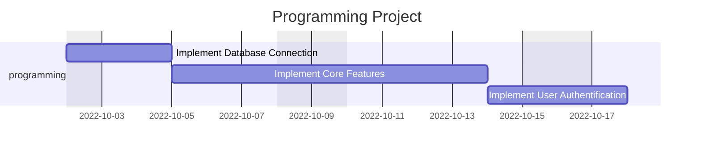
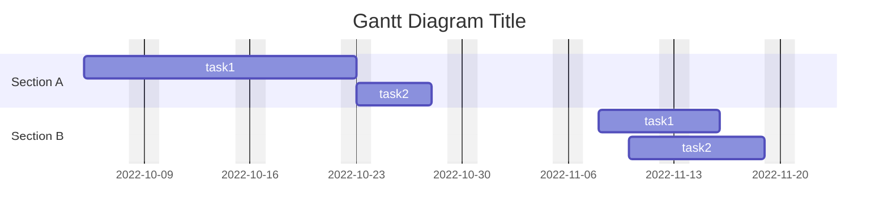
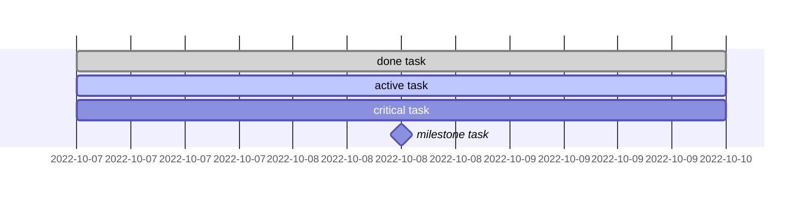

# **Mermaid Gantt Diagram**
<br>

## **Table Of Contents**
<br>

- [**Mermaid Gantt Diagram**](#mermaid-gantt-diagram)
  - [**Table Of Contents**](#table-of-contents)
  - [**General**](#general)
  - [**Syntax**](#syntax)
    - [**Tasks**](#tasks)
      - [**Status**](#status)

<br>
<br>
<br>

## **General**
<br>

A Gantt diagram describes a project schedule including order and duration of tasks.

<br>



<br>
<br>
<br>

## **Syntax**
<br>

Basic syntax:

```
gantt
    title <title text>
    dateFormat <format like YYYY-MM-DD>
    excludes <excluse code ['weekends' or individual weekdays]>

    section <section name>
        <task name> :[<status>], [alias], [after <task alias>], [start date], [<end date> or <duration in weeks(w), days(d) or hours(h)>]
```

<br>

```
gantt
    title Gantt Diagram Title
    dateFormat YYYY-MM-DD
    excludes weekends

    section Section A
        task1 :t1, 2022-10-05, 2022-10-23
        task2 :t2, after t1, 5d

    section Section B
        task1 :t1, 2022-11-08, 6d
        task2 :t2, 2022-11-10, 7d
```

<br>



<br>
<br>

### **Tasks**
<br>
<br>

#### **Status**
<br>

|Status    |
|:---------|
|active    |
|done      |
|critical  |
|milestone |

<br>

```
gantt
    dateFormat YYYY-MM-DD

    done task :done, 2022-10-07, 3d
    active task :active, 2022-10-07, 3d
    critical task :critical, 2022-10-07, 3d
    milestone task :milestone, 2022-10-07, 3d
```

<br>

