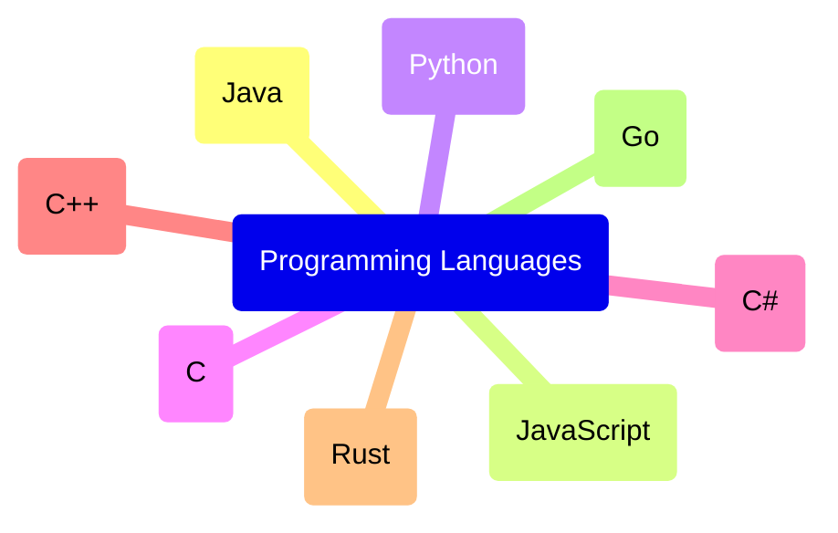

# **Mermaid Mind Map**
<br>

## **Table Of Contents**
<br>

- [**Mermaid Mind Map**](#mermaid-mind-map)
  - [**Table Of Contents**](#table-of-contents)
  - [**General**](#general)
  - [**Syntax**](#syntax)

<br>
<br>
<br>

## **General**
<br>

A mindmap visualizes and connects information

<br>



<br>
<br>
<br>

## **Syntax**
<br>

```
mindmap
   root(Programming Languages)
      (Java)
      (JavaScript)
      (Python)
      (C)
      (C#)
      (C++)
      (Rust)
      (Go)
```