# **Mermaid State Diagram**
<br>

## **Table Of Contents**
<br>

- [**Mermaid State Diagram**](#mermaid-state-diagram)
  - [**Table Of Contents**](#table-of-contents)
  - [**General**](#general)
  - [**States**](#states)
    - [**Types**](#types)
      - [**Standard**](#standard)
      - [**Composite**](#composite)
    - [**Note**](#note)
  - [**Transitions**](#transitions)
    - [**Standard**](#standard-1)
    - [**Diagram Start And End**](#diagram-start-and-end)
    - [**Choice**](#choice)
    - [**Fork**](#fork)
    - [**Concurrency**](#concurrency)
  - [**Diagram Direction**](#diagram-direction)

<br>
<br>
<br>

## **General**
<br>

A state diagram describes the finite states of a system.

<br>

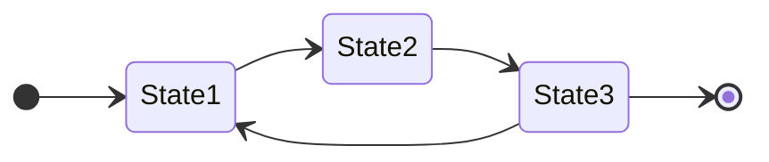

<br>
<br>
<br>

## **States**
<br>
<br>

### **Types**
<br>
<br>

#### **Standard**
<br>

```
stateDiagram-v2
  stateName
```

<br>

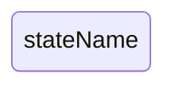

<br>
<br>

```
stateDiagram-v2
  stateName : State Description
```

<br>

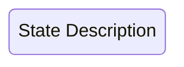

<br>
<br>

```
stateDiagram-v2
  state "State Description" as stateName
```

<br>


<br>
<br>

#### **Composite**
<br>

* state consisting of several internal states (composite states)

<br>

Basic Syntax:

```
state <stateName> {
  <internal state diagram>
}
```

<br>

```
stateDiagram-v2
  [*] --> state1
  state1 --> compositeStateName
  state compositeState {
    [*] --> internalState1
    internalState1 --> internalState2
    internalState2 --> [*]
  }
```

<br>

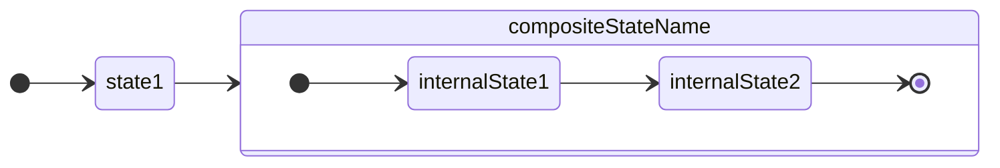

<br>
<br>

### **Note**
<br>

Basic syntax:

```
note right of <stateName>
  <noteText>
end note

note left of <stateName>
  <noteText>
end note
```

<br>

```
stateDiagram-v2
  State1 --> State2

  note left of State1
    left note
  end note

  note right of State2
    right note
  end note
```

<br>

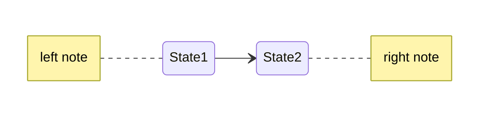

<br>
<br>
<br>

## **Transitions**
<br>
<br>

### **Standard**
<br>

```
stateDiagram-v2
  state1 --> state2
```

<br>

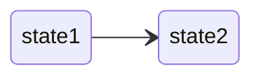

<br>
<br>

### **Diagram Start And End**
<br>

```
stateDiagram-v2
  [*] --> state1
  state1 --> state2
  state2 --> [*]
```

<br>

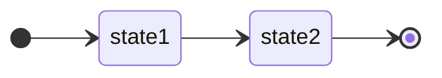

<br>
<br>

### **Choice**
<br>

Basic syntax

```
state <choiceStateName> <<choice>>
  <otherStateName> --> <choiceStateName>
  <choiceStateName> --> <subsequentStateName>: <condition>
```

<br>

```
stateDiagram-v2
  state compile <<choice>>
  [*] --> program
  program --> compile
  compile --> execute: if code is correct
  compile --> debug: if conde is not correct
```

<br>

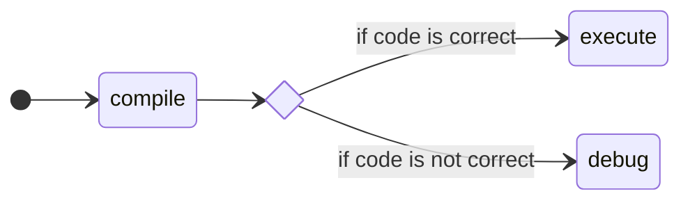

<br>
<br>

### **Fork**
<br>

Basic syntax:

```
state <forkStateName> <<fork>>
state <joinStateName> <<join>>
```

<br>

```
stateDiagram-v2
  state forkState <<fork>>
  state joinState <<join>>

  [*] --> forkState
  forkState --> State1
  forkState --> State2
  State1 --> joinState
  State2 --> joinState
  joinState --> [*]
```

<br>

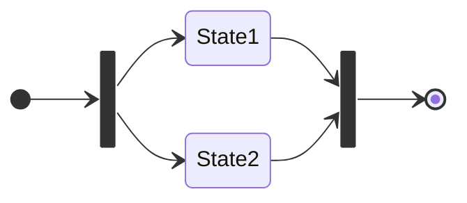

<br>
<br>

### **Concurrency**
<br>

Basic syntax:

```
<state subdiagram>
--
<state subdiagram>
```

<br>

```
stateDiagram-v2
  [*] --> State1.1
  State1.1 --> State1.2
  State1.2 --> [*]
  --
  [*] --> State2.1
  State2.1 --> State2.2
  State2.2 --> [*]
```

<br>

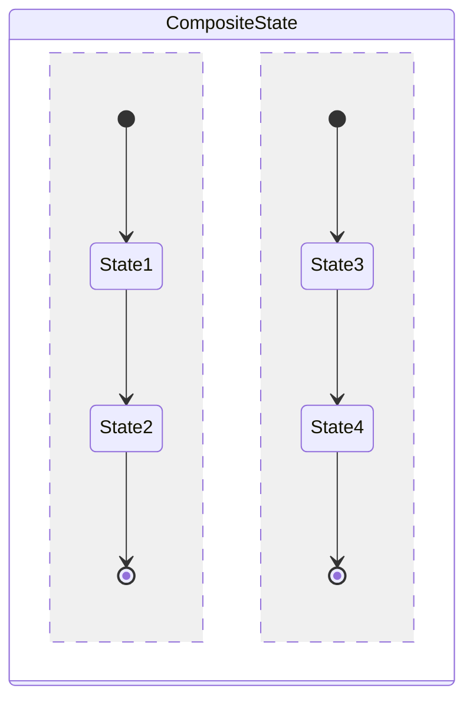

<br>
<br>
<br>

## **Diagram Direction**
<br>

Basic syntax:

```
stateDiagram
  direction <directionNam>
```

<br>

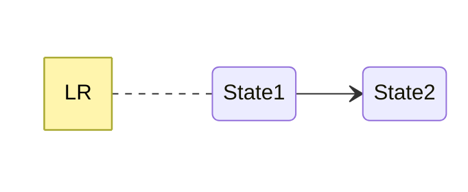

<br>

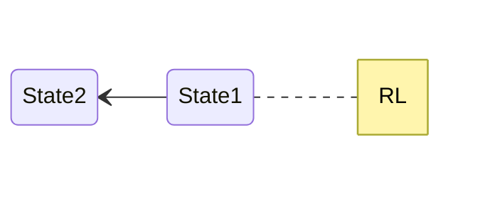

<br>

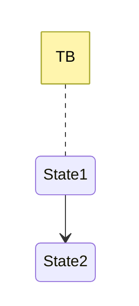

<br>

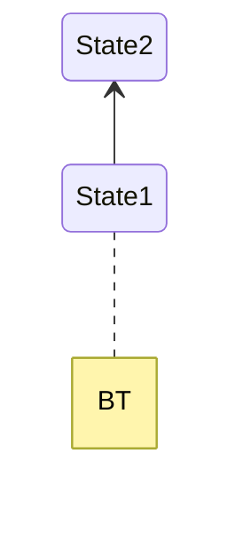