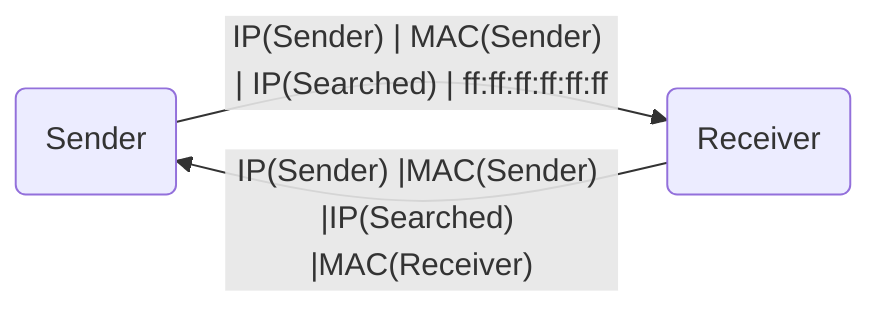

# **Address Resolution Prococol (ARP)**
 

## **Table Of Contents**
 

- [**Address Resolution Prococol (ARP)**](#address-resolution-prococol-arp)
  - [**Table Of Contents**](#table-of-contents)
  - [**General**](#general)
  - [**Request**](#request)

 
 
 

## **General**
 

* used on osi layer 2 (Data Link Layer)
* used for IPv4 networks (see [NDP](./NDP.md) for IPv6)
* tasks:
  * determines the MAC address for a given IP address
  * allows manual assignment of a MAC address to an IP address

 
 
 

## **Request**
 

* **Step 1**: aks all available hosts via broadcast if given IP address is assigned to them
* **Step 2**: host answers with its MAC address

 

