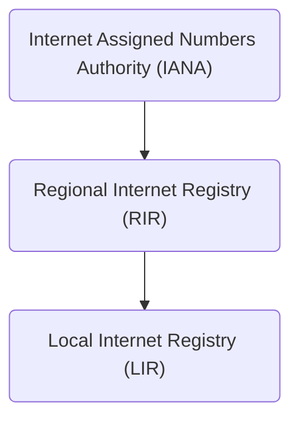

# **IPv4**
<br>

## **Table Of Contents**
<br>

- [**IPv4**](#ipv4)
  - [**Table Of Contents**](#table-of-contents)
  - [**General**](#general)
  - [**IP Addresses**](#ip-addresses)
    - [**Decimal Representation**](#decimal-representation)
    - [**Subnet mask**](#subnet-mask)
    - [**Authorities For Assigning IP Addresses**](#authorities-for-assigning-ip-addresses)

<br>
<br>
<br>
<br>

## **General**
<br>

IPv4 is used for:
* network identification
* logical location addressing
* enabling connections between different network segments

<br>
<br>
<br>
<br>

## **IP Addresses**
<br>

* length: 32 Bit (4 x 8 Bit)
* must be unique within a network
* can be split into a **network part** and a **host part**

<br>
<br>
<br>

### **Decimal Representation**
<br>

* ip addresses are represented with the decimal value of each octet
* each octet is in the range of decimal values 0 to 255

<br>

Example
```
192.168.0.23
```

<br>
<br>
<br>

### **Subnet mask**
<br>

* defines the network part of an ip address
* length: 32 Bit (4 x 8 Bit)
* sequence of `1`s followed by a block of `0s`
    * `1`s represent network part
    * `0`s represent host part

<br>

|Subnet mask                         |Decimal         |CIDR Notation |Total addresses |
|:-----------------------------------|:---------------|:------------:|---------------:|
|11111111.00000000.00000000.00000000 |255.0.0.0       |/8            |16.777.214      |
|11111111.10000000.00000000.00000000 |255.128.0.0     |/9            |8.388.608       |
|11111111.11000000.00000000.00000000 |255.192.0.0     |/10           |4.194.304       |
|11111111.11100000.00000000.00000000 |255.224.0.0     |/11           |2.097.152       |
|11111111.11110000.00000000.00000000 |255.240.0.0     |/12           |1.048.576       |
|11111111.11111000.00000000.00000000 |255.248.0.0     |/13           |524.288         |
|11111111.11111100.00000000.00000000 |255.252.0.0     |/14           |262.144         |
|11111111.11111110.00000000.00000000 |255.254.0.0     |/15           |131.072         |
|11111111.11111111.00000000.00000000 |255.255.0.0     |/16           |65.536          |
|11111111.11111111.10000000.00000000 |255.255.128.0   |/17           |32.768          |
|11111111.11111111.11000000.00000000 |255.255.192.0   |/18           |16.384          |
|11111111.11111111.11100000.00000000 |255.255.224.0   |/19           |8.192           |
|11111111.11111111.11110000.00000000 |255.255.240.0   |/20           |4.096           |
|11111111.11111111.11111000.00000000 |255.255.248.0   |/21           |2.048           |
|11111111.11111111.11111100.00000000 |255.255.252.0   |/22           |1.024           |
|11111111.11111111.11111110.00000000 |255.255.254.0   |/23           |512             |
|11111111.11111111.11111111.00000000 |255.255.255.0   |/24           |256             |
|11111111.11111111.11111111.10000000 |255.255.255.128 |/25           |128             |
|11111111.11111111.11111111.11000000 |255.255.255.192 |/26           |64              |
|11111111.11111111.11111111.11100000 |255.255.255.224 |/27           |32              |
|11111111.11111111.11111111.11110000 |255.255.255.240 |/28           |16              |
|11111111.11111111.11111111.11111000 |255.255.255.248 |/29           |8               |
|11111111.11111111.11111111.11111100 |255.255.255.252 |/30           |4               |
|11111111.11111111.11111111.11111110 |255.255.255.254 |/31           |2               |
|11111111.11111111.11111111.11111111 |255.255.255.255 |/32           |0               |

<br>
<br>
<br>

### **Authorities For Assigning IP Addresses**
<br>




