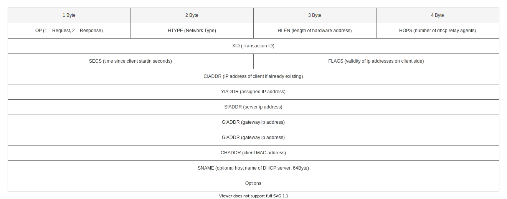

# **DHCP - Dynamic Host Configuration Protocol**
 

## **Table Of Contents**
 

- [**DHCP - Dynamic Host Configuration Protocol**](#dhcp---dynamic-host-configuration-protocol)
  - [**Table Of Contents**](#table-of-contents)
  - [**General**](#general)
  - [**DHCP Packet**](#dhcp-packet)

 
 
 

## **General**
 

* automatic configuration of network devices by a central server
* server can assign
  * ip address
  * subnetmask
  * default gateway
  * dns server
  * time and NTP server
* server port: UDP 67
* client port: UDP 68

 
 

|Pros                        |Cons |
|:---------------------------|:----|
|+ central administration    |- client can not get ip addresses if server is down
|+ easy client configuration |- danger of another unauthorized dhcp server assigning ip addesses (Rogue DHCP)
|                            |- danger of attackers denying assignment of ip addresses by emptying address pool via request spam
|                            |- every subnet needs its own dhcp server or router need to be configured as dhcp relay

 
 
 

## **DHCP Packet**
 

