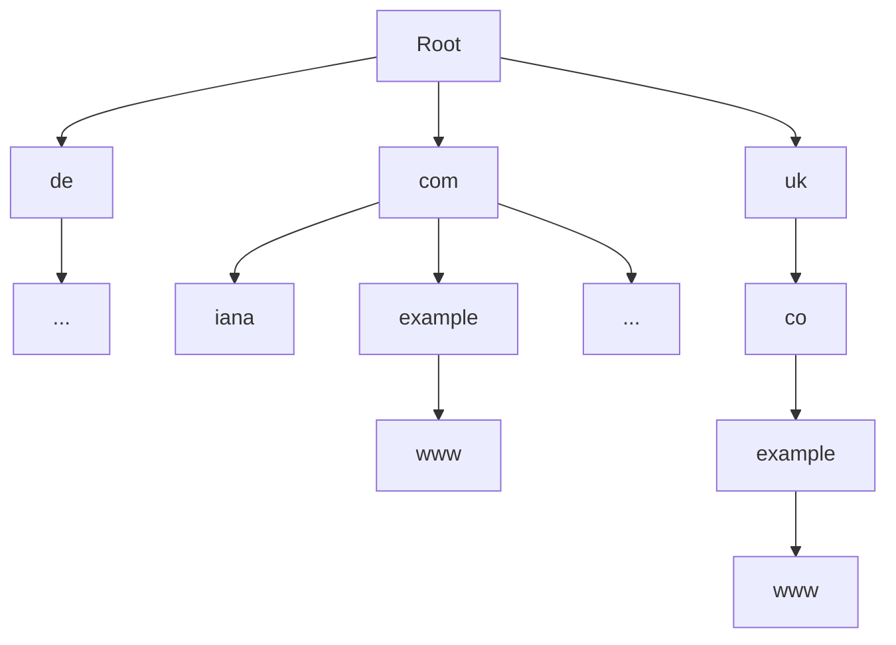
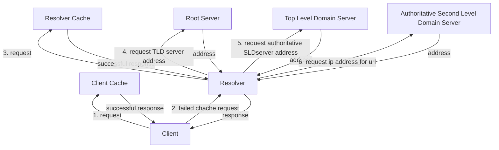

# **DNS - Domain Name Server**
<br>

## **Table Of Contents**
<br>

- [**DNS - Domain Name Server**](#dns---domain-name-server)
  - [**Table Of Contents**](#table-of-contents)
  - [**General**](#general)
  - [**Name Space**](#name-space)
  - [**Name Servers**](#name-servers)
    - [**Authoritative Name Server**](#authoritative-name-server)
    - [**Primary Name Server**](#primary-name-server)
    - [**Secondary Name Server**](#secondary-name-server)
    - [**Nonauthoritative Name Server**](#nonauthoritative-name-server)
  - [**Recursively resolve requests**](#recursively-resolve-requests)

<br>
<br>
<br>

## **General**
<br>

* resolves `host names` to assigned `ip address` and vice versa
* can be used for local networks and for the internet
* ports: 53 (UDP/TCP)
* client can get ip address of resolver
  * via [DHCP](./dhcp.md)
  * via manual configuration

<br>
<br>
<br>

## **Name Space**
<br>

* urls are analyzed backwards

```
www.example.org  --> .org.example.www
```

<br>

|Root  |Top Level Domain |Second Level Domain |Hostname |
|-----:|:---------------:|:------------------:|:-------:|
|.     |org.             |example.            |www      |

<br>

|Root  |Top Level Domain |Second Level Domain |Third Level Domain |Hostname |
|-----:|:---------------:|:------------------:|:-----------------:|:-------:|
|.     |org.             |co.                 |example.           |www      |

<br>
<br>



<br>
<br>
<br>

## **Name Servers**
<br>
<br>

### **Authoritative Name Server**
<br>

* reliable source of information about **one or multiple specific domains**
* do not need to ask other name servers
* information is added by administrators

<br>
<br>

### **Primary Name Server**
<br>

* alias for authoritative name server of a domain

<br>
<br>

### **Secondary Name Server**
<br>

* additional name server of a domain that delivers the same information as the primary name server

<br>
<br>

### **Nonauthoritative Name Server**
<br>

* address resolving comes from another name server
* results are not safe

<br>
<br>
<br>

## **Recursively resolve requests**
<br>

