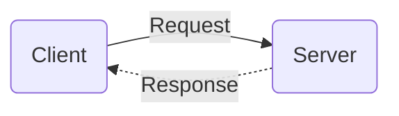

# **HTTP Protocol**
<br>

## **Table Of Contents**
<br>

- [**HTTP Protocol**](#http-protocol)
  - [**Table Of Contents**](#table-of-contents)
  - [**General**](#general)
  - [**HTTP Flow**](#http-flow)
  - [**HTTP Messages**](#http-messages)
    - [**Request**](#request)
    - [**Response**](#response)
  - [**HTTP Versions**](#http-versions)
  - [**HTTP Methods**](#http-methods)
  - [**Headers**](#headers)
    - [**General Header**](#general-header)
    - [**Request Header**](#request-header)
    - [**Response Header**](#response-header)
  - [**Status Codes**](#status-codes)
    - [**1\*\* Informational**](#1-informational)
    - [**2\*\* Success**](#2-success)
    - [**3\*\* Redirect**](#3-redirect)
    - [**4\*\* Client Error**](#4-client-error)
    - [**5\*\* Server Error**](#5-server-error)
  - [**HTTP Cookies**](#http-cookies)
    - [**Create Cookie**](#create-cookie)

<br>
<br>
<br>

## **General**
<br>

* **H**yper**T**ext **T**ransfer **P**rotocol (HTTP)
* Application Layer Protocol
* Allows fetching resources from servers
* Client-Server-Protocol
  * Client (user-agent) requests resource from server
  * Server responds with resource
* **Stateless**, so the server does not keep any data between two requests
* is sent over a (TLS-encrypted) TCP connection

<br>



<br>
<br>
<br>

## **HTTP Flow**
<br>

1. Open TCP connection
2. Send HTTP request
3. Receive response from server
4. Close TCP connection or reuse for further requests

<br>
<br>
<br>

## **HTTP Messages**
<br>
<br>

### **Request**
<br>

A request consists of:
<br>

* Start line
  * [HTTP Method](#methods)
  * Resource path (url)
  * HTTP protocol version
* Headers
* Blank line
* Optional body (for methods like _POST_)

<br>
<br>

```
GET / HTTP/2
Host: developer.mozilla.org
Accept-Language: en-US,en
...

body
```

<br>
<br>

### **Response**
<br>

* Start line
  * HTTP protocol version
  * [HTTP Status Code](#status-codes)
  * [Status Message](#status-codes)
* Headers
* Blank line
* Optional body

<br>
<br>

```
HTTP/2 200 OK
date: Tue, 18 Oct 2020 00:59:31 GMT
server: AmazonS3
...

body
```

<br>
<br>
<br>

## **HTTP Versions**
<br>

|                   |HTTP1.1                                          |HTTP2
|:------------------|:------------------------------------------------|:-----------
|Format             |Text                                             |Binary
|Header Compression |No                                               |Yes
|Multiplex          |No (every request requires a new TCP-connection) |Yes (Multiple requests can be sent over the same TCP-connection)
|Server Push        |No                                               |Yes
<br>
<br>
<br>

## **HTTP Methods**
<br>

| Method  | Description                                           |
| :------ | :---------------------------------------------------- |
| GET     | Retrieve resource from server                         |
| POST    | Submit data to the server                             |
| PUT     | Update existing resource on the server                |
| DELETE  | Delete resource on the server                         |
| PATCH   | Apply partial modification to resource                |
| HEAD    | Like GET, but without response body                   |
| CONNECT | Establish tunnel to server                            |
| OPTIONS | Describe communication options for resource           |
| TRACE   | Perform message loop back test along path to resource |

<br>
<br>
<br>

## **Headers**
<br>
<br>

### **General Header**
<br>

Common:
<br>

| Header          | Description |
| :-------------- | :---------- |
| URL             |
| Method          |
| Status Code     |
| Remote Address  |
| Referrer Policy |

<br>
<br>

### **Request Header**
<br>

Common headers:
<br>

| Header         | Description |
| :------------- | :---------- |
| Cookies        |
| Accept-xxx     |
| Content-Type   |
| Content-Length |
| Authorization  |
| User-Agent     |
| Referrer       |

<br>
<br>

### **Response Header**
<br>

Common:
<br>

| Header         | Description |
| :------------- | :---------- |
| Server         |
| Set-Cookie     |
| Content-Type   |
| Content-Length |
| Date           |

<br>
<br>
<br>

## **Status Codes**
<br>
<br>

### **1\*\* Informational**
<br>

| Code  | Message             |
| :---: | :------------------ |
|  100  | Continue            |
|  101  | Switching Protocols |
|  102  | Processing          |
|  103  | Early Hints         |

<br>
<br>

### **2\*\* Success**
<br>

| Code  | Message                       |
| :---: | :---------------------------- |
|  200  | OK                            |
|  201  | Created                       |
|  202  | Accepted                      |
|  203  | Non-Authoritative Information |
|  204  | No Content                    |
|  205  | Reset Content                 |
|  206  | Partial Content               |
|  207  | Multi-Status                  |
|  208  | Already Reported              |
|  226  | IM Used                       |

<br>
<br>

### **3\*\* Redirect**
<br>

| Code  | Message            |
| :---: | :----------------- |
|  300  | Multiple Choices   |
|  301  | Moved Permanently  |
|  302  | Found              |
|  303  | See Other          |
|  304  | Not Modified       |
|  305  | Use Proxy          |
|  307  | Temporary Redirect |
|  308  | Permanent Redirect |

<br>
<br>

### **4\*\* Client Error**
<br>

| Code  | Message                         |
| :---: | :------------------------------ |
|  400  | Bad Request                     |
|  401  | Unauthorized                    |
|  402  | Payment Required                |
|  403  | Forbidden                       |
|  404  | Not Found                       |
|  405  | Method Not Allowed              |
|  406  | Not Acceptable                  |
|  407  | Proxy Authentication Required   |
|  408  | Request Timeout                 |
|  409  | Conflict                        |
|  410  | Gone                            |
|  411  | Length Required                 |
|  412  | Precondition Failed             |
|  413  | Payload Too Large               |
|  414  | URI Too Long                    |
|  415  | Unsupported Media Type          |
|  416  | Range Not Satisfiable           |
|  417  | Expectation Failed              |
|  418  | I'm a Teapot                    |
|  421  | Misdirected Request             |
|  422  | Unprocessable Entity            |
|  423  | Locked                          |
|  424  | Failed Dependency               |
|  425  | Too Early                       |
|  426  | Upgrade Required                |
|  428  | Precondition Required           |
|  429  | Too Many Requests               |
|  431  | Request Header Fields Too Large |
|  451  | Unavailable For Legal Reasons   |

<br>
<br>

### **5\*\* Server Error**
<br>

| Code  | Message                         |
| :---: | :------------------------------ |
|  500  | Internal Server Error           |
|  501  | Not Implemented                 |
|  502  | Bad Gateway                     |
|  503  | Service Unavailable             |
|  504  | Gateway Timeout                 |
|  505  | HTTP Version Not Supported      |
|  506  | Variant Also Negotiates         |
|  507  | Insufficient Storage            |
|  508  | Loop Detected                   |
|  509  | Bandwidth Limit Exceeded        |
|  510  | Not Extended                    |
|  511  | Network Authentication Required |

<br>
<br>
<br>

## **HTTP Cookies**
<br>

* small chunk of data
* is sent by the server to the client
* client can store the cookie and send it with later requests to same server
* can be utilized to remember information despite HTTP being stateless

<br>

Initial response header:

```
HTTP/2 200 OK
Content-Type: text/html
Set-Cookie: cookie1Name=payload
Set-Cookie: cookie2Name=payload

... Content ...
```

<br>

Subsequent request headers to same server:

```
GET /fileName.html HTTP/2
Host: www.domain.com
Cookie: cookie1Name=payload; cookie2Name=payload
```

<br>

Main Purposes:

1. Session Management
2. Personalization
3. Tracking

<br>

Lifetime:

1. Session cookie: deleted when browser defined session ends (no attributes _Expires_ or _Max-Age_)
2. Permanent cookie: deleted after cookie defined date (_Expires_) or period of time (_Max-Age_)

<br>
<br>

### **Create Cookie**
<br>

Cookie header:

```
Set-Cookie: <name>=<value>
```

<br>

Optional cookie headers:

| Attribute | Example                                    | Description                                                                                                 |
| :-------- | :----------------------------------------- | :---------------------------------------------------------------------------------------------------------- |
| Expires   | Expires=Fri Oct 21 2022 15:51:58 GMT+0200; | delete date for cookie                                                                                      |
| Max-Age   | Max-Age=60;                                | number of seconds before deletion                                                                           |
| Secure    | Secure;                                    | cookie is only sent via encrypted requests                                                                  |
| HttpOnly  | HttpOnly;                                  | cookie is inaccessible to JavaScript                                                                        |
| Domain    | Domain=google.com;                         | specify which host can receive cookie (including subdomains). Defaults to same host _excluding_ subdomains! |
| Path      | Path=/docs;                                | specify path required in requested URL to send cookie                                                       |
| SameSite  | SameSite=Strict;                           | specify cookie sending behavior for cross-site requests. See Arguments below                                |
|           |

<br>
<br>

Arguments for Attribute _SameSite_:
<br>

| Argument | Description                                                                              |
| :------- | :--------------------------------------------------------------------------------------- |
| Strict   | cookie is only sent to originating site                                                  |
| Lax      | cookie is only sent when user navigates to originating site                              |
| None     | cookie is sent to originating site and cross-site-requests, but if _Secure_ is activated |
