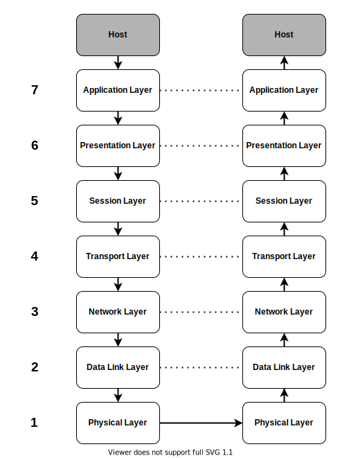

# **Network Basics**

 

## **Table Of Contents**
 

- [**Network Basics**](#network-basics)
  - [**Table Of Contents**](#table-of-contents)
  - [**Definitions**](#definitions)
    - [**Network**](#network)
    - [**Network Protocol**](#network-protocol)
  - [**Basic Network Types**](#basic-network-types)
    - [**PAN (Personal Area Network)**](#pan-personal-area-network)
    - [**LAN (Local Area Network)**](#lan-local-area-network)
    - [**CAN (Campus Area Network)**](#can-campus-area-network)
    - [**MAN (Metropolitan Area Network)**](#man-metropolitan-area-network)
    - [**WAN (Wide Area Network)**](#wan-wide-area-network)
  - [**Protocol Types**](#protocol-types)
    - [**Connection-Oriented Protocols**](#connection-oriented-protocols)
    - [**Connectionless Protocols**](#connectionless-protocols)
  - [**OSI Model**](#osi-model)

 
 
 

## **Definitions**
 
 

### **Network**
 

> A Network is an infrastructure that allows devices to communicate with each other to share data and resources.

 
 

### **Network Protocol**
 

> A Network protocol is a set of rules for creating connections and transmitting data over a network. It usually defines rules for the following areas:
>* addressing sender and receiver
>* connection establishment
>* flow control
>* error detection
>* error handling

 
 
 

## **Basic Network Types**
 
 

### **PAN (Personal Area Network)**
 

* covers devices of a workspace of a single person
* range: approximately 10 meters

 
 

### **LAN (Local Area Network)**
 

* covers a single limited area like a building

 
 

### **CAN (Campus Area Network)**
 

* covers multiple limited areas like multiple buildings on a campus

 
 

### **MAN (Metropolitan Area Network)**
 

* covers big geographical area like a town, city etc.

 
 

### **WAN (Wide Area Network)**
 

* covers huge geographical area (worldwide)

 
 
 

## **Protocol Types**
 
 

### **Connection-Oriented Protocols**
 

* requires establishment of a connection before transmission
* sender and receiver know each other before transmitting data
* connection is terminated after transmission

|Pro               |Con
|:-----------------|:--------------------------------------
|secure connection |increased calculation and network load

 
 

### **Connectionless Protocols**
 

* data will be sent without establishing a connection

|Pro               |Con
|:-----------------|:--------
|higher throughput |not flowcontrol or error handling (has to be implemented in higher layers)
|less network load |

 
 
 

## **OSI Model**
 
 

|Layer |Name               |Summary                                                                                              |**P**rotocol **D**ata **U**nit
|:----:|:------------------|:--------------------------------------------------------------------------------------------------- |:---------------------------
|7     |Application Layer  |Applications using the network                                                                       |Data
|6     |Presentation Layer |Encoding/decoding, compression/decompression, encyryption/decryption and conversion of Data          |Data
|5     |Session Layer      |Starts, manages and ends communication between hosts (session)                                       |Data
|4     |Transport Layer    |Transfer data from a source process on a source host to a destination process on a destination host  |Segment, Datagram
|3     |Network Layer      |Logical addressing and Routing from source host to destination host                                  |Packet
|2     |Data Link Layer    |Data transfer between two directly connected nodes including flow control and error handling         |Frame
|1     |Physical Layer     |Physical transfer of raw unstructured data between devices via electrical, radio, or optical signals |Bit

 
 

 
 

Mnemonic:

**A**ll  
**P**eople  
**S**eem  
**T**o  
**N**eed  
**D**ata  
**P**rocessing
