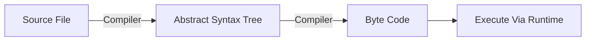

# **Compiler Basics**
 

## **Table Of Contents**
 

- [**Compiler Basics**](#compiler-basics)
  - [**Table Of Contents**](#table-of-contents)
  - [**General**](#general)

 
 
 

## **General**
 

```mermaid
flowchart LR
    a[Source File] -- Compiler --> b[Abstract Syntax Tree]
    b -- Compiler --> c[Byte Code]
    c --> d[Execute Via Runtime]
```