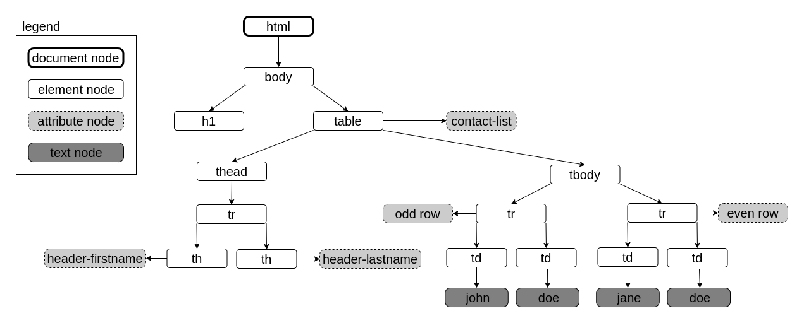

# **JavaScript Document Object Model**

<br>

## **Table Of Contents**
<br>

- [**JavaScript Document Object Model**](#javascript-document-object-model)
  - [**Table Of Contents**](#table-of-contents)
  - [**General**](#general)
  - [**Types Of DOM-Tree Nodes**](#types-of-dom-tree-nodes)
    - [**Document Node**](#document-node)
    - [**Element Node**](#element-node)
    - [**Attribute Node**](#attribute-node)
    - [**Text Node**](#text-node)
    - [**Example**](#example)
  - [**Element And Text Nodes**](#element-and-text-nodes)
    - [**Selecting Elements / Nodes**](#selecting-elements--nodes)
      - [**getElementById()**](#getelementbyid)
      - [**getElementsByClassName()**](#getelementsbyclassname)
      - [**getElementsByTagName()**](#getelementsbytagname)
      - [**getElementsByName()**](#getelementsbyname)
      - [**querySelector()**](#queryselector)
      - [**querySelectorAll()**](#queryselectorall)
      - [**parentElement()**](#parentelement)
      - [**parentNode()**](#parentnode)
      - [**previousElementSibling()**](#previouselementsibling)
      - [**previousSibling()**](#previoussibling)
      - [**nextElementSibling()**](#nextelementsibling)
      - [**nextSibling()**](#nextsibling)
      - [**firstElementChild()**](#firstelementchild)
      - [**firstChild()**](#firstchild)
      - [**lastElementChild()**](#lastelementchild)
      - [**lastChild()**](#lastchild)
      - [**childNodes()**](#childnodes)
      - [**children()**](#children)
    - [**Selecting Element Types**](#selecting-element-types)
    - [**Create And Manipulate Nodes**](#create-and-manipulate-nodes)
      - [**Access Content**](#access-content)
        - [**textContent**](#textcontent)
        - [**innerHTML**](#innerhtml)
      - [**Create Nodes**](#create-nodes)
        - [**createTextNode()**](#createtextnode)
        - [**createElement()**](#createelement)
      - [**Add Nodes To DOM Tree**](#add-nodes-to-dom-tree)
        - [**appendChild()**](#appendchild)
        - [**insertBefore()**](#insertbefore)
        - [**replaceChild()**](#replacechild)
    - [**Delete Nodes**](#delete-nodes)
      - [**removeChild()**](#removechild)
  - [**Attribute Nodes**](#attribute-nodes)
    - [**Access Attribute Nodes**](#access-attribute-nodes)
      - [**Access Via Element Property**](#access-via-element-property)
      - [**getAttribute()**](#getattribute)
      - [**setAttribute()**](#setattribute)
    - [**createAttribute()**](#createattribute)
    - [**removeAttribute()**](#removeattribute)
  - [**CSS Classes**](#css-classes)
    - [**classList.add()**](#classlistadd)
    - [**classList.remove()**](#classlistremove)
    - [**classList.replace()**](#classlistreplace)
    - [**classList.toggle()**](#classlisttoggle)
    - [**classList.contains()**](#classlistcontains)

<br>
<br>
<br>
<br>

## **General**
<br>

Document Object Model (DOM) contains the components of a website in a hierarchic DOM-tree.

<br>
<br>
<br>
<br>

## **Types Of DOM-Tree Nodes**
<br>
<br>

### **Document Node**
<br>

* represents the root of the DOM-tree
* properties can be accessed by the global _document_ object

<br>

```javascript
document.title
document.lastModified
document.URL
document.domain
document.cookie                 // list of all cookies
document.forms                  // list of all forms
document.images                 // list of all images
document.links                  // list of all links
```

<br>
<br>

### **Element Node**

Represents elements of DOM-tree like \<table>,  \<h1>  etc.

<br>
<br>

### **Attribute Node**

Represents attributes of element nodes like _id_, _lang_ etc.

<br>
<br>

### **Text Node**

Represents text inside of element nodes. Can not have child nodes. Whitespaces are represented as empty text nodes.

<br>
<br>

### **Example**
<br>

```html
<!DOCTYPE html>
<html>
  <body>
    <h1>Contacts</h1>
    <table id='contact-list'>
      <thead>
        <tr>
          <th id='header-firstname'>first name</th>
          <th id='header-last-name'>last name</th>
        </tr>
      </thead>
      <tbody>
        <tr class='odd row'>
          <td>john</td>
          <td>doe</td>
        </tr>
        <tr class='even row'>
          <td>jane</td>
          <td>doe</td>
        </tr>
      </tbody>
    </table>
  </body>
</html>
```

<br>
<br>



<br>
<br>
<br>
<br>

## **Element And Text Nodes**
<br>
<br>


### **Selecting Elements / Nodes**
<br>
<br>


#### **getElementById()**
<br>

* returns element with specified id
* returns null if no element with specified id exists

<br>

```javascript
document.getElementById('idName')
```

<br>
<br>
<br>

#### **getElementsByClassName()**
<br>

* returns active node-list of elements with specified class name
* node-list is array-like
* node-list is active, so changes to nodes effect the document immediately

<br>

```javascript
document.getElementsByClassName('className')
```

<br>
<br>
<br>

#### **getElementsByTagName()**
<br>

* returns active node-list of elements with specified tag name
  * tag name without brackets!
* node-list is array-like
* node-list is active, so changes to nodes effect the document immediately 

<br>

```javascript
document.getElementsByTagName('tagNameWithoutBracket')
```

<br>
<br>
<br>

#### **getElementsByName()**
<br>

* returns active node-list of elements with specified name
* node-list is array-like
* node-list is active, so changes to nodes effect the document immediately 

<br>

```javascript
document.getElementsByName('name')
```

<br>
<br>
<br>

#### **querySelector()**
<br>

* returns first element with specified css selector
* returns null if no element with specified id exists

<br>

```javascript
document.querySelector('cssSelector')
```

See [CSS Selectors](../css/css_selectors.md).

<br>
<br>
<br>

#### **querySelectorAll()**
<br>

* returns static node list of elements with specified css selector
* node-list is array-like
* node-list is static, so changes to nodes do NOT effect the document immediately

<br>

```javascript
document.querySelector('cssSelector')
```

See [CSS Selectors](../css/css_selectors.md).

<br>
<br>
<br>

#### **parentElement()**
<br>

* returns parent element of node
* returns null if element has no parent or does not exist  

<br>

```javascript
node.parentElement()
```

<br>
<br>
<br>

#### **parentNode()**
<br>

* returns parent node of node
* returns null if element has no parent or does not exist  

<br>

```javascript
node.parentNode()
```

<br>
<br>
<br>

#### **previousElementSibling()**
<br>

* returns previous sibling element for specified element
* returns null if specified element is first in list

<br>

```javascript
element.previousElementSibling()
```

<br>
<br>
<br>


#### **previousSibling()**
<br>

* returns previous sibling node for specified node
* returns null if specified node is first in list

<br>

```javascript
node.previousSibling()
```

<br>
<br>
<br>


#### **nextElementSibling()**
<br>

* returns next sibling element for specified element
* returns null if specified element is last one in list

<br>

```javascript
element.nextElementSibling()
```

<br>
<br>
<br>


#### **nextSibling()**
<br>

* returns next sibling node for specified node
* returns null if specified node is last one in list

<br>

```javascript
node.nextSibling()
```

<br>
<br>
<br>


#### **firstElementChild()**
<br>

* returns first child element for specified element
* returns null if no child elements exists

<br>

```javascript
element.firstElementChild()
```

<br>
<br>
<br>


#### **firstChild()**
<br>

* returns first child node for specified node
* returns null if no child nodes exists

<br>

```javascript
node.firstChild()
```

<br>
<br>
<br>


#### **lastElementChild()**
<br>

* returns last child element for specified element
* returns null if no child elements exist

<br>

```javascript
element.lastElementChild()
```

<br>
<br>
<br>


#### **lastChild()**
<br>

* returns last child node for specified node
* returns null if no child nodes exist

<br>

```javascript
node.lastChild()
```

<br>
<br>
<br>

#### **childNodes()**
<br>

* returns list of all child nodes for specified node

<br>

```javascript
node.childNodes()
```

<br>
<br>
<br>

#### **children()**
<br>

* returns list of all child elements for specified node

<br>

```javascript
element.children()
```

<br>
<br>
<br>
<br>

### **Selecting Element Types**
<br>

```javascript
document.forms                /* returns HTMLCollection of all <form> elements in the document */

document.images               /* returns HTMLCollection of all images in the document */

document.links                /* returns HTMLCollection of all link elements in the document */

document.head                 /* returns <head> node of the element */

document.body                 /* returns <body> node of the element */
```

<br>
<br>
<br>
<br>

### **Create And Manipulate Nodes**
<br>
<br>

#### **Access Content**
<br>
<br>

##### **textContent**
<br>

* property to access the content of a text node
* markups within text node are ignored

<br>

```html
<ul id='list'>
  <li>
    <strong>Foo: </strong>Demo Text <em>Bar</em>
  </li>
</ul>
```

<br>

```javascript
document.querySelector('#list li:nth-child(1)').textContent;                        // returns Foo: Demo Text Bar

document.querySelector('#list li:nth-child(1)').textContent = 'New Text';           // changes the text of first list item to 'New Text' 

document.querySelector('#list li:nth-child(1)').textContent = 'New <em>Text</em>';  // changes the text of first list item to 'New <em>Text</em>', markup is NOT INTERPRETED
```

<br>
<br>
<br>

##### **innerHTML**
<br>

* property to access the content of a text node
* markups within text node are interpreted

<br>

```html
<ul id='list'>
  <li>
    <strong>Foo: </strong>Demo Text <em>Bar</em>
  </li>
</ul>
```

<br>

```javascript
document.querySelector('#list li:nth-child(1)').innerHTML;                        // returns <strong>Foo</strong>: Demo Text <em>Bar</em>

document.querySelector('#list li:nth-child(1)').innerHTML = 'New <em>Text</em>';  // changes the text of first list item to 'New Text' with interpreted markup
```

<br>
<br>
<br>

#### **Create Nodes**
<br>
<br>

##### **createTextNode()**
<br>

```html
<ul id='list'>
  <li>
    <strong>Foo: </strong>Demo Text <em>Bar</em>
  </li>
</ul>
```

<br>

```javascript
let element = document.getElementById('list');
let textNode = document.createTextNode('New Text Node');
element.appendChild(textNode);
```

<br>
<br>
<br>

##### **createElement()**
<br>

* creates HTML element specified by tagName

<br>

```javascript
let tagName = 'div';
document.createElement(tagName);
```

<br>
<br>
<br>

#### **Add Nodes To DOM Tree**
<br>
<br>

##### **appendChild()**
<br>

* adds node to the end of child list of specified node

<br>

```javascript
node.appendChild(newNode);
```

<br>
<br>
<br>

##### **insertBefore()**
<br>

* insert node before specified successor node as child of a specified parent node

<br>

```javascript
parentNode.insertBefore(newNode, sucessorNode)
```

<br>
<br>
<br>

##### **replaceChild()**
<br>

* replace specified child node of a specified parent node with new node

<br>

```javascript
parentNode.replaceChild(oldNode, newNode)
```

<br>
<br>
<br>
<br>

### **Delete Nodes**
<br>
<br>

#### **removeChild()**
<br>

* remove and return child node from parent Node

```javascript
parentNode.removeChild(childNode)
```


<br>
<br>
<br>
<br>

## **Attribute Nodes**
<br>
<br>
<br>

### **Access Attribute Nodes**
<br>
<br>
<br>

#### **Access Via Element Property**
<br>

* almost all attributes of an element can be accessed via element properties with the same name
* differences:
  * attribute class is available as element property className
  * property _style_ returns CSSStyleDeclaration instead of a string
  * event attributes return function object instead of a string

<br>

```javascript
element.attributeName
```

<br>

```html
<div id='div1' class='divClass'></div>
```

```javascript
let element = document.getElementById('div1');
element.id;                                         // returns 'div1'
element.className;                                  // returns 'divClass'
element.className = 'newDivClass';
```

<br>
<br>
<br>

#### **getAttribute()**
<br>

* returns the value of the specified attribute as a string for an element node
* returns null if the specified attribute does not exist

<br>

```javascript
element.getAttribute('attributeName')
```

<br>

```html
<div id='div1' class='divClass'> ... </div>
```

```javascript
let element = doucment.getElementById('div1');
element.getAttribute('id');                         // returns 'div1'
element.getAttribute('class');                      // returns 'divClass'
```

<br>
<br>
<br>

#### **setAttribute()**
<br>

* updates specified attribute of an element if attribute already exists
* adds and initializes specified attribute of an element if attribute not already exists

<br>

```javascript
element.setAttribute('attributeName', 'attributeValue')
```

<br>
<br>
<br>

### **createAttribute()**
<br>

* creates and returns new attribute node
* attribute node is not added to the DOM tree

<br>

```javascript
let newAttributeNode = document.createAttribute('attributeName');
newAttributeNode.value = 'attributeValue';
```

<br>
<br>
<br>

### **removeAttribute()**
<br>

```javascript
element.removeAttribute('attributeName')
```

<br>
<br>
<br>
<br>

## **CSS Classes**
<br>
<br>
<br>

### **classList.add()**
<br>

* adds classes to list of classes of the element

<br>

```javascript
element.classList.add('className1', ..., 'classNameN')
```

<br>
<br>
<br>

### **classList.remove()**
<br>

* removes classes from list of classes of the element

<br>

```javascript
element.classList.remove('className1', ..., 'classNameN')
```

<br>
<br>
<br>

### **classList.replace()**
<br>

* replaces a class from list of classes of the element
* returns boolean indicating whether class was sucessfully replace

<br>

```javascript
element.classList.replace('oldClassName', 'newClassName')
```

<br>
<br>
<br>

### **classList.toggle()**
<br>

* REMOVES existing class from list of classes of the element
* ADDS non existing class to list of classes of the element 
* returns boolean indicating whether class is in the class list after the call 

* Parameter _forceBoolean_:
  * _true_: allows only adding of classes
  * _false_: allows only removal of classes

<br>

```javascript
element.classList.toggle('className', 'forceBoolean')
```

<br>
<br>
<br>

### **classList.contains()**
<br>

* returns boolean indictating whether class list contains specified class

<br>

```javascript
element.classList.contains('className');
```

<!-- nodeValue -->