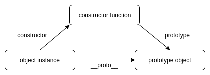

# **JavaScript Objects**

<br>

## **Table Of Contents**
<br>

- [**JavaScript Objects**](#javascript-objects)
  - [**Table Of Contents**](#table-of-contents)
  - [**Ways To Create Objects**](#ways-to-create-objects)
    - [**Object Literal**](#object-literal)
    - [**Object Method fromEntries()**](#object-method-fromentries)
    - [**Constructor Function**](#constructor-function)
    - [**Class**](#class)
    - [**Function Object.create()**](#function-objectcreate)
    - [**Recommended Method**](#recommended-method)
  - [**Access Attributes And Methods**](#access-attributes-and-methods)
    - [**Basic Access**](#basic-access)
    - [**Getter And Setter**](#getter-and-setter)
  - [**Add, Overwrite And Delete Attributes Or Methods**](#add-overwrite-and-delete-attributes-or-methods)
  - [**Iterate Over Attributes And Methods**](#iterate-over-attributes-and-methods)
  - [**Use Of Symbols For Unique Attributes**](#use-of-symbols-for-unique-attributes)
  - [**Prevent Object Modification**](#prevent-object-modification)
    - [**Object.preventExtensions()**](#objectpreventextensions)
    - [**Object.seal()**](#objectseal)
    - [**Object.freeze()**](#objectfreeze)

<br>
<br>
<br>

## **Ways To Create Objects**
<br>
<br>

### **Object Literal**
<br>

```javascript
let obj = { 
    key1: 'value';
    key2: 42.12;
    foo: function() {
        console.log(this.key1);
    }
}
```
<br>
<br>
<br>

### **Object Method fromEntries()**
<br>
  
* create object from two-dimensional array
* array contains arrays \[key, value\]

```javascript
let array = [['key1', 'value'], ['key2', 42.12], ['foo', function() {console.log(this.key1);}]];
let obj = Object.fromEntries(array);
```
<br>
<br>
<br>

### **Constructor Function**
<br>

```javascript
function Obj(value1, value2) {
    this.key1 = value1;
    this.key2 = value2;
    this.foo = function() { console.log(this.key1); }
}

let obj1 = new Obj('value', 42.12);
let obj2 = new Obj(42.12, 'value');
```
<br>

* every constructor function has an internal **prototype** object that is the base for newly created objects
* every object saves its constructor function in the attribute _constructor_
  
<br>



<br>
<br>
<br>

### **Class**
<br>

```javascript
class ClassName {

    constructor(arg1, arg2) {
        this.attribute1 = arg1;
        this.attribute2 = arg2;
    }

    methodName1() {...}

    methodName2() {...}
}


let obj = new ClassName('foo', 123.34);
```

* method _constructor_  is called implicitly on object creation
* classes are a syntactical alternative to constructor functions

<br>
<br>
<br>

### **Function Object.create()**
<br>

```javascript
let obj = Object.create(prototype, configurationObject);

// configuration object
{ 
attributeName1: {attributeProperty1: value1},

attributeName2: {attributeProperty1: value1}
                 attributeProptery2: value2,
                 attributeProperty3: value3}, 
                 
methodName: {value: function() { console.log('method implementation'); }}
}
```
<br>

|Attribute property |Description                                                                                          |
|:------------------|:----------------------------------------------------------------------------------------------------|
|value              |-                                                                                                    |
|writeable          |boolean indicating whether attribute can be overwritten (default: false)                             |
|enumerable         |boolean indicating whether attibute is returned on iteration over object attributes (default: false) |
|configurable       |boolean indicating whether attribute property is editable (default: false)                           |
|set                |defines function that is envoked upon writing to attribute                                           |
|get                |defines function that is envoked upon reading attribute                                              |

<br>
<br>

Access attribute properties
```javascript
Object.getOwnPropertyDescriptor(objectReference, attributeName);
// returns object containing all properties for attributeName of objectReference
```
<br>
<br>

Example:
```javascript
let person = Object.create(Object.prototype, {
                firstName: {
                    value: 'John',
                    writable: false,
                    configurable: true,
                    enumerable : true
                },
                lastName: {
                    value: 'Doe',
                    writable: true,
                    configurable: true,
                    enumerable: true
                },
                age: {
                    value: 34,
                    writable: false,
                    configurable: true,
                    enumerable : false
                },
                introduce: {
                    value: function() {
                        console.log(`Hello, my name is ${this.firstName} ${this.lastName}. I am currently ${this.age} years old.`);
                    }
                }
});


for (let property in person) {
    console.log(property);                      // output: 'firstName', 'lastName' (age is not printed to console, because age.enumerable is false
}

person.firstName = 'Jane';
console.log(person.firstName);                  // output: 'John' (because firstName.writable is false)

person.lastName = 'Dee';
console.log(person.lastName);                   // output: 'Dee' (because firstName.writable is true)

let propertyDescriptor = Object.getOwnPropertyDescriptor(person, 'firstName');
console.log(propertyDescriptor.value);          // output: 'John'
console.log(propertyDescriptor.writable);       // output: 'false'
console.log(propertyDescriptor.configurable);   // output: 'true'
console.log(propertyDescriptor.enumerable);     // output: 'true'
```

<br>
<br>
<br>

### **Recommended Method**
<br>

* Use object literal for simple objects with only one instance
* Use classes for objects with multiple instances
* Use Object.create() if you need attribute properties

<br>
<br>
<br>
<br>

## **Access Attributes And Methods**
<br>
<br>

### **Basic Access**
<br>

```javascript
// Ways to access attribute 
obj.attributeName;
obj['attributeName'];

// Ways to envoke method
obj.methodName();
obj['methodName']();
```

<br>
<br>

### **Getter And Setter**
<br>

* define attribute as _attributeName
* add prefixes _set_ or _get_ to setter or getter functions for attribute
* call setter or getter via object.attributName

<br>

Example:
```javascript
// Object Literal
let obj = {
    _bar: 'foo',
    set bar(param) { /* implementation */ },
    get bar() { return this._bar; }
}


// Constructor Function
function Obj(param) {
    this._bar = param;
}

Obj.prototype = {
    set bar(param) { /* implementation */ }
    get bar() { return this._bar; }
}


// Class
class Obj {
    constructor(param) {
        this._bar = param;
    }
    set bar(param) { /* implementation */ }
    get bar() { return this._bar; }
}


// Function Object.create()
obj = Object.create(Object.prototype, {
                bar: {
                    set: function(param) { /* implementation */ },
                    get: function() { return this._bar; }
                }
});
```

<br>
<br>
<br>
<br>

## **Add, Overwrite And Delete Attributes Or Methods**
<br>

Attributes and Methods can be dynamically added, overwritten and deleted at runtime.

```javascript
// Ways to add or overwrite attributes
obj.attributeName = 'new value';

obj['attributeName'] = 'new value';

Object.defineProperty(obj, 'attributeName', { value: 'new value'});

Object.defineProperties(obj, {attributeName1: {value: 'new value'},
                              attributeName2: {value: 'new value'}
                             });


// Ways to add or overwrite methods
obj.methodName = function() { /* implementation */ }

obj['methodName'] = function() { /* implementation */ }

Object.defineProperty(obj, 'methodName', {value: function() { /* implementation */ }});

Object.defineProperty(obj, {methodName1: {value: function() { /* implementation */ }},
                            methodName2: {value: function() { /* implementation */ }}
                           });


// Delete attribute or method
delete obj.attributeName;
delete obj.methodName;


// Check if attribute or method exist
console.log('attributeName' in obj);
console.log('methodName' in obj);
```

<br>
<br>
<br>
<br>

## **Iterate Over Attributes And Methods**
<br>

```javascript
// iterate over all enumerable elements of an object and its prototype via for-in loop
for (let element in obj) {
    console.log(`element name: ${element}`);
    console.log(`element value: ${obj[element]}`);
}


// iterate over array of element names
let elementNames = Object.keys(obj);
for (let i = 0; i < elementNames.length; i++) {
    console.log(`element name: ${elementNames[i]}`);
    console.log(`element value: ${obj[elementNames[i]]}`);
}


// iterate over array of element values
let elementValues = Object.values(obj);
for (let i = 0; i < elementValues.length; i++) {
    console.log(`element value: ${elementValues[i]}`);
}


// iterate over array of key-value pairs of elements
let elementKeyValuePairs = Object.entries(obj);
for (let i = 0; i < elementKeyValuePairs.length; i++) {
    console.log(`element name: ${elementKeyValuePairs[i][0]}`);
    console.log(`element value: ${elementKeyValuePairs[i][1]}`);
}
```

<br>
<br>
<br>
<br>

## **Use Of Symbols For Unique Attributes**
<br>

Using symbols for defining unique attributes prevents any call of this attribute other than by the symbol.

```javascript
const attribute1 = Symbol('attribute1');
const obj = {};
obj[attribute1] = 'value';

console.log(obj[attribute1]);       // output: value
console.log(obj[0]);                // output: undefined
console.log(obj.attribute1);        // output: undefined
console.log(obj['attribute1']);     // output: undefined   
```

<br>
<br>
<br>
<br>

## **Prevent Object Modification**
<br>

### **Object.preventExtensions()**
<br>

:x: add new attributes and methods to an object  
:heavy_check_mark: alter values of existing attributes and methods  
:heavy_check_mark: alter attribute properties (e.g. enumerable)

```javascript
let obj = {
    attribute1: 'value'
}

Object.preventExtensions(obj);
console.log(Object.isExtensible(obj));      // output: false

obj.attribute1 = 'newValue';
console.log(obj.attribute1);                // output: newValue

obj.newAttribute = 'value';                 // TypeError: Can't add property newAttribute, object is not extensible

console.log(Object.getOwnPropertyDescriptor(obj, 'attribute1').enumerable);     // output: true
Object.defineProperty(obj, 'attribute1', { enumerable: false });
console.log(Object.getOwnPropertyDescriptor(obj, 'attribute1').enumerable);     // output: false
```

<br>
<br>

### **Object.seal()**
<br>

:x: add new attributes and methods to an object  
:heavy_check_mark: alter values of existing attributes and methods  
:x: alter attribute properties (e.g. enumerable)

```javascript
let obj = {
    attribute1: 'value'
}

Object.seal(obj);
console.log(Object.isSealed(obj));          // output: true

obj.attribute1 = 'newValue';                
console.log(obj.attribute1);                // output: newValue

obj.newAttribute = 'value';                 // TypeError: Can't add property newAttribute, object is not extensible

Object.defineProperty(obj, 'attribute1', { enumerable: false });     // Uncaught TypeError: Cannot redefine property: attribute1
```

<br>
<br>

### **Object.freeze()**
<br>

:x: add new attributes and methods to an object  
:x: alter values of existing attributes and methods  
:x: alter attribute properties (e.g. enumerable)

```javascript
let obj = {
    attribute1: 'value'
}

Object.freeze(obj);
console.log(Object.isFrozen(obj));          // output: true

obj.attribute1 = 'newValue';                
console.log(obj.attribute1);                // output: value

obj.newAttribute = 'value';                 // TypeError: Can't add property newAttribute, object is not extensible

Object.defineProperty(obj, 'attribute1', { enumerable: false });     // Uncaught TypeError: Cannot redefine property: attribute1
```