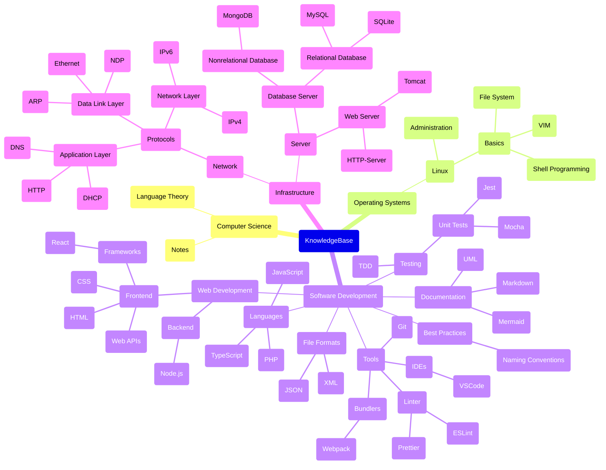

# **KnowlegeBase**
 

```mermaid
mindmap
   (KnowledgeBase)
      (Computer Science)
         (Language Theory)
         (Notes)
      (Operating Systems)
         (Linux)
            (Basics)
               (File System)
               (Shell Programming)
               (VIM)
            (Administration)

      (Software Development)
         (File Formats)
            (JSON)
            (XML)
         (Tools)
            (Git)
            (IDEs)
               (VSCode)
            (Linter)
               (ESLint)
               (Prettier)
            (Bundlers)
               (Webpack)
         (Best Practices)
            (Naming Conventions)
         (Documentation)
            (Markdown)
            (Mermaid)
            (UML)
         (Testing)
            (TDD)
            (Unit Tests)
               (Jest)
               (Mocha)
         (Languages)
            (JavaScript)
            (TypeScript)
            (PHP)
         (Web Development)
            (Backend)
               (Node.js)
            (Frontend)
               (HTML)
               (CSS)
               (Frameworks)
                  (React)
            
               (Web APIs)
      (Infrastructure)
         (Network)
            (Protocols)
               (Application Layer)
                  (DHCP)
                  (DNS)
                  (HTTP)
               (Network Layer)
                  (IPv4)
                  (IPv6)
               (Data Link Layer)
                  (ARP)
                  (NDP)
                  (Ethernet)
         (Server)
            (Database Server)
               (Relational Database)
                  (MySQL)
                  (SQLite)
               (Nonrelational Database)
                  (MongoDB)
            (Web Server)
               (Tomcat)
               (HTTP-Server)

```