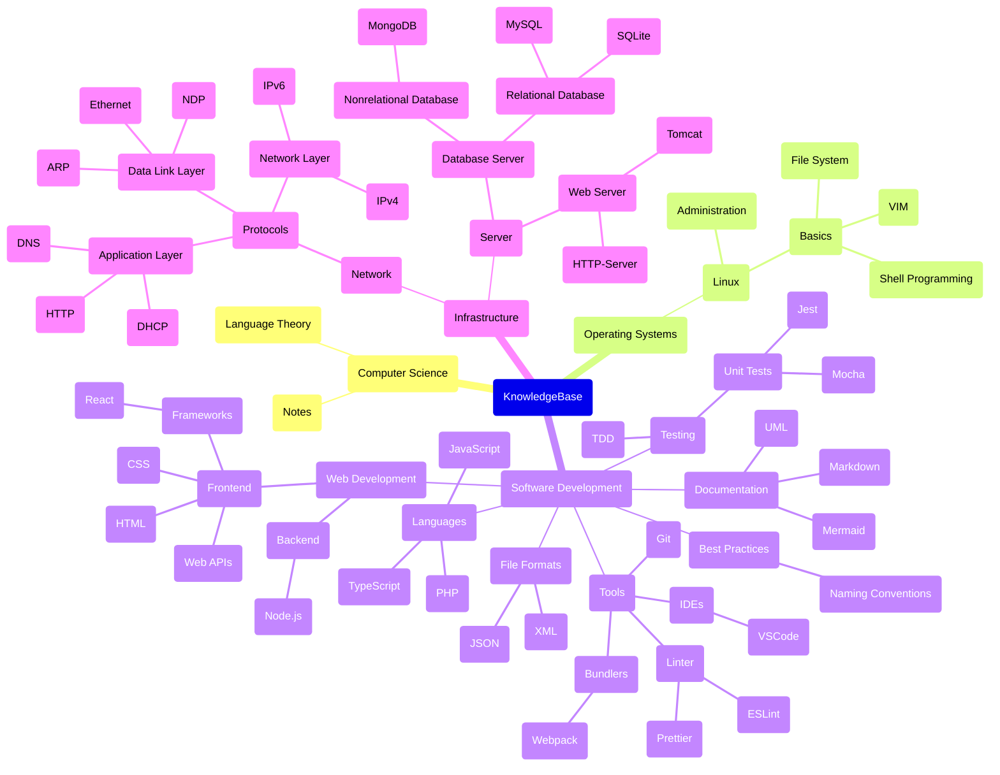

# **KnowlegeBase**
 

 
 
 

## **Topics To Learn**
 

### **Languages**

- [ ] JavaScript Indepth
- [ ] TypeScript Indepth
- [ ] Backend (Java, C# or Go)
- [ ] C
- [ ] Rust

 

### **Web Development Topics**

- [ ] Progressive Web Apps
- [ ] Shadow DOM
- [ ] Web Security
- [ ] CSS Indepth
- [ ] SASS
- [ ] Web Components
- [ ] Accessibility
- [ ] Authentification
- [ ] Next.js
- [ ] Constructable Style Sheets
  - [ ] CSS Modules
  - [ ] CSS Module Scripts

 

### **Web APIs**

- [ ] Console API
- [ ] URL API
- [ ] Pointer Event API
- [ ] `Intl` object

 

### **Frontend Frameworks**

- [ ] React Indepth
- [ ] Angular
- [ ] Vue
- [ ] Svelte
- [ ] Lit

 

### **Testing**

- [ ] React Component Testing
- [ ] Testing Library
- [ ] Cypress
- [ ] Mocha
- [ ] Playwright

 

### **Databases**

- [ ] Document SQL Basics
- [ ] Document MySQL and MariaDB
- [ ] Indexes
- [ ] Administration
- [ ] SQLite

 

### **API**

- [ ] API Design
- [ ] Rest APIs
- [ ] GraphQL APIs
- [ ] SOAP APIs
- [ ] Postman
- [ ] WSDL (Web Services Description Language)

 

### **Software Engineering**

- [ ] Engineering Process
- [ ] Agile Development
- [ ] Software Architecture
- [ ] Design Patterns
- [ ] Domain-Driven Design

 

### **Tools**
 

#### **Build Tools**

- [ ] Document Webpack
- [ ] Vite

#### **QA**

- [ ] ESLint
- [ ] Prettier
- [ ] JSDOC
- [ ] Swagger

#### **Other**

- [ ] CI/CD Pipeline
- [ ] Docker
- [ ] Electron
- [ ] Figma
- [ ] Git Indepth
- [ ] Wireshark
- [ ] Fiddler
- [ ] Ghidra
- [ ] MathJax

 

### **Operating System**

- [ ] Theory And Fundamentals
- [ ] Linux Indepth
- [ ] Linux commands
  - [ ] nmap
  - [ ] dig
  - [ ] grep
  - [ ] ldd
  - [ ] find
  - [ ] nc 

 

### **Miscellaneous**

- [ ] Networking
- [ ] Cloud Computing (AWS, Azure, ...)
- [ ] Machine Learning Basics
- [ ] Compiler Construction
- [ ] Electrical Engineering Basics