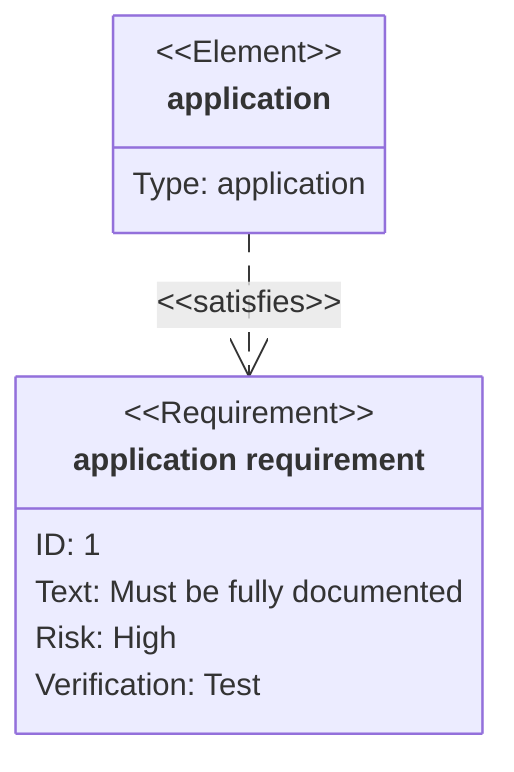
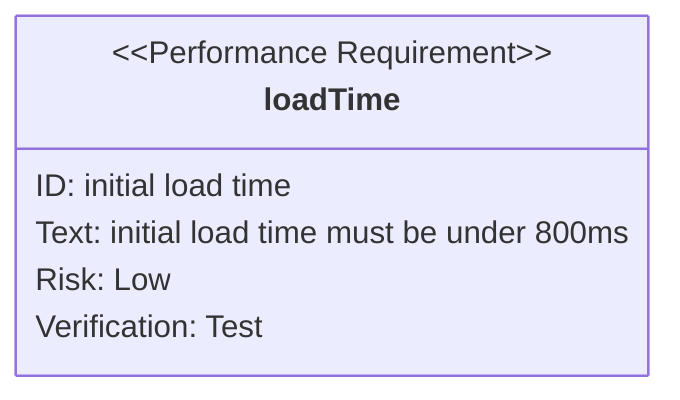

# **Mermaid Requirement Diagram**
<br>

## **Table Of Contents**
<br>

- [**Mermaid Requirement Diagram**](#mermaid-requirement-diagram)
  - [**Table Of Contents**](#table-of-contents)
  - [**General**](#general)
  - [**Syntax**](#syntax)
    - [**Element**](#element)
    - [**Requirement**](#requirement)
      - [**Types**](#types)
      - [**Risks**](#risks)
      - [**Verify Methods**](#verify-methods)
    - [**Relationship**](#relationship)
      - [**Types**](#types-1)

<br>
<br>
<br>

## **General**
<br>



<br>
<br>

## **Syntax**
<br>
<br>

Basic syntax:

```
requirementDiagram
    <requirement definition>
    <element definition>
    <element> <arrow> <requirement>
```

<br>
<br>

### **Element**
<br>

Basic syntax:

```element <element name> {
    type: <user input>
    docref: <user input>
}
```

<br>

```
requirementDiagram
    element repository {
        type: application
        docref: https://github.com
    }
```

<br>

```mermaid
requirementDiagram
    element repository {
        type: application
        docref: https://github.com
    }
```

<br>
<br>

### **Requirement**
<br>

Basic syntax:

```
<type> <requirement name> {
    id: <user input>
    text: <user input>
    risk: <risk>
    verifymethod: <verify method>
}
```

<br>

```
requirementDiagram
    performanceRequirement loadTime {
        id: initial load time
        text: initial load time must be under 800ms
        risk: Low
        verifymethod: Test
    }
```

<br>



<br>
<br>

#### **Types**
<br>

|Type                   |
|:----------------------|
|requirement            |
|physicalRequirement    |
|interfaceRequirement   |
|functionalRequirement  |
|performanceRequirement |
|designConstraint       |

<br>

#### **Risks**
<br>

|Risk   |
|:------|
|High   |
|Medium |
|Low    |

<br>

#### **Verify Methods**
<br>

|Verification Method |
|:-------------------|
|Test                |
|Inspection          |
|Analysis            |
|Demonstration       |

<br>
<br>

### **Relationship**
<br>

Basic syntax:

```
<source> - <type> -> <destination>
```

<br>

```
requirementDiagram

    requirement "application requirement" {
        id: 1
        text: Must be fully documented
        risk: high
        verifymethod: test
    }

    element application{
        type: application
    }

    application - satisfies -> application requirement
```

<br>


<br>
<br>

#### **Types**
<br>

|Type      |
|:---------|
|copies    |
|contains  |
|derives   |
|refines   |
|traces    |
|satisfies |
|verifies  |