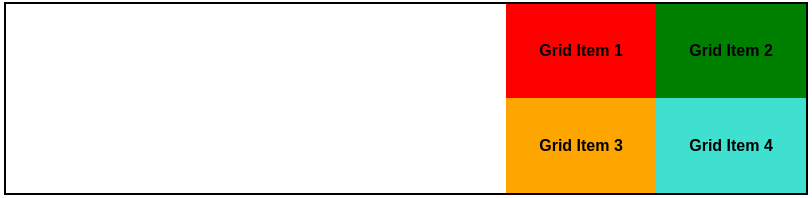

# **CSS Grid**
<br>

## **Table Of Contents**
<br>

- [**CSS Grid**](#css-grid)
  - [**Table Of Contents**](#table-of-contents)
  - [**General**](#general)
    - [**Terminology**](#terminology)
    - [**Grid Line Enumeration**](#grid-line-enumeration)
  - [**Example**](#example)
  - [**Grid Container**](#grid-container)
    - [**Define Dimensions**](#define-dimensions)
      - [**grid-template-columns**](#grid-template-columns)
      - [**grid-template-rows**](#grid-template-rows)
      - [**grid-template-areas**](#grid-template-areas)
    - [**Gaps**](#gaps)
      - [**column-gap**](#column-gap)
      - [**row-gap**](#row-gap)
      - [**gap (shorthand)**](#gap-shorthand)
    - [**Grid Alignment**](#grid-alignment)
      - [**Row Axis (justify-content)**](#row-axis-justify-content)
        - [**start**](#start)
        - [**end**](#end)
        - [**center**](#center)
        - [**space-around**](#space-around)
        - [**space-between**](#space-between)
        - [**space-evenly**](#space-evenly)
      - [**Column Axis (align-content)**](#column-axis-align-content)
        - [**start**](#start-1)
        - [**end**](#end-1)
        - [**center**](#center-1)
        - [**space-around**](#space-around-1)
        - [**space-between**](#space-between-1)
        - [**space-evenly**](#space-evenly-1)
      - [**Shorthand (place-content)**](#shorthand-place-content)
    - [**Item Alignment**](#item-alignment)
      - [**Row Axis (justify-items)**](#row-axis-justify-items)
        - [**start**](#start-2)
        - [**end**](#end-2)
        - [**center**](#center-2)
        - [**stretch**](#stretch)
      - [**Column Axis (align-items)**](#column-axis-align-items)
        - [**start**](#start-3)
        - [**end**](#end-3)
        - [**center**](#center-3)
        - [**stretch**](#stretch-1)
      - [**Shorthand (place-items)**](#shorthand-place-items)
  - [**Grid Items**](#grid-items)
    - [**Positioning**](#positioning)
      - [**Column Position**](#column-position)
      - [**Row Position**](#row-position)
      - [**Grid Area**](#grid-area)
    - [**Alignment**](#alignment)
      - [**Row-Axis (justify-self)**](#row-axis-justify-self)
        - [**start**](#start-4)
        - [**end**](#end-4)
        - [**center**](#center-4)
        - [**stretch**](#stretch-2)
      - [**Column-Axis (align-self)**](#column-axis-align-self)
        - [**start**](#start-5)
        - [**end**](#end-5)
        - [**center**](#center-5)
        - [**stretch**](#stretch-3)
      - [**Shorthand (place-self)**](#shorthand-place-self)

<br>
<br>
<br>
<br>

## **General**
<br>

Grid...
* is used to align items into a two-dimensional grid layout

<br>
<br>
<br>

### **Terminology**
<br>


<br>
<br>
<br>

### **Grid Line Enumeration**
<br>

 

<br>
<br>
<br>
<br>

## **Example**
<br>

HTML:
```html
<div class="grid-container">
    <div id="grid-item-1" class="grid-item">Grid Item 1</div>
    <div id="grid-item-2" class="grid-item">Grid Item 2</div>
    <div id="grid-item-3" class="grid-item">Grid Item 3</div>
    <div id="grid-item-4" class="grid-item">Grid Item 4</div>
</div>
```

<br>

CSS:

```css
.grid-container {
    display: grid;
    gap: 1rem;
    grid-template-columns: 100px 450px;
    grid-template-rows: 70px 200px;
}
```

```css
#grid-item-2 {
    background-color: green;
    grid-row: 2;
    grid-column: 1;
}
```

<br>


<br>
<br>
<br>
<br>

## **Grid Container**
<br>
<br>
<br>

### **Define Dimensions**
<br>

|Unit |Description                           |
|:----|:-------------------------------------|
|px   |pixel length                          |
|x%   |percentage of parent                  |
|fr   |fraction of available space of parent |

<br>
<br>

#### **grid-template-columns**
<br>

* defines columns of the grid via space separated list of track sizes
* allows assigning optional linenames that can be used instead of the line enumeration

<br>

```
grid-template-columns: [linename alternateLinename] 20% ...
```

<br>
<br>

```css
.grid-container {
    grid-template-columns: 200px 500px;
}
```

<br>


<br>
<br>

#### **grid-template-rows**
<br>

* defines tows of the grid via space separated list of track sizes
* allows assigning optional linenames that can be used instead of the line enumeration

<br>

```
grid-template-rows: [linename alternateLinename] 20% ...
```

<br>
<br>

```css
.grid-container {
    grid-template-rows: 50px 150px;
}
```

<br>


<br>
<br>

#### **grid-template-areas**
<br>

* allows to describe layout using grid area names
* allows spanning areas by repeated use of same name

<br>

|Value         |Description             |
|:-------------|:-----------------------|
|.             |empty cell              |
|\<area-name\> |cell of named grid area |

<br>

HTML

```html
<div class="grid-container">
    <div id="grid-item-1">Header</div>
    <div id="grid-item-2">Content</div>
    <div id="grid-item-3">Sidebar</div>
    <div id="grid-item-4">Footer</div>
</div>
```

<br>

CSS

```css
.grid-container {
    display: grid;
    grid-template-areas: 
        "header header header"
        "content . sidebar"
        "content footer footer";
}
```

<br>


<br>
<br>
<br>

### **Gaps**
<br>
<br>

#### **column-gap**
<br>

```css
.grid-container {
    column-gap: 20px;
    display: grid;
    grid-template-rows: repeat(2, 1fr);
    grid-template-columns: repeat(2, 1fr);
}
```

<br>


<br>
<br>

#### **row-gap**
<br>

```css
.grid-container {
    row-gap: 20px;
    display: grid;
    grid-template-rows: repeat(2, 1fr);
    grid-template-columns: repeat(2, 1fr);
}
```

<br>


<br>
<br>

#### **gap (shorthand)**
<br>

* shorthand for [column-gap](#column-gap) and [row-gap](#row-gap)

<br>

```css
.grid-container {
    gap: 20px;
    display: grid;
    grid-template-rows: repeat(2, 1fr);
    grid-template-columns: repeat(2, 1fr);
}
```

<br>


<br>
<br>
<br>

### **Grid Alignment**
<br>
<br>

#### **Row Axis (justify-content)**
<br>

* horizontally aligns entire grid if combined width of grid items is less than width of grid container

<br>
<br>

##### **start**
<br>

```css
.grid-container {
    display: grid;
    grid-template-rows: repeat(2, 1fr);
    grid-template-columns: repeat(2, 150px);
    justify-content: start;
}
```

<br>


<br>
<br>

##### **end**
<br>

```css
.grid-container {
    display: grid;
    grid-template-rows: repeat(2, 1fr);
    grid-template-columns: repeat(2, 150px);
    justify-content: end;
}
```

<br>



<br>
<br>

##### **center**
<br>

```css
.grid-container {
    display: grid;
    grid-template-rows: repeat(2, 1fr);
    grid-template-columns: repeat(2, 150px);
    justify-content: center;
}
```

<br>


<br>
<br>

##### **space-around**
<br>

```css
.grid-container {
    display: grid;
    grid-template-rows: repeat(2, 1fr);
    grid-template-columns: repeat(2, 150px);
    justify-content: space-around;
}
```

<br>


<br>
<br>

##### **space-between**
<br>

```css
.grid-container {
    display: grid;
    grid-template-rows: repeat(2, 1fr);
    grid-template-columns: repeat(2, 150px);
    justify-content: space-between;
}
```

<br>


<br>
<br>

##### **space-evenly**
<br>

```css
.grid-container {
    display: grid;
    grid-template-rows: repeat(2, 1fr);
    grid-template-columns: repeat(2, 150px);
    justify-content: space-evenly;
}
```

<br>


<br>
<br>

#### **Column Axis (align-content)**
<br>

* vertically aligns entire grid if combined height of grid items is less than height of grid container

<br>
<br>

##### **start**
<br>

```css
.grid-container {
    display: grid;
    grid-template-rows: repeat(2, 50px);
    grid-template-columns: repeat(2, 1fr);
    align-content: start;
}
```

<br>


<br>
<br>

##### **end**
<br>

```css
.grid-container {
    display: grid;
    grid-template-rows: repeat(2, 50px);
    grid-template-columns: repeat(2, 1fr);
    align-content: end;
}
```

<br>


<br>
<br>

##### **center**
<br>

```css
.grid-container {
    display: grid;
    grid-template-rows: repeat(2, 50px);
    grid-template-columns: repeat(2, 1fr);
    align-content: center;
}
```

<br>


<br>
<br>

##### **space-around**
<br>

```css
.grid-container {
    display: grid;
    grid-template-rows: repeat(2, 50px);
    grid-template-columns: repeat(2, 1fr);
    align-content: space-around;
}
```

<br>


<br>
<br>

##### **space-between**
<br>

```css
.grid-container {
    display: grid;
    grid-template-rows: repeat(2, 50px);
    grid-template-columns: repeat(2, 1fr);
    align-content: space-between;
}
```

<br>


<br>
<br>

##### **space-evenly**
<br>

```css
.grid-container {
    display: grid;
    grid-template-rows: repeat(2, 50px);
    grid-template-columns: repeat(2, 1fr);
    align-content: space-evenly;
}
```

<br>


<br>
<br>

#### **Shorthand (place-content)**
<br>

* shorthand for [align-content](#column-axis-align-content) and [justify-content](#row-axis-justify-content)

<br>
<br>

```css
.grid-container {
    display: grid;
    grid-template-rows: repeat(2, 50px);
    grid-template-columns: repeat(2, 150px);
    place-content: start center;
}
```

equals

```css
.grid-container {
    display: grid;
    grid-template-rows: repeat(2, 50px);
    grid-template-columns: repeat(2, 150px);
    align-content: start;
    justify-content: center;
}
```

<br>


<br>
<br>
<br>

### **Item Alignment**
<br>
<br>

#### **Row Axis (justify-items)**
<br>

* aligns items along row axis
* default: stretch

<br>
<br>

##### **start**
<br>

```css
.grid-container {
    display: grid;
    grid-template-rows: repeat(2, 1fr);
    grid-template-columns: repeat(2, 1fr);
    justify-items: start;
}
```

<br>


<br>
<br>

##### **end**
<br>

```css
.grid-container {
    display: grid;
    grid-template-rows: repeat(2, 1fr);
    grid-template-columns: repeat(2, 1fr);
    justify-items: end;
}
```

<br>


<br>
<br>

##### **center**
<br>

```css
.grid-container {
    display: grid;
    grid-template-rows: repeat(2, 1fr);
    grid-template-columns: repeat(2, 1fr);
    justify-items: center;
}
```

<br>


<br>
<br>

##### **stretch**
<br>

```css
.grid-container {
    display: grid;
    grid-template-rows: repeat(2, 1fr);
    grid-template-columns: repeat(2, 1fr);
    justify-items: stretch;
}
```

<br>


<br>
<br>

#### **Column Axis (align-items)**
<br>

* aligns items along column axis
* default: stretch

<br>
<br>

##### **start**
<br>

```css
.grid-container {
    display: grid;
    grid-template-rows: repeat(2, 1fr);
    grid-template-columns: repeat(2, 1fr);
    align-items: start;
}
```

<br>


<br>
<br>

##### **end**
<br>

```css
.grid-container {
    display: grid;
    grid-template-rows: repeat(2, 1fr);
    grid-template-columns: repeat(2, 1fr);
    align-items: end;
}
```

<br>


<br>
<br>

##### **center**
<br>

```css
.grid-container {
    display: grid;
    grid-template-rows: repeat(2, 1fr);
    grid-template-columns: repeat(2, 1fr);
    align-items: center;
}
```

<br>


<br>
<br>

##### **stretch**
<br>

```css
.grid-container {
    display: grid;
    grid-template-rows: repeat(2, 1fr);
    grid-template-columns: repeat(2, 1fr);
    align-items: stretch;
}
```

<br>


<br>
<br>

#### **Shorthand (place-items)**
<br>

* shorthand for [align-items](#column-axis-align-items) and [justify-items](#row-axis-justify-items)

<br>
<br>

```css
.grid-container {
    display: grid;
    grid-template-rows: repeat(2, 1fr);
    grid-template-columns: repeat(2, 1fr);
    place-items: start end;
}
```

equals 

```css
.grid-container {
    display: grid;
    grid-template-rows: repeat(2, 1fr);
    grid-template-columns: repeat(2, 1fr);
    align-items: start;
    justify-items: end;
}
```

<br>


<br>
<br>

```css
.grid-container {
    display: grid;
    grid-template-rows: repeat(2, 1fr);
    grid-template-columns: repeat(2, 1fr);
    place-items: center;
}
```

equals 

```css
.grid-container {
    display: grid;
    grid-template-rows: repeat(2, 1fr);
    grid-template-columns: repeat(2, 1fr);
    align-items: center;
    justify-items: center;
}
```

<br>


<br>
<br>
<br>
<br>

## **Grid Items**
<br>
<br>
<br>

### **Positioning**
<br>
<br>

#### **Column Position**
<br>

|Property          |Description                                         |
|:-----------------|:---------------------------------------------------|
|grid-column-start |specify item start position (inclusive)             |
|grid-column-end   |specify item end position (inclusive)               |
|grid-column       |shorthand for grid-column-start and grid-column-end |

<br>

```css
.grid-container {
    display: grid;
    grid-template-rows: repeat(3, 1fr);
    grid-template-columns: repeat(3, 1fr);
}
```

<br>

```css
#grid-item-1 {
    grid-column: 1 / 3;
}
```

equals

```css
#grid-item-1 {
    grid-column-start: 1;
    grid-column-end: 3;
}
```

<br>


<br>
<br>

#### **Row Position**
<br>

|Property          |Description                                         |
|:-----------------|:---------------------------------------------------|
|grid-row-start    |specify item start position (inclusive)             |
|grid-row-end      |specify item end position (inclusive)               |
|grid-row          |shorthand for grid-row-start and grid-row-end       |

<br>

```css
.grid-container {
    display: grid;
    grid-template-rows: repeat(3, 1fr);
    grid-template-columns: repeat(3, 1fr);
}
```

<br>

```css
#grid-item-1 {
    grid-row: 1 / 4;
}
```

equals

```css
#grid-item-1 {
    grid-row-start: 1;
    grid-row-end: 4;
}
```

<br>


<br>
<br>

#### **Grid Area**
<br>

* allows naming items and position it accordingly to [grid-template-areas](#grid-template-areas)

<br>

```css
.grid-container {
    border: 2px solid black;
    display: grid;
    grid-template-areas: 
        "header header header"
        "content . sidebar"
        "content footer footer";
}
```

<br>

```css
#grid-item-2 {
    grid-area: header;
}
```

<br>


<br>
<br>
<br>

### **Alignment**
<br>
<br>

#### **Row-Axis (justify-self)**
<br>

* horizontally aligns item within assigned item space

<br>
<br>

##### **start**
<br>

```css
.grid-container {
    display: grid;
    grid-template-rows: repeat(2, 1fr);
    grid-template-columns: repeat(2, 1fr);
}

#grid-item-1 {
    justify-self: start;
}
```

<br>


<br>
<br>

##### **end**
<br>

```css
.grid-container {
    display: grid;
    grid-template-rows: repeat(2, 1fr);
    grid-template-columns: repeat(2, 1fr);
}

#grid-item-1 {
    justify-self: end;
}
```

<br>


<br>
<br>

##### **center**
<br>

```css
.grid-container {
    display: grid;
    grid-template-rows: repeat(2, 1fr);
    grid-template-columns: repeat(2, 1fr);
}

#grid-item-1 {
    justify-self: center;
}
```

<br>


<br>
<br>

##### **stretch**
<br>

```css
.grid-container {
    display: grid;
    grid-template-rows: repeat(2, 1fr);
    grid-template-columns: repeat(2, 1fr);
}

#grid-item-1 {
    justify-self: stretch;
}
```

<br>


<br>
<br>

#### **Column-Axis (align-self)**
<br>

* vertically aligns item within assigned item space

<br>
<br>

##### **start**
<br>

```css
.grid-container {
    display: grid;
    grid-template-rows: repeat(2, 1fr);
    grid-template-columns: repeat(2, 1fr);
}

#grid-item-1 {
    align-self: start;
}
```

<br>


<br>
<br>

##### **end**
<br>

```css
.grid-container {
    display: grid;
    grid-template-rows: repeat(2, 1fr);
    grid-template-columns: repeat(2, 1fr);
}

#grid-item-1 {
    align-self: end;
}
```

<br>


<br>
<br>

##### **center**
<br>

```css
.grid-container {
    display: grid;
    grid-template-rows: repeat(2, 1fr);
    grid-template-columns: repeat(2, 1fr);
}

#grid-item-1 {
    align-self: center;
}
```

<br>


<br>
<br>

##### **stretch**
<br>

```css
.grid-container {
    display: grid;
    grid-template-rows: repeat(2, 1fr);
    grid-template-columns: repeat(2, 1fr);
}

#grid-item-1 {
    align-self: stretch;
}
```

<br>


<br>
<br>

#### **Shorthand (place-self)**
<br>

* shorthand for [align-self](#column-axis-align-self) and [justify-self](#row-axis-justify-self)

<br>

```css
.grid-container {
    display: grid;
    grid-template-rows: repeat(2, 1fr);
    grid-template-columns: repeat(2, 1fr);
}

```

<br>

```css
#grid-item-1 {
    place-self: start center;
}
```

equals

```css
#grid-item-1 {
    align-self: start;
    justify-self: center;
}
```

<br>

