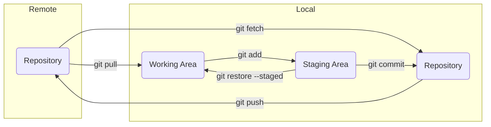

# **Git Basics**
 
 

## **Table Of Contents**
 

- [**Git Basics**](#git-basics)
  - [**Table Of Contents**](#table-of-contents)
  - [**Basic Git Workflow**](#basic-git-workflow)

 
 
 

## **Basic Git Workflow**
 

All changes to a repository have one of the following states:

|State     |Location     |
|:---------|:------------|
|Untracked |Work Area    |
|Staged    |Staging Area |
|Committed |Repository   |

 
 

