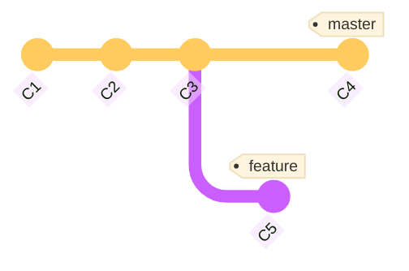
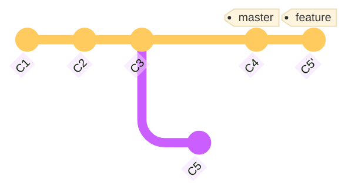
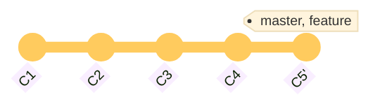

# **Git Basics**
<br>
<br>

## **Table Of Contents**
<br>

- [**Git Basics**](#git-basics)
  - [**Table Of Contents**](#table-of-contents)
  - [**General**](#general)
  - [**Git Terminology**](#git-terminology)
  - [**Data Model**](#data-model)
    - [**Overview**](#overview)
    - [**Implementation**](#implementation)
  - [**Basic Git Workflow**](#basic-git-workflow)
  - [**Branches**](#branches)
    - [**Merge**](#merge)
      - [**Fast-Forward-Merge**](#fast-forward-merge)
      - [**Recursive Merge**](#recursive-merge)
      - [**Merge With Conflicts**](#merge-with-conflicts)
    - [**Rebase**](#rebase)
  - [**Ignore Files**](#ignore-files)

<br>
<br>
<br>

## **General**
<br>

- Git is a version control system
  - keeps track of changes to files in snapshots
  - support collaboration of differrent people

<br>
<br>
<br>

## **Git Terminology**
<br>

|Git  |Description |
|:----|:-----------|
|tree |Folder      |
|blob |File        |

<br>
<br>
<br>

## **Data Model**
<br>
<br>

### **Overview**
<br>

Git uses a **directed acyclic graph** to model changes over time:

<br>


<br>

- Each node in this graph represents a **snapshot of the tree at some point in time** plus **metadata** (who made what changes and when?)
- In Git terminology each node is called a **commit** and each edge is called a **reference**.
- Internally each commit has a unique identifier (hash value).

<br>
<br>

### **Implementation**
<br>

```javascript
type blob = byte[]

type tree = map<string, blob | tree>

type commit = {
  parents: commit[],
  metadata: string[]
  snapshot: tree
}

type object = blob | tree | commit

type objects = map<string, object>

function store(in)
  id: sha1(in)
  object[id] 

type references = map<string, string>   // maps alphanumerical name to hash id
```

<br>


<br>
<br>
<br>

## **Basic Git Workflow**
<br>

All changes to a repository have one of the following states:

|State     |Location     |
|:---------|:------------|
|Untracked |Work Area    |
|Staged    |Staging Area |
|Committed |Repository   |

<br>
<br>


<br>
<br>
<br>

## **Branches**
<br>

- Branches are **movable** pointers to a specific commit
- A Branch contains the commit the pointer is referencing and all previous commits
- The currently selected branch is marked by the `HEAD` reference

<br>


<br>
<br>

### **Merge**
<br>

We can incorporate changes of one branch into another branch by **merging**.

<br>

> **WARNING**  
> Do not try to merge when you still have uncommitted changes! They may be lost when a merge conflict occurs!

<br>
Depending on the situation Git executes one of the following merging strategies:

<br>
<br>

#### **Fast-Forward-Merge**
<br>

- Git merges two branches by simply moving the branch reference forward
- only when the branch you merge into is the direct predecessor of the current branch and was not changed

<br>

Before:


<br>

After:


<br>
<br>

#### **Recursive Merge**
<br>

- Git merges two branches that diverged at some point in time via three-way-merge

<br>

Before:


<br>

After:


<br>
<br>

#### **Merge With Conflicts**
<br>

- Git merges two branches that diverged at some point in time via [recursive merge](#recursive-merge)
- Merge conflicts must be **manually** resolved

<br>
<br>

### **Rebase**
<br>

Rebasing is another way to incorporate changes of a branch into another branch. Instead of merging the branches, we take all changes and apply them to the current branch as **different** commits.

<br>

>**Warning**  
>Never rebase commits outside of your repository that are the basis of the work of other contributors!

<br>

Basic Rebase:

1. Go to the common ancestor of the current branch and the branch we are rebasing onto
2. Save diff of each commit of current branch to temporary file
3. Reset current branch to state of branch we are rebasing onto
4. Apply temporary saved changes

<br>

```branch
git switch feature
git rebase master
```

<br>

Before:



<br>

After:



<br>

Now we can do a simple fast-forward merge:

```bash
git switch master
git merge feature
```

<br>



<br>
<br>
<br>

## **Ignore Files**
<br>

Files that git should ignore can be specified in the `.gitignore` file