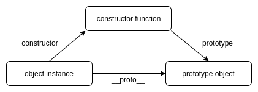

# **JavaScript Prototype**

<br>

## **Table Of Contents**
<br>

- [**JavaScript Prototype**](#javascript-prototype)
  - [**Table Of Contents**](#table-of-contents)
  - [**General**](#general)
  - [**Create Object With Specific Prototype**](#create-object-with-specific-prototype)
  - [**Access Prototype**](#access-prototype)
  - [**Check Prototype**](#check-prototype)
  - [**Prototype Chain**](#prototype-chain)
  - [**Check Whether Object Defines Own Properties**](#check-whether-object-defines-own-properties)

<br>
<br>
<br>
<br>


## **General**
<br>

* every object (except root _Object_) is based on another object (prototype)
  
* reference to prototype of an object is stored in the \__proto__ property

* prototype of root _Object_ is _null_ 

* every object can be used as a prototype of other objects (default: _Object_)

* objects inherit all properties (= variables and functions) of their prototype

<br>
<br>




<br>
<br>
<br>
<br>


## **Create Object With Specific Prototype**
<br>

```javascript
Object.create(prototype);
```

<br>


```javascript
const prototypeObject = {
    foo: function() {
        console.log('defined in prototypeObject');
    }
}

const newObject = Object.create(prototypeObject);
newObject.foo();                                            // 'defined in prototypeObject'
```

<br>
<br>
<br>
<br>


## **Access Prototype**
<br>

```javascript
Object.getPrototypeOf(obj)
```

<br>

```javascript
const prototype = Object.getPrototypeOf(newObject);

//  {foo: f}
//      foo: f ()
//      [[Prototype]]: Object
```

<br>
<br>
<br>
<br>

## **Check Prototype**
<br>

```javascript
objectA.isPrototypeOf(ObjectB)
```

<br>

```javascript
newObject.isPrototypeOf(prototypeObject);           // false
prototypeObject.isPrototypeOf(newObject);           // true              
```

<br>
<br>
<br>
<br>

## **Prototype Chain**
<br>

Assume we call a property of an object:

1. Check if property is defined at current object

2. If property is not found: 
   
   1. Prototype is defined: Go to prototype and resume with step 1

   2. Prototype is null: end search

<br>
<br>

```javascript
const objA = {property1: 'A', property2: 'A'};
const objB = Object.create(objA);
objB.property1 = 'B';


console.log(objB.property1);                    // 'B' (Shadowing objA.property1)
console.log(objB.property2);                    // 'A'
console.log(objB.property3);                    // 'undefined'
```

<br>
<br>
<br>
<br>

## **Check Whether Object Defines Own Properties**
<br>

```javascript
Object.hasOwn(obj, propertyName);
```

<br>

```javascript
Object.hasOwn(objB, 'property1');               // true
Object.hasOwn(objB, 'property2');               // false
```