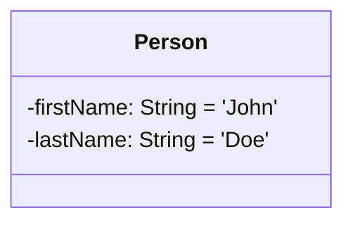
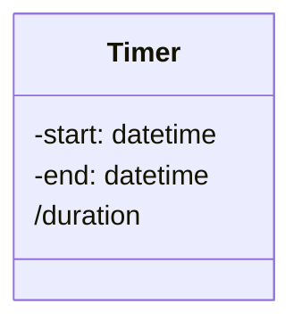
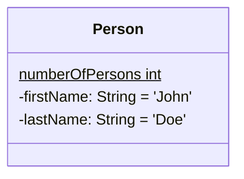
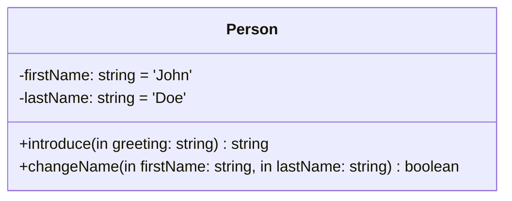
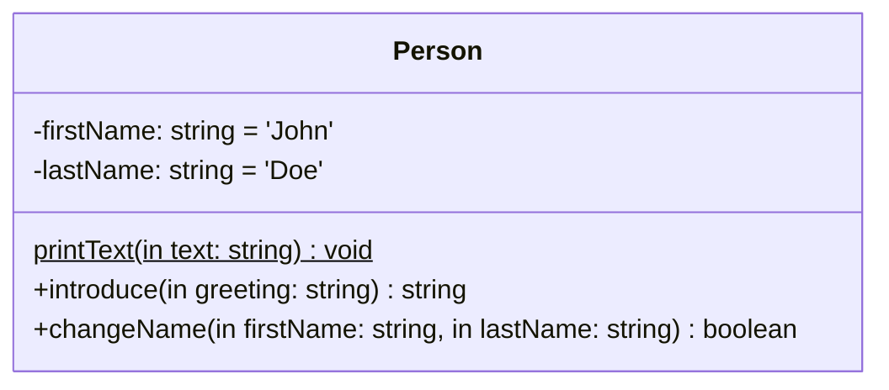

# **UML Class Diagram**
<br>

## **Table Of Contents**
<br>

- [**UML Class Diagram**](#uml-class-diagram)
  - [**Table Of Contents**](#table-of-contents)
  - [**Classes**](#classes)
    - [**Attributes**](#attributes)
      - [**Instance Attributes**](#instance-attributes)
        - [**Visibility Flags**](#visibility-flags)
        - [**Modification Flags**](#modification-flags)
      - [**Derived Attributes**](#derived-attributes)
      - [**Class Attribute**](#class-attribute)
    - [**Methods**](#methods)
      - [**Instance Methods**](#instance-methods)
        - [**Parameter Modes**](#parameter-modes)
      - [**Class Methods**](#class-methods)

<br>
<br>
<br>

## **Classes**
<br>
<br>

### **Attributes**
<br>
<br>

#### **Instance Attributes**
<br>

```
[visibilityFlag] <attributeName>: <type> [= <defaultValue>] [{modificationFlag}]
```

<br>

Example:



<br>
<br>

##### **Visibility Flags**
<br>

|Flag |Description
|:---:|:------------
|+    |public
|-    |private
|#    |protected

<br>
<br>

##### **Modification Flags**
<br>

|Flag       |Description
|:----------|:-----------
|changeable |attribute can be modified
|frozen     |attribute is readonly

<br>
<br>

#### **Derived Attributes**
<br>

* attribute that is calculated from other attributes
* does not determine whether attribute is physically stored

```
/ <attributeName>: <type>
```

<br>

Example:



<br>
<br>

#### **Class Attribute**
<br>

```
<attributeName>: <type>
-----------------------
```

<br>

Example:



<br>
<br>

### **Methods**
<br>
<br>

#### **Instance Methods**
<br>

```
[visibilityFlag] <methodName>([parameterMode] <parameterName>: <parameterType>): <resultType> [{isQuery}]
```

<br>

Example:



<br>
<br>

##### **Parameter Modes**
<br>

|Mode  |Description
|:-----|:------------------------------
|in    |use parameter argument by value (= can not be modified for outer scope)
|inout |use parameter argument by reference (= can be modified for outer scope)
|out   |reference parameter that is used to return method results to outer scope

<br>
<br>

#### **Class Methods**
<br>



