# **UML Class Diagram**
<br>

## **Table Of Contents**
<br>

- [**UML Class Diagram**](#uml-class-diagram)
  - [**Table Of Contents**](#table-of-contents)
  - [**Classes**](#classes)
    - [**Attributes**](#attributes)
      - [**Instance Attributes**](#instance-attributes)
        - [**Visibility Flags**](#visibility-flags)
        - [**Modification Flags**](#modification-flags)
      - [**Derived Attributes**](#derived-attributes)
      - [**Class Attribute**](#class-attribute)
    - [**Methods**](#methods)
      - [**Instance Methods**](#instance-methods)
        - [**Parameter Modes**](#parameter-modes)
        - [**Standard Methods**](#standard-methods)
      - [**Abstract Methods**](#abstract-methods)
      - [**Class Methods**](#class-methods)
    - [**Associations**](#associations)
      - [**Association**](#association)
        - [**Direction**](#direction)
        - [**Multiplicity**](#multiplicity)
        - [**Association Class**](#association-class)
      - [**Inheritance**](#inheritance)
      - [**Aggregation**](#aggregation)
      - [**Composition**](#composition)
      - [**Dependency**](#dependency)
  - [**Interfaces**](#interfaces)

<br>
<br>
<br>

## **Classes**
<br>
<br>

### **Attributes**
<br>
<br>

#### **Instance Attributes**
<br>

```
[visibilityFlag] <attributeName>: <type> [= <defaultValue>] [{modificationFlag}]
```

<br>

Example:


<br>
<br>

##### **Visibility Flags**
<br>

|Flag |Description
|:---:|:------------
|+    |public
|-    |private
|#    |protected
|~    |package visibility

<br>
<br>

##### **Modification Flags**
<br>

|Flag       |Description
|:----------|:-----------
|changeable |attribute can be modified
|frozen     |attribute is readonly

<br>
<br>

#### **Derived Attributes**
<br>

* attribute that is calculated from other attributes
* does not determine whether attribute is physically stored

```
/ <attributeName>: <type>
```

<br>

Example:


<br>
<br>

#### **Class Attribute**
<br>

```
<attributeName>: <type>
-----------------------
```

<br>

Example:


<br>
<br>

### **Methods**
<br>
<br>

#### **Instance Methods**
<br>

```
[visibilityFlag] <methodName>([parameterMode] <parameterName>: <parameterType>): <resultType> [{isQuery}]
```

<br>

Example:


<br>
<br>

##### **Parameter Modes**
<br>

|Mode  |Description
|:-----|:------------------------------
|in    |use parameter argument by value (= can not be modified for outer scope)
|inout |use parameter argument by reference (= can be modified for outer scope)
|out   |reference parameter that is used to return method results to outer scope

<br>
<br>

##### **Standard Methods**
<br>

The following methods are part of every class without being explicitly listed:

* setter methods for attributes
* getter methods for attributes
* setter methods for associations
* delete methods for associations

<br>
<br>

#### **Abstract Methods**
<br>

* method signature that has no implementation
* implementation is handled by subclasses
* abstract methods are written in cursive

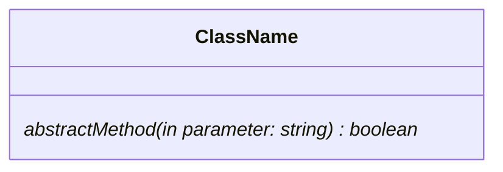

<br>
<br>

#### **Class Methods**
<br>


<br>
<br>

### **Associations**
<br>
<br>

#### **Association**
<br>

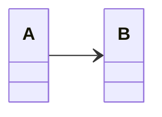

<br>
<br>

##### **Direction**
<br>

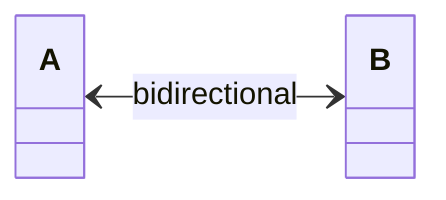
* All connected instances know about the connection

<br>

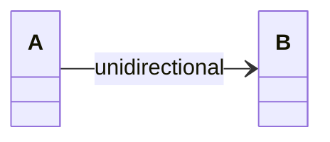
* only instances of A know about their connection to instances of B

<br>

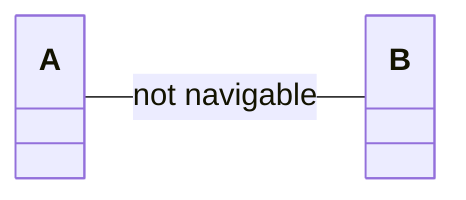
* connected instances do not know about the connection

<br>
<br>

##### **Multiplicity**
<br>

Multiplicity defines upper and lower boundaries for connected instances:

|Multiplicity |Shorthand |Description                                |
|:-----------:|:--------:|-------------------------------------------|
|1..1         |1         |exactly one connected instance             |
|0..1         |          |no or exactly one connected instance       |
|1..*         |          |many connected instances, but at lease one |
|0..*         |*         |no or many connected instances             |
|_number_     |          |exactly _number_ of connected instances    |
|[2, 3]       |          |range for number of connected instances    |

<br>

Examples:

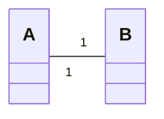
* every instance of A is connected to exactly one instance of B
* every instance of B is connected to exactly one instance of A

<br>

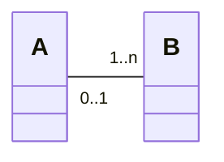
* every instance of A is connected to one or multiple instances of B
* every instance of B is connected to either none or exactly one instance of A

<br>
<br>

##### **Association Class**
<br>

* class assigned to a specific association between classes
* used to model additional attributes or methods of an association
* association class represents exactly one association!

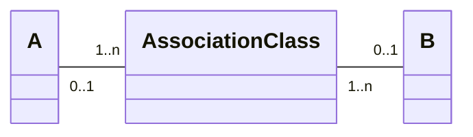

<br>
<br>

#### **Inheritance**
<br>

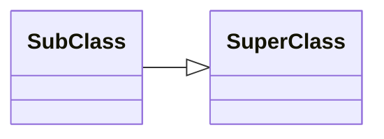

<br>
<br>

#### **Aggregation**
<br>

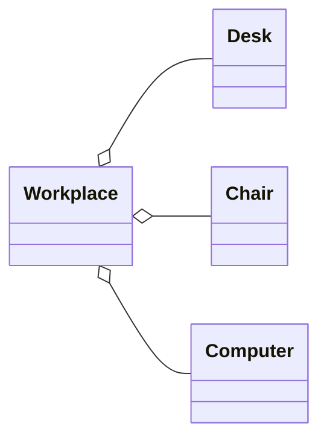

* defines a relationship between a whole and its parts
* whole has the reponsibility to deal with its parts
* parts can exist without their whole

<br>
<br>

#### **Composition**
<br>

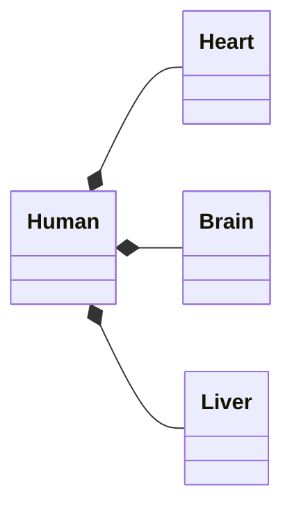

* defines a relationship between a whole and its parts
* parts can not exist without their whole
* parts can only be part of a single whole

<br>
<br>

#### **Dependency**
<br>

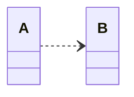

<br>
<br>
<br>

## **Interfaces**
<br>

* lists only method signatures
* can not be instantiated

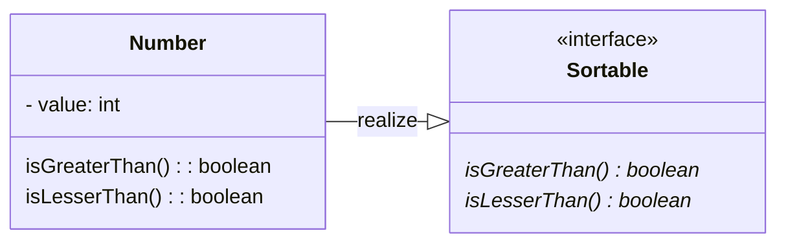