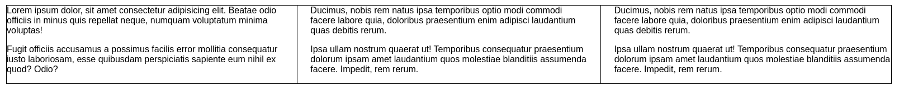
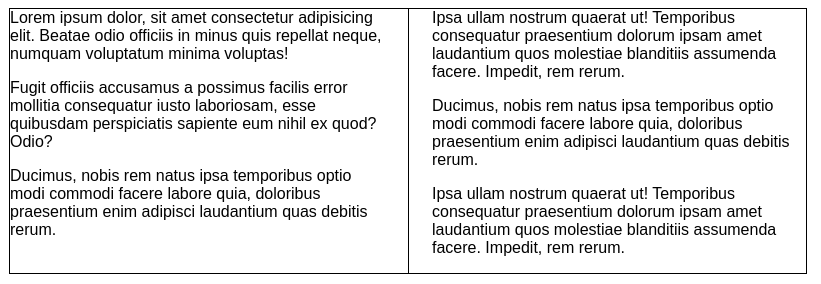
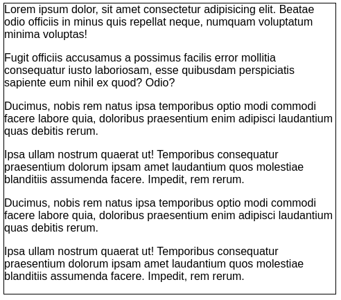

# **CSS Columns**
<br>

## **Table Of Contents**
<br>

- [**CSS Columns**](#css-columns)
  - [**Table Of Contents**](#table-of-contents)
  - [**General**](#general)
  - [**Properties**](#properties)

<br>
<br>
<br>

## **General**
<br>

* used to split elements into columns

<br>

HTML:
```html
<section id="column-container">
    <p>Lorem ipsum dolor, sit amet consectetur adipisicing elit. Beatae odio officiis in minus quis repellat neque,
        numquam voluptatum minima voluptas!</p>
    <p>Fugit officiis accusamus a possimus facilis error mollitia consequatur iusto laboriosam, esse quibusdam
        perspiciatis sapiente eum nihil ex quod? Odio?</p>
    <p>Ducimus, nobis rem natus ipsa temporibus optio modi commodi facere labore quia, doloribus praesentium enim
        adipisci laudantium quas debitis rerum.</p>
    <p>Ipsa ullam nostrum quaerat ut! Temporibus consequatur praesentium dolorum ipsam amet laudantium quos
        molestiae blanditiis assumenda facere. Impedit, rem rerum.</p>
    <p>Ducimus, nobis rem natus ipsa temporibus optio modi commodi facere labore quia, doloribus praesentium enim
        adipisci laudantium quas debitis rerum.</p>
    <p>Ipsa ullam nostrum quaerat ut! Temporibus consequatur praesentium dolorum ipsam amet laudantium quos
        molestiae blanditiis assumenda facere. Impedit, rem rerum.</p>
</section>
```

<br>
<br>

CSS:
```css
#column-container {
    border: 1px solid black;
    columns: 3 250px;
    column-rule: 1px solid black;
    column-gap: 3rem;
}
```

<br>
<br>

Render:



* big viewport

<br>
<br>



* medium viewport

<br>
<br>



* small viewport

<br>
<br>
<br>

## **Properties**
<br>

|Property                               |Description                                           |Example |
|:--------------------------------------|:-----------------------------------------------------|:-------|
|`column-count: <number>`               |preferred column count (if possible)                  |`column-count: 3;`|
|`column-width: <length>`               |minimum width of single column                        |`column-width: 250px;`|
|`columns: <count> <length>`            |shorthand combining `column-count` and `column-width` |`columns: 3 250px;`|
|`column-rule: <width> <style> <color>` |settings for visual column separator                  |`column-rule: 1px solid black;` |
|`column-gap: <lenght>`                 |specify whitespace between columns                    |`column-gap: 3rem;`|
|`break-inside: <value>`                |specify breaking behavior of single element           |`break-inside: avoid;`|
|`column-span: <value>`                 |allow selected element to span over multiple columns  |`column-span: all;` |


