# **CSS Flexbox**
<br>

## **Table Of Contents**
<br>

- [**CSS Flexbox**](#css-flexbox)
  - [**Table Of Contents**](#table-of-contents)
  - [**General**](#general)
  - [**Axis**](#axis)
    - [**Main Axis**](#main-axis)
      - [**row**](#row)
      - [**row-reverse**](#row-reverse)
      - [**column**](#column)
      - [**column-reverse**](#column-reverse)
    - [**Cross Axis**](#cross-axis)
  - [**Wrapping**](#wrapping)
    - [**nowrap (default setting)**](#nowrap-default-setting)
    - [**wrap**](#wrap)
    - [**wrap-reverse**](#wrap-reverse)
  - [**Flex Items Sizing**](#flex-items-sizing)
    - [**flex-grow**](#flex-grow)

<br>
<br>
<br>
<br>

## **General**
<br>

Flexbox...
* is used to align elements (***flex items***) within a container (***flex container***)
* can be used as **row** (default) or **column** layout

<br>
<br>
<br>
<br>

## **Axis**
<br>

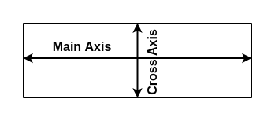
* Axis for flexbox with row layout

<br>
<br>


* Axis for flexbox with column layout

<br>
<br>
<br>

### **Main Axis**
<br>
<br>

#### **row**
<br>

```css
.flex-container {
    display: flex;
    flex-direction: row;
}
```

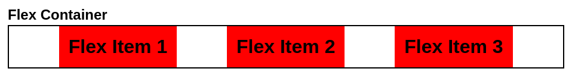

<br>
<br>

#### **row-reverse**
<br>

```css
.flex-container {
    display: flex;
    flex-direction: row-reverse;
}
```

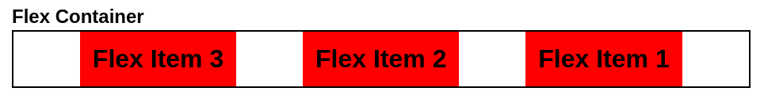

<br>
<br>

#### **column**
<br>

```css
.flex-container {
    display: flex;
    flex-direction: column;
}
```

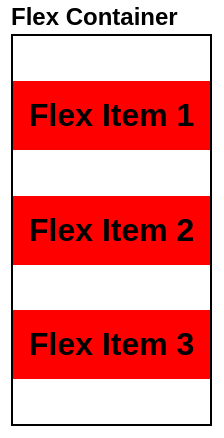

<br>
<br>

#### **column-reverse**
<br>

```css
.flex-container {
    display: flex;
    flex-direction: column-reverse;
}
```

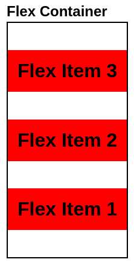

<br>
<br>
<br>

### **Cross Axis**
<br>

<br>
<br>
<br>
<br>

## **Wrapping**
<br>

* allows flex items to wrap onto multiple lines

<br>
<br>
<br>

### **nowrap (default setting)**
<br>

```css
.flex-container {
    display: flex;
    flex-wrap: nowrap;
}
```

<br>

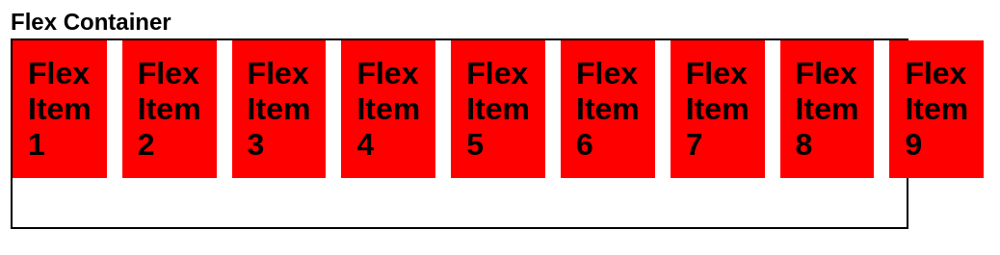
* flex items are not allowed to wrap onto the next line and therefore overflow their container

<br>
<br>
<br>

### **wrap**
<br>

```css
.flex-container {
    display: flex;
    flex-wrap: wrap;
}
```

<br>

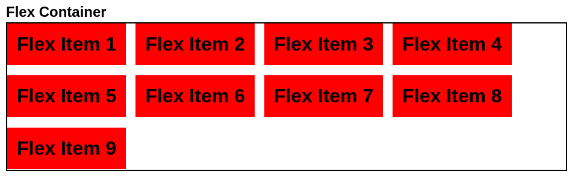
* flex items are allowed to wrap onto the **next** line

<br>
<br>
<br>

### **wrap-reverse**
<br>

```css
.flex-container {
    display: flex;
    flex-wrap: wrap-reverse;
}
```

<br>

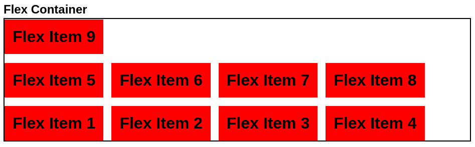
* flex items are allowed to wrap onto the **previous** line

<br>
<br>
<br>
<br>

## **Flex Items Sizing**
<br>
<br>
<br>

### **flex-grow**
<br>

* factor that determines how much a **flex item** is allowed to grow if the container has undistributed size

<br>

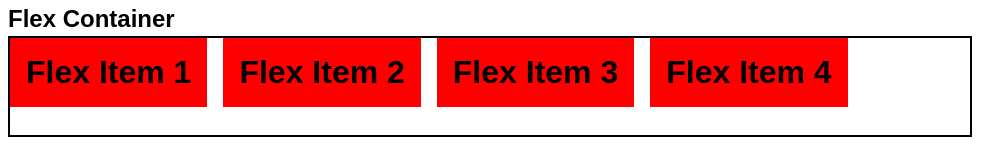
* default behavior: flex items do not grow

<br>
<br>

```css
.flex-item {
    flex-grow: 1;
}
```

<br>

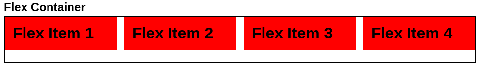
* remaining size of the flex container is evenly distributed to all flex items

<br>
<br>

```css
#flex-item-2 {
    flex-grow: 1;
}
```

<br>

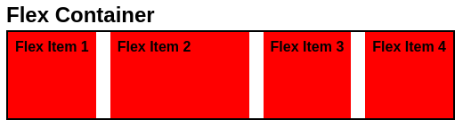
* all remaining size of the flex container is distributed to the second flex item