# **CSS Flexbox**
<br>

## **Table Of Contents**
<br>

- [**CSS Flexbox**](#css-flexbox)
  - [**Table Of Contents**](#table-of-contents)
  - [**General**](#general)
  - [**Flexbox Container**](#flexbox-container)
    - [**Axis**](#axis)
    - [**Main Axis Directions (flex-direction)**](#main-axis-directions-flex-direction)
      - [**row**](#row)
      - [**row-reverse**](#row-reverse)
      - [**column**](#column)
      - [**column-reverse**](#column-reverse)
    - [**Item Alignment**](#item-alignment)
      - [**Main Axis (justify-content)**](#main-axis-justify-content)
        - [**start**](#start)
        - [**end**](#end)
        - [**center**](#center)
        - [**space-between**](#space-between)
        - [**space-around**](#space-around)
        - [**space-evenly**](#space-evenly)
      - [**Cross Axis (align-items)**](#cross-axis-align-items)
        - [**start**](#start-1)
        - [**end**](#end-1)
        - [**center**](#center-1)
        - [**stretch**](#stretch)
      - [**Cross Axis For Multi-Line Flex Container (align-content)**](#cross-axis-for-multi-line-flex-container-align-content)
        - [**start**](#start-2)
        - [**end**](#end-2)
        - [**center**](#center-2)
        - [**space-between**](#space-between-1)
        - [**space-around**](#space-around-1)
        - [**space-evenly**](#space-evenly-1)
        - [**stretch**](#stretch-1)
    - [**Gap**](#gap)
    - [**Wrapping (flex-wrap)**](#wrapping-flex-wrap)
      - [**nowrap (default setting)**](#nowrap-default-setting)
      - [**wrap**](#wrap)
      - [**wrap-reverse**](#wrap-reverse)
  - [**Flex Items**](#flex-items)
    - [**Sizing**](#sizing)
      - [**flex-grow**](#flex-grow)
      - [**flex-shrink**](#flex-shrink)
      - [**flex-basis**](#flex-basis)
      - [**Shorthand: flex**](#shorthand-flex)
      - [**Alignment (align-self)**](#alignment-align-self)
        - [**start**](#start-3)
        - [**end**](#end-3)
        - [**center**](#center-3)
        - [**stretch**](#stretch-2)

<br>
<br>
<br>
<br>

## **General**
<br>

Flexbox...
* is used to align elements (***flex items***) within a container (***flex container***)
* can be used as **row** (default) or **column** layout

<br>
<br>
<br>
<br>

## **Flexbox Container**
<br>
<br>
<br>

### **Axis**
<br>


* Axis for flexbox with row layout

<br>
<br>


* Axis for flexbox with column layout

<br>
<br>
<br>

### **Main Axis Directions (flex-direction)**
<br>
<br>

#### **row**
<br>

```css
.flex-container {
    display: flex;
    flex-direction: row;
}
```


<br>
<br>

#### **row-reverse**
<br>

```css
.flex-container {
    display: flex;
    flex-direction: row-reverse;
}
```


<br>
<br>

#### **column**
<br>

```css
.flex-container {
    display: flex;
    flex-direction: column;
}
```


<br>
<br>

#### **column-reverse**
<br>

```css
.flex-container {
    display: flex;
    flex-direction: column-reverse;
}
```


<br>
<br>
<br>

### **Item Alignment**
<br>
<br>
<br>

#### **Main Axis (justify-content)**
<br>
<br>

##### **start**
<br>

```css
.flex-row {
    display: flex;
    justify-content: start;
}
```

<br>


<br>
<br>

##### **end**
<br>

```css
.flex-row {
    display: flex;
    justify-content: end;
}
```

<br>


<br>
<br>

##### **center**
<br>

```css
.flex-row {
    display: flex;
    justify-content: center;
}
```

<br>

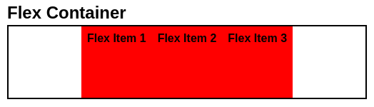

<br>
<br>

##### **space-between**
<br>

```css
.flex-row {
    display: flex;
    justify-content: space-between;
}
```

<br>


<br>
<br>

##### **space-around**
<br>

```css
.flex-row {
    display: flex;
    justify-content: space-around;
}
```

<br>


<br>
<br>

##### **space-evenly**
<br>

```css
.flex-row {
    display: flex;
    justify-content: space-evenly;
}
```

<br>


<br>
<br>
<br>

#### **Cross Axis (align-items)**
<br>
<br>

##### **start**
<br>

```css
.flex-row {
    display: flex;
    justify-content: space-evenly;
    align-items: start;
}           
```

<br>

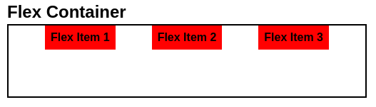

<br>
<br>

##### **end**
<br>

```css
.flex-row {
    display: flex;
    justify-content: space-evenly;
    align-items: end;
}           
```

<br>

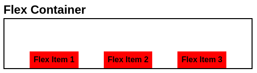

<br>
<br>

##### **center**
<br>

```css
.flex-row {
    display: flex;
    justify-content: space-evenly;
    align-items: center;
}           
```

<br>

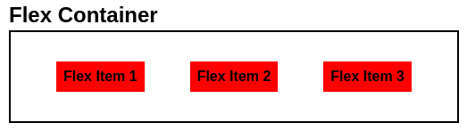

<br>
<br>

##### **stretch**
<br>

```css
.flex-row {
    display: flex;
    justify-content: space-evenly;
    align-items: stretch;
}           
```

<br>

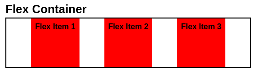

<br>
<br>
<br>

#### **Cross Axis For Multi-Line Flex Container (align-content)**
<br>
<br>

##### **start**
<br>

```css
.flex-row {
    display: flex;
    flex-wrap: wrap;
    justify-content: space-evenly;
    align-content: start;
}           
```

<br>


<br>
<br>

##### **end**
<br>

```css
.flex-row {
    display: flex;
    flex-wrap: wrap;
    justify-content: space-evenly;
    align-content: end;
}           
```

<br>

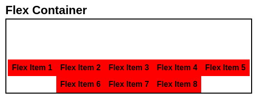

<br>
<br>

##### **center**
<br>

```css
.flex-row {
    display: flex;
    flex-wrap: wrap;
    justify-content: space-evenly;
    align-content: center;
}           
```

<br>

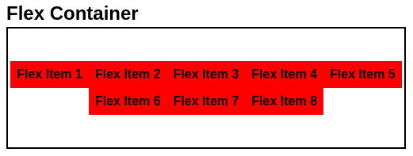

<br>
<br>

##### **space-between**
<br>

```css
.flex-row {
    display: flex;
    flex-wrap: wrap;
    justify-content: space-evenly;
    align-content: space-between;
}           
```

<br>

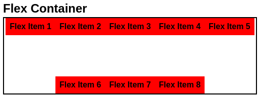

<br>
<br>

##### **space-around**
<br>

```css
.flex-row {
    display: flex;
    flex-wrap: wrap;
    justify-content: space-evenly;
    align-content: space-around;
}           
```

<br>

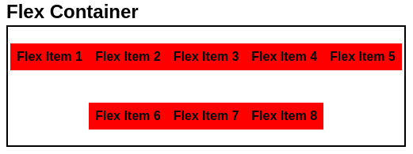

<br>
<br>

##### **space-evenly**
<br>

```css
.flex-row {
    display: flex;
    flex-wrap: wrap;
    justify-content: space-evenly;
    align-content: space-evenly;
}           
```

<br>

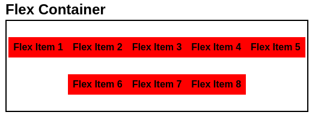

<br>
<br>

##### **stretch**
<br>

```css
.flex-row {
    display: flex;
    flex-wrap: wrap;
    justify-content: space-evenly;
    align-content: stretch;
}           
```

<br>


<br>
<br>
<br>

### **Gap**
<br>

* explicitly sets space between flex items

<br>

```css
.flex-row {
    display: flex;
    gap: 1rem;
}
```

<br>

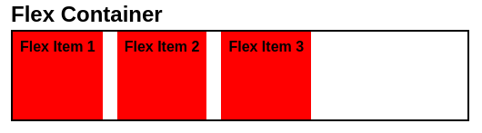

<br>
<br>
<br>

### **Wrapping (flex-wrap)**
<br>

* allows flex items to wrap onto multiple lines

<br>
<br>
<br>

#### **nowrap (default setting)**
<br>

```css
.flex-container {
    display: flex;
    flex-wrap: nowrap;
}
```

<br>


* flex items are not allowed to wrap onto the next line and therefore overflow their container

<br>
<br>
<br>

#### **wrap**
<br>

```css
.flex-container {
    display: flex;
    flex-wrap: wrap;
}
```

<br>


* flex items are allowed to wrap onto the **next** line

<br>
<br>
<br>

#### **wrap-reverse**
<br>

```css
.flex-container {
    display: flex;
    flex-wrap: wrap-reverse;
}
```

<br>


* flex items are allowed to wrap onto the **previous** line

<br>
<br>
<br>
<br>

## **Flex Items**
<br>
<br>
<br>

### **Sizing**

<br>
<br>
<br>

#### **flex-grow**
<br>

* factor that determines how much a **flex item** is allowed to grow if the container has undistributed size
* default: `flex-grow: 0;`

<br>


* default behavior: flex items do not grow

<br>
<br>

```css
.flex-item {
    flex-grow: 1;
}
```

<br>


* remaining size of the flex container is evenly distributed to all flex items

<br>
<br>

```css
#flex-item-2 {
    flex-grow: 1;
}
```

<br>


* remaining size of the flex container is distributed to the second flex item

<br>
<br>

```css
.flex-item {
    flex-grow: 1;
}
```

<br>

```css
#flex-item-2 {
    flex-grow: 4;
}
```

<br>

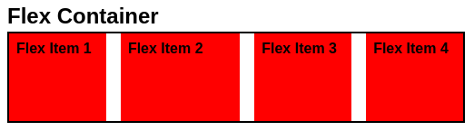
* remaining size of the flex container is distributed to all items but the second flex item gets four times more size

<br>
<br>
<br>

#### **flex-shrink**
<br>

* factor that determines how much a **flex item** is allowed to shrink if the combined width of the flex items exceeds the container width
* default: `flex-shrink: 1;`

<br>
<br>

```css
.flex-item {
    flex-shrink: 0;
}
```

<br>


* flex items are not allowed to shrink and therefore overflow their container

<br>
<br>

```css
.flex-item {
    flex-shrink: 1;
}
```

<br>

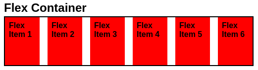
* flex items are to shrink

<br>
<br>

```css
.flex-item {
    flex-shrink: 1;
}
```

<br>

```css
#flex-item-2 {
    flex-shrink: 4;
}
```

<br>

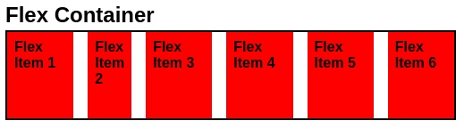
* all flex items shrink to fit into the container, but the second item is forced to give up four times as much space as its siblings

<br>
<br>
<br>

#### **flex-basis**
<br>

* used to define the initial size of a **flex item**
* basis for [flex-grow](#flex-grow) and [flex-shrink](#flex-shrink)

<br>

|Value                |
|:--------------------|
|\<absolute value \>  |
|\<percentage value\> |
|auto                 |
|max-content          |
|min-content          |
|fit-content          |

<br>
<br>

```css
.flex-item {
    flex-grow: 1;
    flex-basis: 0;
}
```

<br>

```css
#flex-item-2 {
    flex-grow: 4;
}
```

<br>

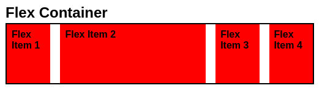
* since all flex items have the basis of **0** the size of the entire flex container is distributed to the items on the basis of the flex-grow factor

<br>
<br>

```css
.flex-item {
    flex-grow: 1;
    flex-basis: 200px;
}
```

<br>

```css
#flex-item-2 {
    flex-grow: 4;
}
```

<br>

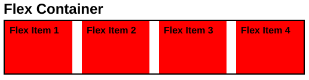
* since all flex items have the basis of **200px** their combined width exceed the width of the flex container
* since all flex items have the default **flex-shrink** of 1 they all end up with the same width

<br>
<br>

```css
.flex-item {
    flex-grow: 1;
    flex-basis: 50px;
}
```

<br>

```css
#flex-item-2 {
    flex-basis: 100px;
}
```

<br>

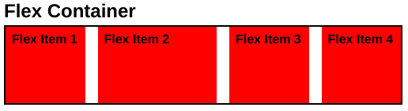

<br>
<br>
<br>

#### **Shorthand: flex**
<br>

* shorthand for `flex-grow`, `flex-shrink` and `flex-basis`
* second and third parameter is optional
* default: `flex: 0 1 auto`

<br>
<br>

Examples:
<br>

```css
.flex-item {
    flex: 2;    
}
```

equals 

```css
.flex-item {
    flex-grow: 2;
    flex-shrink: 1;
    flex-basis: 0;
}
```

<br>
<br>

```css
.flex-item {
    flex: 2 2 20%;    
}
```

equals 

```css
.flex-item {
    flex-grow: 2;
    flex-shrink: 2;
    flex-basis: 20%;
}
```

<br>
<br>
<br>

#### **Alignment (align-self)**
<br>

* allows item to overwrite the cross-axis-alignment set by the container via [align-items](#cross-axis-align-items)

<br>
<br>

##### **start**
<br>

```css
.flex-container {
   display: flex;
   align-items: center; 
}
```

<br>

```css
#flex-item-2 {
    align-self: start;
}
```

<br>

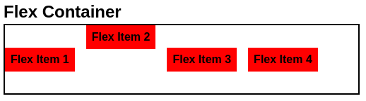

<br>
<br>

##### **end**
<br>

```css
.flex-container {
   display: flex;
   align-items: center; 
}
```

<br>

```css
#flex-item-2 {
    align-self: end;
}
```

<br>

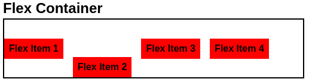

<br>
<br>

##### **center**
<br>

```css
.flex-container {
   display: flex;
   align-items: start; 
}
```

<br>

```css
#flex-item-2 {
    align-self: center;
}
```

<br>

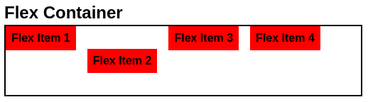

<br>
<br>

##### **stretch**
<br>

```css
.flex-container {
   display: flex;
   align-items: center; 
}
```

<br>

```css
#flex-item-2 {
    align-self: stretch;
}
```

<br>

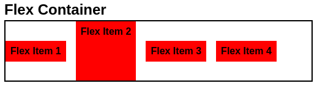