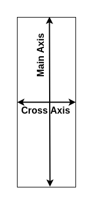
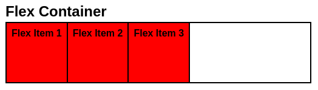
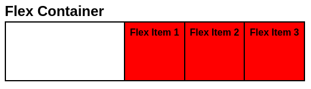
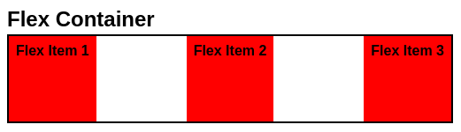
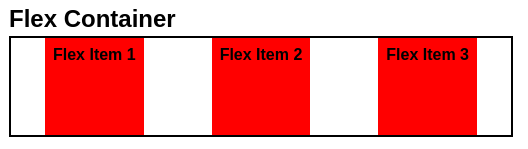
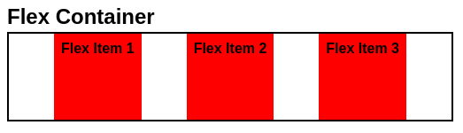
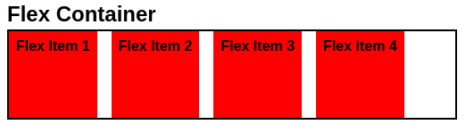
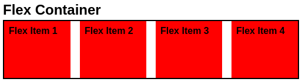

# **CSS Flexbox**
<br>

## **Table Of Contents**
<br>

- [**CSS Flexbox**](#css-flexbox)
  - [**Table Of Contents**](#table-of-contents)
  - [**General**](#general)
  - [**Flexbox Container**](#flexbox-container)
    - [**Axis**](#axis)
    - [**Main Axis Directions**](#main-axis-directions)
      - [**row**](#row)
      - [**row-reverse**](#row-reverse)
      - [**column**](#column)
      - [**column-reverse**](#column-reverse)
    - [**Item Alignment**](#item-alignment)
      - [**Main Axis**](#main-axis)
        - [**start**](#start)
        - [**end**](#end)
        - [**space-between**](#space-between)
        - [**space-around**](#space-around)
        - [**space-evenly**](#space-evenly)
    - [**Wrapping**](#wrapping)
      - [**nowrap (default setting)**](#nowrap-default-setting)
      - [**wrap**](#wrap)
      - [**wrap-reverse**](#wrap-reverse)
  - [**Flex Items**](#flex-items)
    - [**Flex Items Sizing**](#flex-items-sizing)
      - [**flex-basis**](#flex-basis)
      - [**flex-grow**](#flex-grow)

<br>
<br>
<br>
<br>

## **General**
<br>

Flexbox...
* is used to align elements (***flex items***) within a container (***flex container***)
* can be used as **row** (default) or **column** layout

<br>
<br>
<br>
<br>

## **Flexbox Container**
<br>
<br>
<br>

### **Axis**
<br>


* Axis for flexbox with row layout

<br>
<br>


* Axis for flexbox with column layout

<br>
<br>
<br>

### **Main Axis Directions**
<br>
<br>

#### **row**
<br>

```css
.flex-container {
    display: flex;
    flex-direction: row;
}
```


<br>
<br>

#### **row-reverse**
<br>

```css
.flex-container {
    display: flex;
    flex-direction: row-reverse;
}
```


<br>
<br>

#### **column**
<br>

```css
.flex-container {
    display: flex;
    flex-direction: column;
}
```


<br>
<br>

#### **column-reverse**
<br>

```css
.flex-container {
    display: flex;
    flex-direction: column-reverse;
}
```


<br>
<br>
<br>

### **Item Alignment**
<br>
<br>

#### **Main Axis**
<br>
<br>

##### **start**
<br>

```css
.flex-row {
    display: flex;
    justify-content: start;
}
```

<br>



<br>
<br>

##### **end**
<br>

```css
.flex-row {
    display: flex;
    justify-content: end;
}
```

<br>



<br>
<br>

##### **space-between**
<br>

```css
.flex-row {
    display: flex;
    justify-content: space-between;
}
```

<br>



<br>
<br>

##### **space-around**
<br>

```css
.flex-row {
    display: flex;
    justify-content: space-around;
}
```

<br>



<br>
<br>

##### **space-evenly**
<br>

```css
.flex-row {
    display: flex;
    justify-content: space-evenly;
}
```

<br>




<br>
<br>
<br>

### **Wrapping**
<br>

* allows flex items to wrap onto multiple lines

<br>
<br>
<br>

#### **nowrap (default setting)**
<br>

```css
.flex-container {
    display: flex;
    flex-wrap: nowrap;
}
```

<br>


* flex items are not allowed to wrap onto the next line and therefore overflow their container

<br>
<br>
<br>

#### **wrap**
<br>

```css
.flex-container {
    display: flex;
    flex-wrap: wrap;
}
```

<br>


* flex items are allowed to wrap onto the **next** line

<br>
<br>
<br>

#### **wrap-reverse**
<br>

```css
.flex-container {
    display: flex;
    flex-wrap: wrap-reverse;
}
```

<br>


* flex items are allowed to wrap onto the **previous** line

<br>
<br>
<br>
<br>

## **Flex Items**
<br>
<br>
<br>

### **Flex Items Sizing**
<br>
<br>

#### **flex-basis**
<br>

* used to define the initial size of a **flex item**
* basis for [flex-grow](#flex-grow) and [flex-shrink](#flex-shrink)

<br>

|Value                |
|:--------------------|
|\<absolute value \>  |
|\<percentage value\> |
|auto                 |
|max-content          |
|min-content          |
|fit-content          |

<br>
<br>


<br>

<br>
<br>
<br>

#### **flex-grow**
<br>

* factor that determines how much a **flex item** is allowed to grow if the container has undistributed size

<br>


* default behavior: flex items do not grow

<br>
<br>

```css
.flex-item {
    flex-grow: 1;
}
```

<br>


* remaining size of the flex container is evenly distributed to all flex items

<br>
<br>

```css
#flex-item-2 {
    flex-grow: 1;
}
```

<br>


* all remaining size of the flex container is distributed to the second flex item