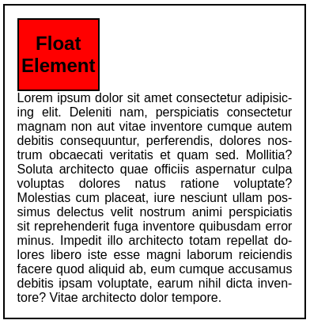
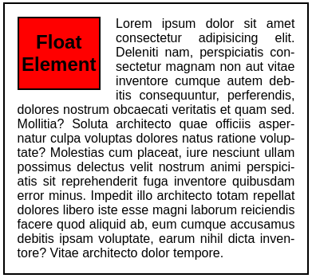
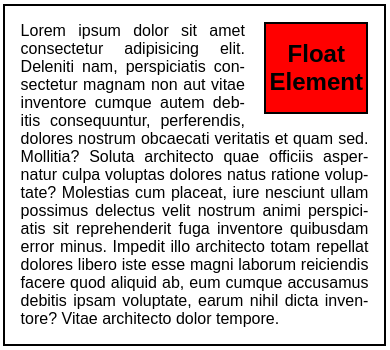

# **CSS Float**
<br>

## **Table Of Contents**
<br>

- [**CSS Float**](#css-float)
  - [**Table Of Contents**](#table-of-contents)
  - [**General**](#general)
  - [**Float Values**](#float-values)
    - [**None**](#none)
    - [**Left**](#left)
    - [**Right**](#right)

<br>
<br>
<br>

## **General**
<br>

* elements with the attribute `float` are positioned to the left or right of their parent container
* sibling elements (text or inline elements) can flow around the element

<br>
<br>
<br>

## **Float Values**
<br>
<br>

### **None**
<br>

* default value

<br>

```css
#float-element {
    float: none;
}
```

<br>



<br>
<br>

### **Left**
<br>

```css
#float-element {
    float: left;
    margin-right: 1.2rem:
}
```

<br>



<br>
<br>

### **Right**
<br>

```css
#float-element {
    float: right;
    margin-left: 1.2rem:
}
```

<br>


