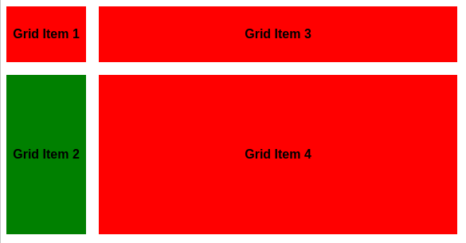

# **CSS Grid**
<br>

## **Table Of Contents**
<br>

- [**CSS Grid**](#css-grid)
  - [**Table Of Contents**](#table-of-contents)
  - [**General**](#general)
    - [**Terminology**](#terminology)
    - [**Grid Line Enumeration**](#grid-line-enumeration)
  - [**Example**](#example)
  - [**Grid Container**](#grid-container)
    - [**Define Dimensions**](#define-dimensions)
      - [**grid-template-columns**](#grid-template-columns)
      - [**grid-template-rows**](#grid-template-rows)
      - [**grid-template-areas**](#grid-template-areas)
    - [**Gaps**](#gaps)
      - [**column-gap**](#column-gap)
      - [**row-gap**](#row-gap)
      - [**gap (shorthand)**](#gap-shorthand)
    - [**Alignment**](#alignment)
      - [**justify-items**](#justify-items)

<br>
<br>
<br>
<br>

## **General**
<br>

Grid...
* is used to align items into a two-dimensional grid layout

<br>
<br>
<br>

### **Terminology**
<br>


<br>
<br>
<br>

### **Grid Line Enumeration**
<br>

 

<br>
<br>
<br>
<br>

## **Example**
<br>

HTML:
```html
<div class="grid-container">
    <div id="grid-item-1" class="grid-item">Grid Item 1</div>
    <div id="grid-item-2" class="grid-item">Grid Item 2</div>
    <div id="grid-item-3" class="grid-item">Grid Item 3</div>
    <div id="grid-item-4" class="grid-item">Grid Item 4</div>
</div>
```

<br>

CSS:

```css
.grid-container {
    display: grid;
    gap: 1rem;
    grid-template-columns: 100px 450px;
    grid-template-rows: 70px 200px;
}
```

```css
#grid-item-2 {
    background-color: green;
    grid-row: 2;
    grid-column: 1;
}
```

<br>



<br>
<br>
<br>
<br>

## **Grid Container**
<br>
<br>
<br>

### **Define Dimensions**
<br>

|Unit |Description                           |
|:----|:-------------------------------------|
|px   |pixel length                          |
|x%   |percentage of parent                  |
|fr   |fraction of available space of parent |

<br>
<br>

#### **grid-template-columns**
<br>

* defines columns of the grid via space separated list of track sizes
* allows assigning optional linenames that can be used instead of the line enumeration

<br>

```
grid-template-columns: [linename alternateLinename] 20% ...
```

<br>
<br>

```css
.grid-container {
    grid-template-columns: 200px 500px;
}
```

<br>


<br>
<br>

#### **grid-template-rows**
<br>

* defines tows of the grid via space separated list of track sizes
* allows assigning optional linenames that can be used instead of the line enumeration

<br>

```
grid-template-rows: [linename alternateLinename] 20% ...
```

<br>
<br>

```css
.grid-container {
    grid-template-rows: 50px 150px;
}
```

<br>


<br>
<br>

#### **grid-template-areas**
<br>

* allows to describe layout using grid area names
* allows spanning areas by repeated use of same name

<br>

|Value         |Description             |
|:-------------|:-----------------------|
|.             |empty cell              |
|\<area-name\> |cell of named grid area |

<br>

HTML

```html
<div class="grid-container">
    <div id="grid-item-1">Header</div>
    <div id="grid-item-2">Content</div>
    <div id="grid-item-3">Sidebar</div>
    <div id="grid-item-4">Footer</div>
</div>
```

<br>

CSS

```css
.grid-container {
    display: grid;
    grid-template-areas: 
        "header header header"
        "content . sidebar"
        "content footer footer";
}
```

<br>


<br>
<br>
<br>

### **Gaps**
<br>
<br>

#### **column-gap**
<br>

```css
.grid-container {
    column-gap: 20px;
    display: grid;
    grid-template-rows: repeat(2, 1fr);
    grid-template-columns: repeat(2, 1fr);
}
```

<br>


<br>
<br>

#### **row-gap**
<br>

```css
.grid-container {
    row-gap: 20px;
    display: grid;
    grid-template-rows: repeat(2, 1fr);
    grid-template-columns: repeat(2, 1fr);
}
```

<br>


<br>
<br>

#### **gap (shorthand)**
<br>

* shorthand for [column-gap](#column-gap) and [row-gap](#row-gap)

<br>

```css
.grid-container {
    gap: 20px;
    display: grid;
    grid-template-rows: repeat(2, 1fr);
    grid-template-columns: repeat(2, 1fr);
}
```

<br>


<br>
<br>
<br>

### **Alignment**
<br>
<br>

#### **justify-items**
<br>

