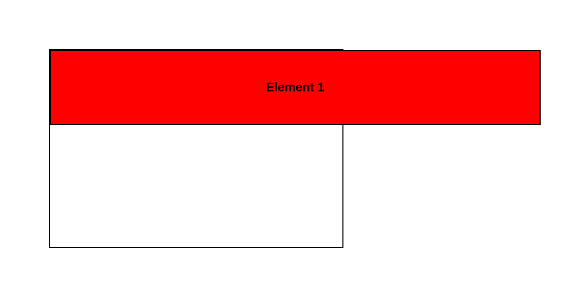
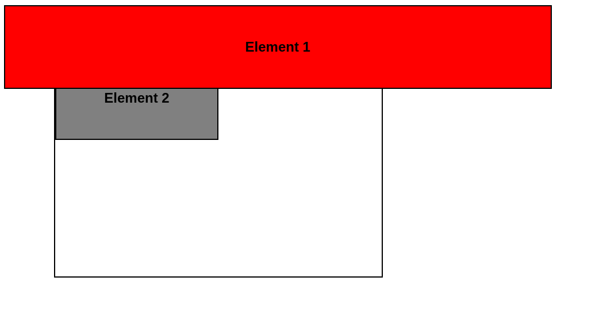

# **CSS Position**
<br>

## **Table Of Contents**
<br>

- [**CSS Position**](#css-position)
  - [**Table Of Contents**](#table-of-contents)
  - [**Overview**](#overview)
  - [**static**](#static)
  - [**relative**](#relative)
  - [**absolute**](#absolute)
  - [**fixed**](#fixed)
  - [**sticky**](#sticky)

<br>
<br>
<br>

## **Overview**
<br>

|static |relative |absolute |fixed |sticky |
|:------|:--------|:--------|:-----|:------|

<br>
<br>
<br>

## **static**
<br>

* default value
* elements are positioned according to the normal document flow

<br>
<br>

Example:

<div style="background-color: white; padding: 1rem; text-align: center; font-weight: bold;">
    <div style="background-color: black">1</div>
    <div style="background-color: gray">2</div>
    <div style="background-color: black">3</div>
</div>

* elements 1, 2 and 3 all are positioned static

<br>
<br>
<br>

## **relative**
<br>

* behaves like *static*, but can also be positioned relative to its original position in the normal document flow
* offset is ignored by other elements in the document flow
  * therefore it does not affect the position of other elements
  * therefore this attribute should not be used

<br>

Offset can be defined via the following attributes:

|attribute |
|:---------|
|top       |
|left      |
|bottom    |
|right     |

<br>
<br>

Example:

```css
#element-1 {
    position: relative;
    left: 2rem;
}
```

<br>

<div style="background-color: white; padding: 1rem; text-align: center; font-weight: bold">
    <div style="background-color: black; position: relative; left: 2rem">1</div>
    <div style="background-color: gray">2</div>
    <div style="background-color: black">3</div>
</div>

* first element has an offset to the left relative to its normal position
* first element overflows its parent element

<br>
<br>

```css
#element-1 {
    position: relative;
    top: .6rem;
}
```

<br>

<div style="background-color: white; padding: 1rem; text-align: center; font-weight: bold">
    <div style="background-color: black; position: relative; top: .6rem">1</div>
    <div style="background-color: gray">2</div>
    <div style="background-color: black">3</div>
</div>

* first element has an offset to the left relative to its normal position
* second element ignores the offset of the first element
  * first element overflows into the second element

<br>
<br>
<br>

## **absolute**
<br>

* removes element from the normal document flow
* other elements in the normal document flow are positioned as if the absolute elements does not exist
* element can be positioned relative to the next parent that is positioned as static
  * if no such parent exist, the offset is calculated relative to the top-left corner of the screen

<br>

Offset can be defined via the following attributes:

|attribute |
|:---------|
|top       |
|left      |
|bottom    |
|right     |

<br>
<br>

Example:

```css
#element-1 {
    position: absolute;
}
```

<br>

<div style="background-color: white; padding: 1rem; text-align: center; font-weight: bold">
    <div style="background-color: black; position: absolute;">1</div>
    <div style="background-color: gray">2</div>
    <div style="background-color: black">3</div>
</div>

* element 1 is removed from the document flow
* element 2 renders as if element 1 does not exist

<br>
<br>

```css
#element-1 {
    position: absolute;
    top: 5px;
    left: 5px;
}
```

<br>



* element 1 is removed from the document flow
* element 2 renders as if element 1 does not exist
* since the container is static by default, the offset of the absolute positioned element 1 is calculated from the top left corner of the **page**

<br>
<br>

```css
#container {
    position: relative;
}

#element-1 {
    position: absolute;
    top: 5px;
    left: 5px;
}
```

<br>



* element 1 is removed from the document flow
* element 2 renders as if element 1 does not exist
* since the container is relative, the offset of the absolute positioned element 1 is calculated from the top left corner of the **container**

<br>
<br>
<br>

## **fixed**
<br>

* removes element from the normal document flow
* element is positioned relative to the top-left corner of the screen
* element keeps its fixed position from the top left corner regardless of scrolling

<br>
<br>

Examples:

```css
#element-1 {
    position: fixed;
    top: 5px;
    left: 5px;
}
```

<br>


* element 1 is removed from the document flow
* element 1 is positioned from the top left corner of the **page**
* element keeps its fixed position from the top left corner regardless of scrolling
* element 2 renders as if element 1 does not exist

<br>
<br>
<br>

## **sticky**
<br>

* element is offset relative to nearest scrolling ancestor
* offset is ignored by other elements in the document flow
* sticks to nearest scrolling ancestor upon scrolling

<br>

> *Relative* by default, *Fixed* when scrolled

<br>
<br>

```css
#element-1 {
    position: sticky;
    top: 5px;
}
```

<br>


* before scrolling

<br>


* after scrolling

