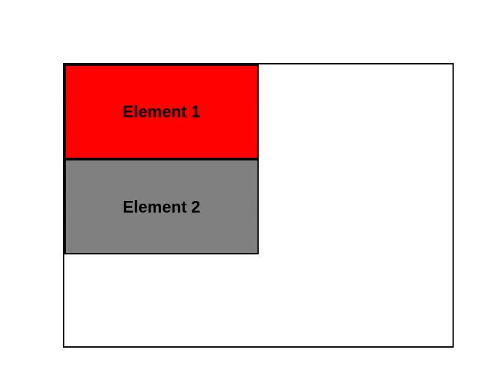

# **CSS Position**
<br>

## **Table Of Contents**
<br>

- [**CSS Position**](#css-position)
  - [**Table Of Contents**](#table-of-contents)
  - [**Overview**](#overview)
  - [**static**](#static)
  - [**relative**](#relative)
  - [**absolute**](#absolute)
  - [**fixed**](#fixed)
  - [**sticky**](#sticky)

<br>
<br>
<br>

## **Overview**
<br>

|                 |static             |relative                    |absolute                              |fixed |sticky                  |
|:---------------:|:-----------------:|:--------------------------:|:------------------------------------:|:----:|:----------------------:|
|in document flow |:heavy_check_mark: |:heavy_check_mark:          |:x:                                   |:x:   |only while not scrolled |
|offset origin    |:x:                |original flow position      |next nonstatic parent element or page |page  | |

<br>
<br>
<br>

## **static**
<br>

* default value
* elements are positioned according to the normal document flow

<br>
<br>

Example:

<br>


* elements 1 and 2 are positioned static
* as block elements they are positioned beneath each other

<br>
<br>
<br>

## **relative**
<br>

* behaves like *static*, but can also be positioned relative to its original position in the document flow
* offset is ignored by other elements in the document flow
  * therefore it does not affect the position of other elements

<br>

Offset can be defined via the following attributes:

|attribute |
|:---------|
|top       |
|left      |
|bottom    |
|right     |

<br>
<br>

Example:

```css
#element-1 {
    background-color: red;
    left: 30px;
    position: relative;
    top: 55px;
}
```

<br>


* element 1 is positioned relative to the top left corner of its original position in the flow
* element 1 stays in the normal flow, so the position of element 2 is not changed
    * therefore element 1 overflows element 2

<br>
<br>

```css
#element-1 {
    background-color: red;
    bottom: 30px;
    left: 50px;
    position: relative;
}
```

<br>


* element 1 is positioned relative to the bottom left corner of its original position in the flow
* element 1 stays in the normal flow, so the position of element 2 is not changed
* element 1 overflows its container

<br>
<br>
<br>

## **absolute**
<br>

* removes element from the normal document flow
* other elements in the normal document flow are positioned as if the absolute elements does not exist
* element can be positioned relative to the next parent that is positioned as static
  * if no such parent exist, the offset is calculated relative to the top-left corner of the screen

<br>

Offset can be defined via the following attributes:

|attribute |
|:---------|
|top       |
|left      |
|bottom    |
|right     |

<br>
<br>

Example:

```css
#element-1 {
    background-color: red;
    position: absolute;
}
```

<br>


* element 1 is removed from the document flow
* element 2 renders as if element 1 does not exist
  * therefore element 1 overflows element 2

<br>
<br>

```css
#element-1 {
    background-color: red;
    left: 10px;
    position: absolute;
    top: 10px;
}
```

<br>


* element 1 is removed from the document flow
* element 2 renders as if element 1 does not exist
* since the container is **static** by default, the offset of the absolute positioned element 1 is calculated from the top left corner of the **page**

<br>
<br>

```css
#container {
    position: relative;
}

#element-1 {
    background-color: red;
    left: 40px;
    position: absolute;
    top: 40px;
}
```

<br>


* element 1 is removed from the document flow
* element 2 renders as if element 1 does not exist
* since the container is **relative**, the offset of the absolute positioned element 1 is calculated from the top left corner of the **container**

<br>
<br>
<br>

## **fixed**
<br>

* removes element from the normal document flow
* element is positioned relative to the top-left corner of the screen
* element keeps its fixed position from the top left corner regardless of scrolling

<br>
<br>

Examples:

```css
#element-1 {
    position: fixed;
    top: 5px;
    left: 15px;
}
```

<br>


* element 1 is removed from the document flow
* element 1 is positioned from the top left corner of the **page**
* element 1 keeps its fixed position from the top left corner regardless of scrolling
* element 2 renders as if element 1 does not exist

<br>
<br>
<br>

## **sticky**
<br>

|Initial Behavior                         |Scrolling Behavior                                                         |
|:----------------------------------------|:--------------------------------------------------------------------------|
|static position within the document flow |removed from the document flow                                             |
|                                         |offset relative to current scroll position within nearest scrolling parent |
|                                         |element will not overflow its nearst scrolling parent                      |

<br>
<br>

Examples:

```css
#element-1 {
    background-color: red;
    position: sticky;
    top: 20px;
}
```

<br>



element 1 is
* positioned static before scrolling
* positioned 20px from top of the viewport while scrolling since the page is the nearest scrolling parent
* is not positioned outside of its parent element

<br>
<br>

```css
#element-1 {
    background-color: red;
    position: sticky;
    bottom: 20px;
}
```

<br>


* element 1 is
  * positioned 20px from bottom of the viewport while scrolling until its static position within the document flow is reached
  * positioned static after reaching its original position within the document flow

