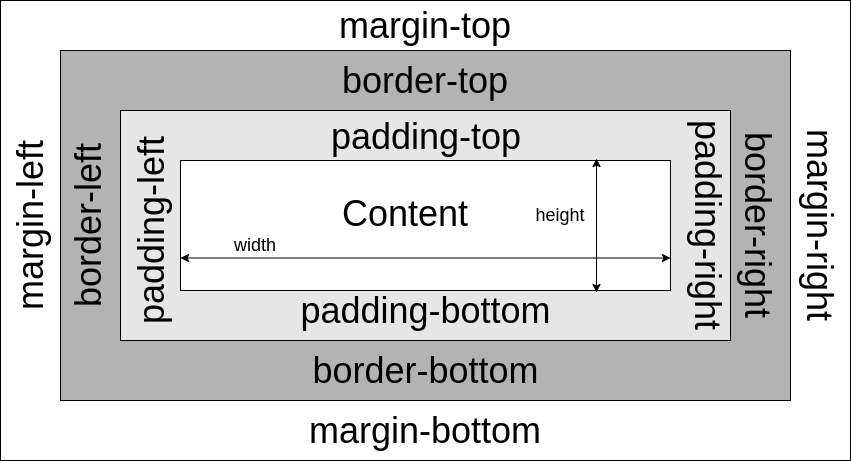

# **CSS (Cascading Style Sheets) Basics**
<br>

## **Table Of Contents**
<br>

- [**CSS (Cascading Style Sheets) Basics**](#css-cascading-style-sheets-basics)
  - [**Table Of Contents**](#table-of-contents)
  - [**Character Encoding For External CSS File**](#character-encoding-for-external-css-file)
  - [**Basic Syntax**](#basic-syntax)
  - [**Sources For CSS Rules**](#sources-for-css-rules)
  - [**CSS Selectors**](#css-selectors)
  - [**CSS Colors**](#css-colors)
    - [**RGB**](#rgb)
    - [**RGBA**](#rgba)
    - [**HEX**](#hex)
    - [**HSL**](#hsl)
    - [**HSLA**](#hsla)
  - [**Background Properties**](#background-properties)
  - [**Border Properties**](#border-properties)
  - [**Box Model**](#box-model)
    - [**Default Box Model**](#default-box-model)
    - [**Border Box**](#border-box)
  - [**Flex Box Layout**](#flex-box-layout)
  - [**CSS Grid Layout**](#css-grid-layout)
  - [**Text Properties**](#text-properties)
    - [**text-align**](#text-align)
    - [**vertical-align**](#vertical-align)
    - [**text-decoration-line**](#text-decoration-line)
    - [**text-transform**](#text-transform)
  - [**Links**](#links)
  - [**Lists**](#lists)
  - [**Table**](#table)
  - [**Size**](#size)
  - [**Units**](#units)
    - [**Absolute Units**](#absolute-units)
    - [**Relative Units**](#relative-units)
  - [**Positioning**](#positioning)
  - [**Overflow**](#overflow)
  - [**Opacity**](#opacity)
  - [**Variables / Custom Properties**](#variables--custom-properties)
  - [**Counters**](#counters)
  - [**Math Functions**](#math-functions)
  - [**Google Fonts**](#google-fonts)
  - [**Media Queries**](#media-queries)
    - [**Syntax**](#syntax)
    - [**Examples**](#examples)

<br>
<br>
<br>

## **Character Encoding For External CSS File**
<br>

externalFile.css  
```css
@charset "UTF-8";
@import url("url/other/css/file");

/* 
...
css rules 
...
*/

```

<br>
<br>
<br>


## **Basic Syntax**
<br>

```css
/* css rule */
<selector> {
    /* declarations */
    <property>:<value>;
    <property>:<value>;
}
```

<br>
<br>
<br>


## **Sources For CSS Rules**
<br>

* Inline CSS
  * attach declaration to attribute style of an element  
* Internal CSS 
  * add rules to \<style> block within the \<head> of a document 
* External CSS (preferred)
  * add reference to an external css file 

<br>

```html
<!DOCTYPE html>
<html>

    <head>
        <!-- Internal CSS -->
        <style>
            body {
                background-color: red;
            }

            header {
                margin: 5px;
            }
        </style>

        <!-- External CSS -->
        <link rel="stylesheet" href="externalFile.css">
    </head>

    <body>
        <h1>Header</h1>
        <p id="paragraph1">First paragraph</p>

        <!-- Inline CSS -->
        <p style="color:green;size:10px">Second paragraph</p> 
    </body>

</html>
```

<br>

Priority of css rules (Cascading Order):  
1. Inline style
2. Internal style
3. External style
4. Default style (defined by the browser)

<br>
<br>
<br>

## **CSS Selectors**
<br>

See [CSS Selectors](./css_selectors.md)

<br>
<br>
<br>

## **CSS Colors**
<br>

### **RGB**
```css
rgb(red, green, blue)
/* each parameter has to be in range [0, 255] */
```

### **RGBA**
```css
rgba(red, green, blue, alpha)
/* alpha parameter specifies opacity and has to be in range [0.0, 1.0] */
```

### **HEX**
```css
#rrggbb
/* rr (red), gg (green) and bb (blue) have to be in hex range [00 - ff] */
```

### **HSL**
```css
hsl(hue, saturation, lightness)
/* hue has to be in range [0, 360] (color wheel)
   saturation  and lightness have to be in range[0%, 100%] */
```

### **HSLA**
```css
hsl(hue, saturation, lightness, alpha)
/* alpha parameter specifies opacity and has to in range [0.0, 1.0] */
```

<br>
<br>
<br>

## **Background Properties**
<br>

|Property             |Description                                      |
|:--------------------|:------------------------------------------------|
|background-color     |                                                 |
|background-image     |default: repeat image horizontally and vertically|
|background-repeat    |options see below                                |
|background-attachment|should the image scroll or remain fixed          |
|background-position  |                                                 |
|background           |shorthand (order like in table)                  |

<br>

background-image:  
|Option   |Description             |
|:--------|:-----------------------|
|no-repeat|                        |
|repeat-x |repeat only horizontally|
|repeat-y |repeat only vertically  |

<br>

background-attachment:  
|Option   |Description             |
|:--------|:-----------------------|
|scroll   |                        |
|fixed    |                        |

<br>
<br>
<br>

## **Border Properties**
<br>

|Property             |Description                                      |
|:--------------------|:------------------------------------------------|
|border-style         |if more than one value: top, right, down, left   |
|border-width         |if more than one value: top, right, down, left   |
|border-color         |                                                 |
|border-radius        |add rounded borders                              |

<br>

border-style:  
|Option   |Description             |
|:--------|:-----------------------|
|dotted   |                        |
|dashed   |                        |
|solid    |                        |
|double   |                        |
|groove   |3D                      |
|ridge    |3D                      |
|inset    |3D                      |
|outset   |3D                      |
|none     |no border               |
|hidden   |                        |

<br>
<br>
<br>

## **Box Model**
<br>

### **Default Box Model** 

```css
display: block;
```


Width and height only apply to the content area.  
Actual Width = border-left + padding-left + width + padding-right + border-right  
Actual Height = border-top + padding-top + height + padding-bottom + border-bottom

<br>

### **Border Box**

```css
*, *::before, *::after {
   box-sizing: border-box;
}
```

Width and height include padding and border.

<br>
<br>
<br>

## **Flex Box Layout**
<br>
Flex container aligns its flex items in a row or column. Flex items share the same height.
<br>

```css
<containerElement> {
   display: flex;
   flex-direction: <row | column>;
   flex-flow: <row | row-reverse | column | column-reverse>;   /* optional: specify direction of flex container */
   flex-wrap: <nowrap | wrap>;                                 /* optional: disable or enable line break within flex container */
   flex: 1;                                                    /* optional: distributes container space evenly to all flex items */

   justify-content: <flex-start>                               /* start from container start */
                    <flex-end>                                 /* start from container end */
                    <center>                                   /* place in center without space between flex items */
                    <space-between>                            /* distribute container space evenly between flex items (not between container border) */
                    <space-around>                             /* distribute container space around flex items (also between container border) */
                    <space-evenly>                             /* distribute container space evenly around flex items (also between container border) */
}
```

<br>
<br>
<br>

## **CSS Grid Layout**
<br>

```css
<containerElement> {
   display: grid;

   grid-template-columns: <WidthCol1>fr <WidthCol2>fr ... <WidthColN>fr;      /* set column count and width */
   grid-template-columns: repeat(auto-fit, <ColumnLength>);                   /* divide container lenght between as much columns of <columnLength> as possible */

   grid-column-gap: <number>px;
   grid-row-gap: <number>px;
}

<gridElement> {
   grid-column: <vericalLineNumber>;
   grid-column: <verticalLineNumber> / span <optionalVerticalEndLineNumber>;
}
```

<br>
<br>
<br>

## **Text Properties**
<br>

|Property                 |Description                                   |
|:------------------------|:---------------------------------------------|
|color                    |                                              |
|text-align               |horizontal align                              |
|text-align-last          |applies to last line                          |
|direction                |reading order (ltr or rtl)                    |
|vertical-align           |vertical alignment in inline boxes            |
|text-decoration-line     |add line to text                              |
|text-decoration-color    |specify color of added line                   |
|text-decoration-style    |specify style of added line (see border)      |
|text-decoration-thickness|                                              |
|text-decoration          |shorthand: line, [color], [style], [thickness]|
|text-transform           |                                              |
|text-indent              |specify indentation of first line             |
|letter-spacing           |specify space between characters of a text    |
|line-height              |specify space between lines                   |
|word-spacing             |specify space between words                   |
|white-space              |specify handling of white-space               |
|text-shadow              |


<br>

### **text-align**  
|Option     |Description|
|:----------|:----------|
|center     |    text   |
|left       |text       |
|right      |       text|
|justify    |    text   |

<br>

### **vertical-align**  
|Option      |
|:-----------|
|baseline    |
|text-top    |
|text-bottom |
|sub         |
|super       |

<br>

### **text-decoration-line**  
|Option      |
|:-----------|
|overline    |
|line-through|
|underline   |

<br>

### **text-transform**  
|Option        |Example     |
|:-------------|:-----------|
|uppercase     |EXAMPLE TEXT|
|lowercase     |example text|
|capitalize    |Example Test|

<br>
<br>
<br>

## **Links**
<br>

```css
/* Link States (order is important!) */

a:link { ... } /* unvisited */
a:visited { ... }
a:hover { ... }
a:active { ... } /* moment link is clicked */
```

<br>
<br>
<br>

## **Lists**
<br>

|Property           |Description                                                        |
|:------------------|:------------------------------------------------------------------|
|list-style-type    |specify type of list item marker                                   |
|list-style-position|specify whether the item markers are 'inside' or 'outside' the list|
|list-style-image   |specify image as list item marker                                  |
|list-style         |shorthand (order like in table)                                    |

<br>

list-style-type:  
|Option     |Description            |
|:----------|:----------------------|
|none       |                       |
|disc       |filled circle (default)|
|circle     |hollow circle          |
|square     |filled square          |
|decimal    |decimals beginning at 1|
|lower-roman|                       |
|upper-roman|                       |
|lower-alpha|                       |
|upper-alpha|                       |

<br>
<br>
<br>

## **Table**
<br>

|Property       |Description                                          |
|:--------------|:----------------------------------------------------|
|border-collapse|specify whether cells have shared or separate borders|
|width          |                                                     |
|height         |                                                     |

<br>

border-collapse:  
|Option   |Description                |
|:--------|:--------------------------|
|collapse |cells have shared borders  |
|separate |cells have distinct borders|

<br>
<br>
<br>

## **Size**
<br>

|Property     |Description
|:------------|:---------------------------------|
|width        |                                  |
|height       |                                  |
|max-width    |                                  |
|min-width    |                                  |
|margin: auto |centers the element horizontally  |


<br>
<br>
<br>

## **Units**
<br>

### **Absolute Units**
|Unit|Description                        |
|:---|:----------------------------------|
|cm  |                                   |
|mm  |                                   |
|in  |inch                               |
|px  |pixel (relative to viewing device) |
|pt  |point                              |

<br>

### **Relative Units**
|Unit|Description                                                   |
|:---|:-------------------------------------------------------------|
|em  |relative to font size of element (3em = 3 x element font size)|
|rem |relative to font size of root element                         |
|vw  |relative to 1% to width of viewport                           |
|vh  |relative to 1% to height of viewport                          |
|%   |relative to parent element                                    |

<br>
<br>
<br>

## **Positioning**
<br>

```css
position: static        /* default, positioned according to the flow */
position: relative      /* positioned according to the flow plus offset to itself */
position: absolute      /* element is removed from the flow and positioned relative to the closest ancestor */

position: -webkit-sticky
position: sticky        /* acts like relative until offset position is reached, then positioned based on the scroll position */


/* element float relative to its container */
float: left
float: right            
float: none
```

<br>
<br>
<br>

## **Overflow**
<br>

```css
overflow: visible    /* content may be rendered outside of the padding box */
overflow: hidden     /* no scrollbars */
overflow: scroll     /* always display scrollbars */
overflow: auto       /* display scrollbars if necessary */
```

<br>
<br>
<br>

## **Opacity**
<br>

```css
opacity: [0.0, 1.0];
```

<br>
<br>
<br>

## **Variables / Custom Properties**
<br>

Global variable
```css
:root {
   --<name>: <value>;            /* Declaration */
}

<element> {
   <property>: var(--<name>);    /* Accessing variable value */
}
```
<br>

Local variable
```css
<element> {
   --<name>: <value>;            /* Declaration */
}
```
<br>

Access global CSS variables with JavaScript
```javascript
function getCSSVariable() {
   const rootElement = document.querySelector(':root');
   return rootElement.style.getPropertyValue('--variableName');
}

function setCSSVariable(newValue) {
   const rootElement = document.querySelector(':root');
   rootElement.style.setProperty('--variableName', newValue);
}
```

<br>
<br>
<br>

## **Counters**
<br>
CSS variables incremented or decremented by CSS rules to track the number of usages.

```css
counter-reset: <counterName> [<initialValue>]               /* initialize a css counter <counterName> with <initialValue> (default 0) */
counter-increment: <counterName> [<incrementValue>]         /* increment <counterName> by <initialValue> (default 0) */
counter(<counterName>)                                      /* returns value of counter <counterName> as string */
counters(<counterName>, <separatorString>, <counterStyle>)  /* return concatenated string of values of <counterName> (nested counters) */
```

Example:  
```css
body {
  counter-reset: section;
}

h2::before {
  counter-increment: section;
  content: "Section " counter(section) ": ";
}
```

<br>
<br>
<br>

## **Math Functions**
<br>

```css
calc(<expression>)               /* calculates expression to use as property value */
min(<value_1>, ..., <value_n>)
max(<value_1>, ..., <value_n>)
```

<br>
<br>
<br>

## **Google Fonts**
<br>

Convenient way of getting fonts without downloading or installing.

1. choose font at [fonts.google.com](www.fonts.google.com)
2. copy embedding information:
   1. <link> for embedding information in <link> element in <head>
   2. @IMPORT for embedding information in css file.

<br>
<br>
<br>

## **Media Queries**
<br>

|Media types|
|:----------|
|screen     |
|print      |

<br>

|Media property|Description                                                               |
|:-------------|:-------------------------------------------------------------------------|
|width         |viewport width including scroll bars (commonly used: min-width, max-width)|
|height        |viewport height (commonly used: min-height, max-heigth)                   |
|orientation   |values: landscape, portrait)                                              |
|resolution    |                                                                          |

<br>

### **Syntax**
```css
@media <type> and (<property>: value) {
   /* css rules */
}
```

<br>

### **Examples**
```css
@media screen and (min-width: 600px) {
   /* css rules */
}

@media screen and (min-width: 300px) and (max-width: 500px) {
   /* css rules */
}
```