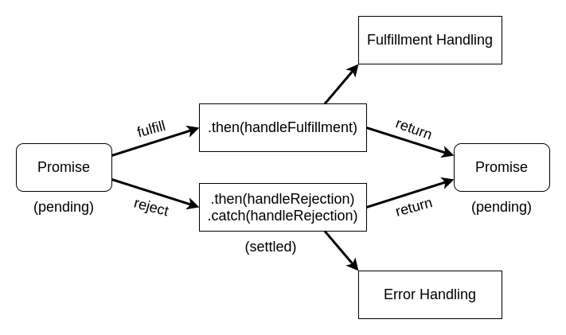

# **JavaScript Asynchronous Programming**
<br>

## **Table Of Contents**
<br>

- [**JavaScript Asynchronous Programming**](#javascript-asynchronous-programming)
  - [**Table Of Contents**](#table-of-contents)
  - [**Asynchronous Programming**](#asynchronous-programming)
  - [**Ways To Implement Asynchronous Programming In JavaScript**](#ways-to-implement-asynchronous-programming-in-javascript)
    - [**Callback Functions**](#callback-functions)
      - [**General**](#general)
        - [**Callback function**](#callback-function)
        - [**Declare asynchronous function**](#declare-asynchronous-function)
      - [**Example**](#example)
      - [**Things To Be Aware Of**](#things-to-be-aware-of)
    - [**Promises**](#promises)
      - [**Create Promise**](#create-promise)
      - [**Consume Promise**](#consume-promise)
      - [**Methods**](#methods)
        - [**Promise.all()**](#promiseall)
        - [**Promise.race()**](#promiserace)
        - [**Promise.allSettled()**](#promiseallsettled)
        - [**Promise.any()**](#promiseany)
    - [**Async Await**](#async-await)
      - [**General**](#general-1)
      - [**Basic Syntax**](#basic-syntax)
      - [**Examples**](#examples)

<br>
<br>
<br>
<br>

## **Asynchronous Programming**
<br>


* asynchronous functions 
  * do not wait idle for the result of expensive called functions
  * continue immediately after calling an expensive function
* result of called function is processed by a callback function

<br>
<br>
<br>
<br>

## **Ways To Implement Asynchronous Programming In JavaScript**
<br>
<br>
<br>
<br>

### **Callback Functions**
<br>

1. Define a callback function with parameters _error_ and _result_
2. use callback in expensive function called by the asynchronous function

<br>
<br>
<br>

#### **General**
<br>
<br>

##### **Callback function**
```javascript
function callback(error, result) {
  if (error) {
    /* implement error handling */
  } else {
    /* implement result handling */
  }
}
```

<br>
<br>

##### **Declare asynchronous function**
```javascript
function asyncFunction(callback) {

  // some code ...

  expensiveFunctionCall(/* params */) {
    // implementation that calls callback function for error and for result
  }

  // some code that is immediately executed after call of expensive function...

}
```

<br>
<br>
<br>

#### **Example**
<br>
<br>

For this example we use the _setTimeout(callback, delay)_ function that runs asynchronously.


```javascript
function asyncFunction(callback) {

  console.log('code before call of setTimeout()');

  setTimeout(
    () => {
    const result = Math.floor(100 * Math.random());

    if (result < 50) {

      // call callback in case of error
      callback(
        new Error(`Error: result ${result} < 50`),
        undefined
      );

    } else {

      // call callback in case of success
      callback(
        null,
        `result: ${result}`
      );

    }
  },
  5_000
  );

  console.log('code after call of setTimeout()');

}
```

<br>

Call of asynchronous function with inline definition of callback method:
```javascript
asyncFunction(
  // inline callback declaration
  (error, result) => {
    if (error) {
      console.error(error);
    } else {
      console.log(result);
    }
  }
);
```

<br>

Result:
```
code before call of setTimeout()
code after call of setTimeout()

Error: 28 < 50   OR   result: 87
```

<br>
<br>
<br>

#### **Things To Be Aware Of**
<br>
<br>
<br>

**1. Result of asynchronous called functions should always be passed to the callback functions. Do not use return statements.****

<br>

Example:

```javascript
function asyncFunction(callback) {
  let result = 'original';

  setTimeout(
    () => { result = 'changed by asynchronous stTimeout()'; },
    5_000
  );

  return result;
}
```

<br>

```javascript
asyncFunction();

// 'original'   
```

<br>
<br>
<br>

**2. Errors can not be thrown in the traditional way within asynchronous functions**

<br>

Example:

```javascript
function asyncFunction(callback) {

  console.log('enter asyncFunction()');

  setTimeout(
    () => { throw new Error('Error in setTimeout()'); },
    5_000
  );

  console.log('terminate asyncFunction()');
}
```

<br>

asyncFunction() does not wait for setTimeout() to terminated and therefore the changed 
```javascript
try {
  asyncFunction();
} catch (err) {
  console.error(err);
}

// 'enter asyncFunction()'
// 'terminate asyncFunction()'
// 'Uncaught Error: Error in setTimeout()'
```

<br>
<br>
<br>


**3. Calling asynchronous functions within callbacks leads to hard to read nested code (callback hell / pyramid of doom)**
<br>

```javascript
asynchronousFunction1(
  (error, result) => {
    asynchronousFunction2(
      (error, result) => {
        asynchronousFunction3(
          (error, result) => {
            /* ... */
          }
        )
      }
    );
  }
);
```

<br>
<br>
<br>
<br>

### **Promises**
<br>

* Promises are placeholder objects for the result of a asynchronous function
* Promises contain two callback methods:
  * _resolve()_ for return value
  * _reject()_ for error

<br>

Promise States:

|State    |Description
|:--------|:---------------------------------
|pending  |neither fulfilled not rejected
|fulfilled|resolve method called
|rejected |failed or reject method called 
|settled  |fulfilled or rejected (= not pending)

<br>



<br>
<br>
<br>

#### **Create Promise**
<br>

```javascript
new Promise((resolve, reject) => { /* code that calls resolve and reject callback functions */ });
```

<br>

Example:
```javascript
function asynchronousFunction() {

  let promise = new Promise((resolve, reject) => {
      setTimeout(
        () => {
          let result = Math.floor(100 * Math.random());

          if (result < 50) {
            const rejectParam = `result ${result} < 50`;
            reject(rejectParam);
          } else {
            resolve(result);
          }

        }, 
        5000
      );

    }
  );

  return promise;

}
```

<br>
<br>
<br>

#### **Consume Promise**
<br>

 ```javascript
asynchronousFunction()
  .then(
    (reject) => { /* handle error */ },
    (resolve) => { /* process resolve */ }
  );
```

<br>

```javascript
asynchronousFunction()
  .then(
    (resolve) => { /* process resolve */ }
  )
  .catch(
    (error) => { /* handle error */ }
  )
  .finally(
    () => { /* code to execute regardless whether promise was resolved or failed */ }
  )
```

<br>

Promises can be chained since the _.then()_ method returns a Promise object:

```javascript
SomePromise
  .then(handleResolvedA)
  .then(handleResolvedB)
  .catch(handleRejectedAny);
```

<br>
<br>
<br>

#### **Methods**
<br>
<br>

##### **Promise.all()**
<br>

* returns pending promise that 
  * will resolve when all input promises have resolved (returns array with results)
  * will reject once a input promise rejects or an error occurs

<br>

Example:

```javascript
const promiseA = new Promise((resolve, reject) => resolve('A'));
const promiseB = new Promise((resolve, reject) => reject('B'));
const promiseC = new Promise((resolve, reject) => resolve('C'));


Promise.all([promiseA, promiseC])
  .then(
    (result) => { console.log(result); }
  )
  .catch(
    (error) => { console.error(`${error} (Error)`); }
  );


Promise.all([promiseA, promiseB, promiseC])
  .then(
    (result) => { console.log(result); }
  )
  .catch(
    (error) => { console.error(`${error} (Error)`); }
  );

console.log('normal statement');

// 'normal statement'
// ['A', 'C']
// 'B (error)'
```

<br>
<br>
<br>

##### **Promise.race()**
<br>

* returns pending Promise that resolves to the first settled (= resolved or rejected) input promise

<br>

Example
```javascript
const promiseA = new Promise((resolve, reject) => setTimeout(
  () => resolve('A'), 
  2000)
);

const promiseB = new Promise((resolve, reject) => setTimeout(
  () => reject('B'),
  6000)
);

const promiseC = new Promise((resolve, reject) => setTimeout(
  () => resolve('C'), 
  1500)
);


Promise.race([promiseA, promiseB, promiseC])
  .then(
    (result) => { console.log(result); }
  )
  .catch(
    (error) => { console.error(`${error} (Error)`); }
  );

console.log('normal statement');

// 'normal statement'
// 'C'
```

<br>
<br>
<br>

##### **Promise.allSettled()**
<br>

* returns pending Promise that will resolve once all promise are settled (= resolved or rejected)

<br>

Example
```javascript
const promiseA = new Promise((resolve, reject) => resolve('A'));
const promiseB = new Promise((resolve, reject) => reject('B'));
const promiseC = new Promise((resolve, reject) => resolve('C'));


Promise.allSettled([promiseA, promiseB, promiseC])
  .then(
    (result) => { console.log(result); }
  )
  .catch(
    (error) => { console.error(`${error} (Error)`); }
  );

console.log('normal statement');

/* 

'normal statement'

[
  {status: 'fulfilled', value: 'A'}
  {status: 'rejected', reason: 'B'}
  {status: 'fulfilled', value: 'C'} 
]

*/
```

<br>
<br>
<br>

##### **Promise.any()**
<br>

* returns pending Promise that
  * will resolve when any of the input promise resolves
  * will reject when all input promises have been rejected

<br>

```javascript
const promiseA = new Promise((resolve, reject) => resolve('A'));
const promiseB = new Promise((resolve, reject) => reject('B'));
const promiseC = new Promise((resolve, reject) => resolve('C'));


Promise.any([promiseA, promiseB, promiseC])
  .then(
    (result) => { console.log(result); }
  )
  .catch(
    (error) => { console.error(`${error} (Error)`); }
  );

console.log('normal statement');


Promise.any([promiseB])
  .then(
    (result) => { console.log(result); }
  )
  .catch(
    (error) => { console.error(`${error} (Error)`); }
  );

console.log('normal statement');

// 'normal statement'
// 'normal statement'
// 'A'
// 'AggregateError: All promises were rejected (Error)'
```

<br>
<br>
<br>
<br>

### **Async Await**
<br>
<br>
<br>

#### **General**
<br>

* syntax for easier use of promises

<br>

* mark asynchronous functions with keyword async
  * marked function implicitly creates and returns Promise object

<br>

* mark asynchronous function calls within marked function with keyword await
  * calling function waits for the result of the called asynchronous function
  * calling function does not block the thread while waiting

<br>
<br>
<br>

#### **Basic Syntax**
<br>

```javascript
async function functionName() { 
  try {
    // some code
    let result = await someAsynchronousFunction();
    // some code
  } catch (err) {
    // handle error
  }
}
```

<br>
<br>
<br>

#### **Examples**
<br>
<br>

```javascript
function getRandomNumberBetween1And100() {
  return new Promise( (resolve) => {
    setTimeout(() => {
    const randomNumber = Math.floor(100 * Math.random()) + 1;
    resolve(randomNumber);
    }, 3000);
  });
}
```

<br>

```javascript
async function multiplyThreeRandomNumbers() {
  try {
    console.log('enter subtractTwoRandomNumbers()');
    const randomNumberOne = await getRandomNumberBetween1And100();
    console.log(`first random number: ${randomNumberOne}`);
    const randomNumberTwo = await getRandomNumberBetween1And100();
    console.log(`second random number: ${randomNumberTwo}`);
    const randomNumberThree = await getRandomNumberBetween1And100();
    console.log(`third random number: ${randomNumberThree}`);
    return randomNumberOne * randomNumberTwo * randomNumberThree;
  } catch (err) {
    console.error(err);
  }
}
```

<br>

```javascript
(async () => {
  const result = await multiplyThreeRandomNumbers();
  console.log(result);
})();
```

<br>

Output:
```
enter subtractTwoRandomNumbers()
first random number: 12
second random number: 30
third random number: 98
35280
```