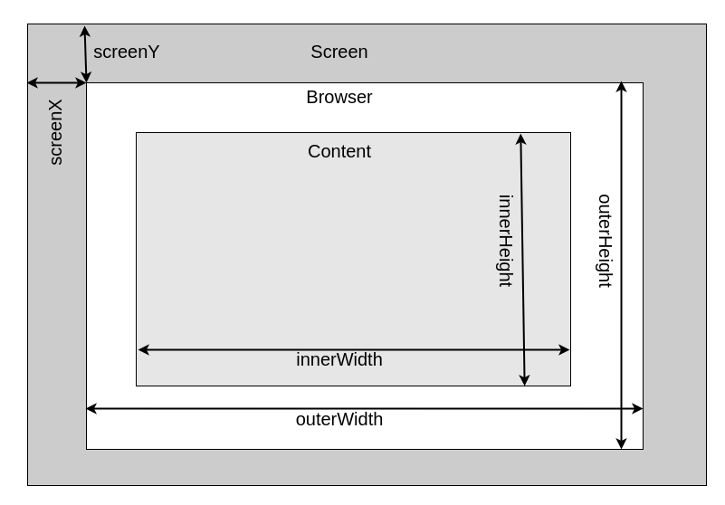

# **JavaScript Browser Object Model**

<br>

## **Table Of Contents**
<br>

- [**JavaScript Browser Object Model**](#javascript-browser-object-model)
  - [**Table Of Contents**](#table-of-contents)
  - [**General**](#general)
  - [**Window Object**](#window-object)
    - [**Properties**](#properties)
      - [**name**](#name)
      - [**opener**](#opener)
      - [**self**](#self)
      - [**innerHeight**](#innerheight)
      - [**innerWidth**](#innerwidth)
      - [**outerHeight**](#outerheight)
      - [**outerWidth**](#outerwidth)
      - [**screenX _or_ screenLeft**](#screenx-or-screenleft)
      - [**screenY _or_ screenTop**](#screeny-or-screentop)
      - [**scrollX**](#scrollx)
      - [**scrollY**](#scrolly)
      - [**locationbar**](#locationbar)
      - [**menubar**](#menubar)
      - [**personalbar**](#personalbar)
      - [**scrollbars**](#scrollbars)
      - [**statusbar**](#statusbar)
      - [**toolbar**](#toolbar)
    - [**Methods**](#methods)
      - [**open([url], [target], windowFeatures)**](#openurl-target-windowfeatures)
      - [**close()**](#close)
      - [**moveBy(numberOfPixelsX, numberOfPixelsY)**](#movebynumberofpixelsx-numberofpixelsy)
      - [**moveTo(positionX, positionY)**](#movetopositionx-positiony)
      - [**resizeBy(numberOfPixelsX, numberOfPixelsY)**](#resizebynumberofpixelsx-numberofpixelsy)
      - [**resizeTo(width, heigth)**](#resizetowidth-heigth)
      - [**scrollTo(positionX, positionY)**](#scrolltopositionx-positiony)
      - [**scroll({top, left, behavior: [auto, smooth]})**](#scrolltop-left-behavior-auto-smooth)
      - [**scrollBy(numberOfPixelsX, numberOfPixelsY)**](#scrollbynumberofpixelsx-numberofpixelsy)
      - [**scrollBy({top, left, behavior: [auto, smooth, instant]})**](#scrollbytop-left-behavior-auto-smooth-instant)
      - [**alert(message)**](#alertmessage)
      - [**confirm(message**](#confirmmessage)
      - [**prompt(message)**](#promptmessage)
      - [**print()**](#print)
      - [**setInterval(function, [delayInMilliseconds], [arg1], ..., [argN])**](#setintervalfunction-delayinmilliseconds-arg1--argn)
      - [**clearInterval(intervalId)**](#clearintervalintervalid)
      - [**setTimeout(function, [delayInMilliseconds], [arg1], ..., [argN])**](#settimeoutfunction-delayinmilliseconds-arg1--argn)
      - [**clearTimeout(timeoutId)**](#cleartimeouttimeoutid)
  - [**Window.Location**](#windowlocation)
    - [**Properties**](#properties-1)
      - [**href**](#href)
      - [**protocol**](#protocol)
      - [**host**](#host)
      - [**hostname**](#hostname)
      - [**port**](#port)
      - [**pathname**](#pathname)
      - [**search**](#search)
      - [**hash**](#hash)
    - [**Methods**](#methods-1)
      - [**assign(url)**](#assignurl)
      - [**reload()**](#reload)
      - [**replace(url)**](#replaceurl)
  - [**Window.History**](#windowhistory)
    - [**Properties**](#properties-2)
      - [**length**](#length)
      - [**scrollRestoration**](#scrollrestoration)
      - [**state**](#state)
    - [**Methods**](#methods-2)
      - [**back()**](#back)
      - [**forward()**](#forward)
      - [**go(step)**](#gostep)
      - [**pushState(stateObject, unused, [url])**](#pushstatestateobject-unused-url)
      - [**replaceState(stateObject, unused, [url])**](#replacestatestateobject-unused-url)
  - [**Window.Navigator**](#windownavigator)
    - [**Properties**](#properties-3)
      - [**clipboard**](#clipboard)
      - [**cookieEnabled**](#cookieenabled)
      - [**geolocation**](#geolocation)
      - [**hardwareConcurrency**](#hardwareconcurrency)
      - [**language**](#language)
      - [**languages**](#languages)
      - [**mediaDevices**](#mediadevices)
      - [**onLine**](#online)
      - [**serviceWorker**](#serviceworker)
      - [**storage**](#storage)
    - [**Methods**](#methods-3)
      - [**clearAppBadge()**](#clearappbadge)
      - [**getBattery()**](#getbattery)
      - [**sendBeacon(url, [data])**](#sendbeaconurl-data)
      - [**setAppBadge([numberContent])**](#setappbadgenumbercontent)
  - [**Window.Screen**](#windowscreen)
    - [**Properties**](#properties-4)
      - [**availHeight**](#availheight)
      - [**availWidth**](#availwidth)
      - [**height**](#height)
      - [**width**](#width)
      - [**orientation**](#orientation)


<br>
<br>
<br>
<br>

## **General**
<br>
<br>

* Browser Object Model (BOM) contains browser information and controls
* global entry point via _window_ 

<br>

Browser Object Model  
* Window
  * Window.location
  * Window.history
  * Window.navigator
  * Window.screen

<br>
<br>
<br>
<br>

## **Window Object**
<br>
<br>

### **Properties**
<br>
<br>


#### **name**
* returns or sets browsing context name

<br>
<br>

#### **opener**
* returns reference to window that opened current window

<br>
<br>

#### **self**
* returns window itself

<br>
<br>

#### **innerHeight**
* returns interior height including horizontal scroll bar in pixel

<br>
<br>

#### **innerWidth**
* returns interior width including vertical scroll bar in pixel

<br>
<br>

#### **outerHeight**
* returns heigth of browser window in pixel

<br>
<br>

#### **outerWidth**
* returns width of browser window in pixel

<br>
<br>

#### **screenX _or_ screenLeft**
* returns horizontal distance between the left browser border and the left side of the screen in css pixel

<br>
<br>

#### **screenY _or_ screenTop**
* returns vertical distance between the top browser border and the top side of the screen in css pixel

<br>
<br>

#### **scrollX**
* returns number of pixels the document is scrolled horizontally

<br>
<br>

#### **scrollY**
* returns number of pixels the document is scrolled vertically

<br>
<br>




<br>
<br>

#### **locationbar**
* returns object with attribute visible

<br>
<br>

#### **menubar**
* returns object with attribute visible

<br>
<br>

#### **personalbar**
* returns object with attribute visible

<br>
<br>

#### **scrollbars**
* returns object with attribute visible

<br>
<br>

#### **statusbar**
* returns object with attribute visible

<br>
<br>

#### **toolbar**
* returns object with attribute visible


<br>
<br>
<br>

### **Methods**
<br>
<br>

#### **open([url], [target], windowFeatures)**
* returns WindowProxy object (wrapper for Window object)
* Parameters
  * url
  * target = [browserContextName, _self, _blank, _parent, _top]
  * windowFeatures = 'width=700,height=700,left=10,top=10,...'
    * height
    * innerHeight
    * width
    * innerWidth
    * left
    * top
    * location
    * menubar
    * resizable
    * scrollbar
    * status
    * toolbar

<br>
<br>

#### **close()**

<br>
<br>

#### **moveBy(numberOfPixelsX, numberOfPixelsY)**
* Firefox requires window to be created with window.open()

<br>
<br>

#### **moveTo(positionX, positionY)**
* Firefox requires window to be created with window.open()

<br>
<br>

#### **resizeBy(numberOfPixelsX, numberOfPixelsY)**
* Firefox requires window to be created with window.open()

<br>
<br>

#### **resizeTo(width, heigth)**
* requires window to be created with window.open()

<br>
<br>

#### **scrollTo(positionX, positionY)**
#### **scroll({top, left, behavior: [auto, smooth]})**
* scroll to absolute position

<br>
<br>

#### **scrollBy(numberOfPixelsX, numberOfPixelsY)**
#### **scrollBy({top, left, behavior: [auto, smooth, instant]})**
* scroll to relative position

<br>
<br>

#### **alert(message)**

<br>
<br>

#### **confirm(message**

<br>
<br>

#### **prompt(message)**

<br>
<br>

#### **print()**

<br>
<br>

#### **setInterval(function, [delayInMilliseconds], [arg1], ..., [argN])**
* executes function in the specified interval
* optional arguments [arg1], ..., [argN] are passed to function
* returns numeric intervalId

<br>
<br>

#### **clearInterval(intervalId)**

<br>
<br>

#### **setTimeout(function, [delayInMilliseconds], [arg1], ..., [argN])**
* executes function ONCE after specified delay
* optional arguments [arg1], ..., [argN] are passed to function
* returns numeric timeoutId

<br>
<br>

#### **clearTimeout(timeoutId)**

<br>
<br>
<br>
<br>

## **Window.Location**
<br>

* represents the location / url of the document

<br>
<br>
<br>

### **Properties**
<br>
<br>

#### **href**
* complete url

<br>
<br>

#### **protocol**

<br>
<br>

#### **host**
* host with port number

<br>
<br>

#### **hostname**
* host without port number

<br>
<br>

#### **port**

<br>
<br>

#### **pathname**
* pathname starting with /

<br>
<br>

#### **search**
* querystring

<br>
<br>

#### **hash**
* #fragmentIdentifier

<br>
<br>
<br>

### **Methods**
<br>
<br>

#### **assign(url)**
* load and display specified url in current window
* user can go back to previous site via back button

<br>
<br>

#### **reload()**

<br>
<br>

#### **replace(url)**
* load and display specified url in current window
* user can NOT go back to previous site via back button

<br>
<br>
<br>
<br>

## **Window.History**
<br>

* contains browser session history 

<br>
<br>
<br>

### **Properties**
<br>
<br>

#### **length**

<br>
<br>

#### **scrollRestoration**
* return or set default scroll restoration behavior [auto, manual]

<br>
<br>

#### **state**
* return entry on top of the session history stack

<br>
<br>
<br>

### **Methods**
<br>
<br>

#### **back()**
* go to previous page (equal to back button)

<br>
<br>

#### **forward()**
* go to next page (equal to forward button)

<br>
<br>

#### **go(step)**
* load page from session history

<br>
<br>

#### **pushState(stateObject, unused, [url])**
* add entry to session history stack
* Parameter
  * stateObject: JavaScript object associated with new history event
  * unused: unused parameter, set to empty string
  * url: optional


```javascript
let state = {'pageId': 4, 'userId': 6};
history.pushState(state, '', 'foo-bar.html');
```

<br>
<br>

#### **replaceState(stateObject, unused, [url])**
* replaces current history event
* Parameter
  * stateObject: JavaScript object associated with new history event
  * unused: unused parameter, set to empty string
  * url: optional


```javascript
let state = {'pageId': 4, 'userId': 6};
history.pushState(state, '', 'foo-bar.html');
```

<br>
<br>
<br>
<br>

## **Window.Navigator**
<br>

* contains information about the browser and entry points for several APIs

<br>
<br>
<br>

### **Properties**
<br>
<br>

#### **clipboard**
* return Clipboard object (Clipboard API)

<br>
<br>

#### **cookieEnabled**

<br>
<br>

#### **geolocation**
* returns Geolocation object (Geolocation API)

<br>
<br>

#### **hardwareConcurrency**
* returns number of available logical processors of the system

<br>
<br>

#### **language**
* returns string representing the preferred language of the browser

<br>
<br>

#### **languages**
* returns array of strings representing the preferred languages of the browser

<br>
<br>

#### **mediaDevices**
* returns MediaDevices object

<br>
<br>

#### **onLine**
* returns boolean indicating whether browser can access the internet

<br>
<br>

#### **serviceWorker**
* returns ServiceWorkerContainer object (Service Worker API)

<br>
<br>

#### **storage**
* returns StorageManager object (Storage API)

<br>
<br>
<br>

### **Methods**
<br>
<br>

#### **clearAppBadge()**

<br>
<br>

#### **getBattery()**
* returns BatteryManager object (Battery Status API)

<br>
<br>

#### **sendBeacon(url, [data])**
* sends HTTP Post request with small amount of data to web server
* returns true if data was successfully queued

<br>
<br>

#### **setAppBadge([numberContent])**

<br>
<br>
<br>
<br>

## **Window.Screen**
<br>

* contains information about the screen

<br>
<br>
<br>

### **Properties**
<br>
<br>


#### **availHeight**
* returns screen heigth available for web content in pixel

<br>
<br>

#### **availWidth**
* returns screen width available for web content in pixel

<br>
<br>

#### **height**
* returns screen heigth in pixel

<br>
<br>

#### **width**
* returns screen width in pixels

<br>
<br>

#### **orientation**
* returns Screen Orientation object (Screen Orientation API)