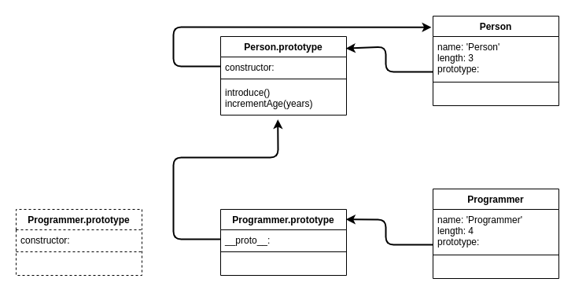

# **JavaScript Object Oriented Programming**
<br>

## **Table Of Contents**
<br>

- [**JavaScript Object Oriented Programming**](#javascript-object-oriented-programming)
  - [**Table Of Contents**](#table-of-contents)
  - [**Core Principles Of Object Orientated Programming**](#core-principles-of-object-orientated-programming)
  - [**Object Oriented Programming In JavaScript**](#object-oriented-programming-in-javascript)
    - [**Prototype Object Orientation**](#prototype-object-orientation)
      - [**Create New Object Based On Prototype**](#create-new-object-based-on-prototype)
      - [**Inherit Prototype Methods And Properties**](#inherit-prototype-methods-and-properties)
      - [**Implicitly Call Prototype Methods**](#implicitly-call-prototype-methods)
      - [**Add Methods And Properties**](#add-methods-and-properties)
      - [**Create Subtypes**](#create-subtypes)
      - [**Overwrite Prototype Methods**](#overwrite-prototype-methods)
      - [**Explicitly Call Prototype Methods**](#explicitly-call-prototype-methods)
    - [**Pseudo Class Object Orientation**](#pseudo-class-object-orientation)
      - [**Add Methods To Prototype Of Constructor Function**](#add-methods-to-prototype-of-constructor-function)
      - [**Create New Object**](#create-new-object)
      - [**Set Up Inheritance**](#set-up-inheritance)
        - [**Step 1: Create Constructor Function For Subtype**](#step-1-create-constructor-function-for-subtype)
        - [**Step 2: Add Newly Created Subtype Prototype Object Referencing Supertype Object**](#step-2-add-newly-created-subtype-prototype-object-referencing-supertype-object)
        - [**Step 3: Set Constructor Property Of Newly Created Subtype Prototype Object To Subtype Constructor**](#step-3-set-constructor-property-of-newly-created-subtype-prototype-object-to-subtype-constructor)
        - [**Step 4: Define Subtype Methods**](#step-4-define-subtype-methods)
        - [**Check Implemented Inheritance**](#check-implemented-inheritance)
        - [**Implicitly Call Supertype Methods**](#implicitly-call-supertype-methods)
      - [**Call Supertype Constructor**](#call-supertype-constructor)
      - [**Overwrite Methods**](#overwrite-methods)
      - [**Explicitly Call Supertype Methods**](#explicitly-call-supertype-methods)
    - [**Class Syntax Object Orientation**](#class-syntax-object-orientation)
      - [**Ways To Define Class Syntax**](#ways-to-define-class-syntax)
        - [**Class Declaration**](#class-declaration)
        - [**Class Expression**](#class-expression)
      - [**Create New Instance Object**](#create-new-instance-object)
      - [**Getter And Setter Methods**](#getter-and-setter-methods)
      - [**Private Properties And Methods**](#private-properties-and-methods)
      - [**Static Properties And Methods**](#static-properties-and-methods)
      - [**Create Subclass**](#create-subclass)
      - [**Call Superclass Constructor**](#call-superclass-constructor)
      - [**Overwrite Superclass Method**](#overwrite-superclass-method)
      - [**Explicitly Call Superclass Method**](#explicitly-call-superclass-method)
      - [**Example**](#example)

<br>
<br>
<br>
<br>

## **Core Principles Of Object Orientated Programming**
<br>

1. **Abstraction**
  
   Abstract behavior and state of similar objects into classes or prototypes

<br>

2. **Data Encapsulation**
   
   Properties and methods are encapsulated by classes or prototypes

<br>

3. **Inheritance**
   
   Classes or prototypes can inherit the properties and methods of other classes or prototypes

<br>

4. **Polymorphism**
   
   Objects can have different types in different contexts

<br>
<br>
<br>
<br>

## **Object Oriented Programming In JavaScript**
<br>

JavaScript is a prototype-based language. That means: objects are created based on other objects (= the _prototype_ of the new object).  
Objects are _NOT_ created based on 'real' classes.

<br>

Lets see whether the core principles of object oriented programming are fulfilled in JavaScript:

<br>
<br>

1. **Abstraction**
   
   Fulfilled by defining properties and methods on prototype objects.

<br>

2. **Data Encapsulation**

   Fulfilled by class syntax object orientation (see below), otherwise only fulfilled by implementing a specific design pattern.

<br>

3. **Inheritance**
   
   Fulfilled by prototype chaining.

<br>

4. **Polymorphism**
   
   Fulfilled because JavaScript is dynamically typed and therefore has no type restrictions.

<br>
<br>

There are three ways to implement object orientation in JavaScript:

<br>
<br>
<br>
<br>

### **Prototype Object Orientation**
<br>
<br>

Assume we have the following object that we will use as a prototype:

```javascript
const personPrototype = {
    firstName: '',
    lastName: '',
    age: 0,
    introduce: function() {
        console.log(`Hello, my name is ${this.firstName} ${this.lastName}`);
    },
    incrementAge: function(years) {
        this.age += years;
    }
}
```

<br>
<br>
<br>

#### **Create New Object Based On Prototype**
#### **Inherit Prototype Methods And Properties**
#### **Implicitly Call Prototype Methods**

<br>

```javascript
Object.create(prototypeObject);
```

<br>


```javascript
const johnDoe = Object.create(personPrototype);     // create new objects based on person object
johnDoe.firstName = 'John';
johnDoe.lastName = 'Doe';
johnDoe.age = 37;


johnDoe.introduce();                                // 'Hello, my name is John Doe'
johnDoe.incrementAge(1);                    
console.log(johnDoe.age);                           // 38
```

<br>
<br>
<br>

#### **Add Methods And Properties**
<br>

```javascript
object.propertyName = 'value';
object.methodName = function(param) { /* implementation */ };
```

<br>

```javascript
johnDoe.isHungry = true;                            // add property

johnDoe.eat = function(food) {                      // add method
  if (this.isHungry) {
    console.log(`eating ${food}...`);
  } else {
    console.log('not hungry...');
  }
  this.isHungry = !this.isHungry;
}

johnDoe.eat('apple');                               // 'eating apple...'
johnDoe.eat('cake');                                // 'not hungry...'
```

<br>
<br>
<br>

#### **Create Subtypes**
<br>

```javascript
const subtypePrototype = Object.create(supertypePrototype);
subtypePrototype.subtypePropertyName = 'value';
subtypePrototype.subtypeMethodName = function(param) { /* implementation */ };
```

<br>

```javascript
const programmerPrototype = Object.create(personPrototype);
programmerPrototype.language = ''
programmerPrototype.program = function(durationInHours) {
    console.log(`Programming ${this.language} for ${durationInHours} hours...`);
}


const janeDoe = Object.create(programmerPrototype);
janeDoe.firstName = 'Jane';
janeDoe.lastName = 'Doe';
janeDoe.age = 24;
janeDoe.language = 'JavaScript';

janeDoe.introduce();                                // 'Hello, my name is Jane Doe'
janeDoe.incrementAge(1);
console.log(janeDoe.age);                           // 25
janeDoe.program(3);                                 // 'Programming JavaScript for 3 hours...'
```

<br>
<br>
<br>

#### **Overwrite Prototype Methods**
<br>

```javascript
object.prototypeObjectMethodName = function(param) { /* implementation */ };
```

<br>

```javascript
johnDoe.introduce();                                // 'Hello, my name is John Doe'
janeDoe.introduce();                                // 'Hello, my name is Jane Doe'

programmerPrototype.introduce = function() {
    console.log(`Hi, i am ${this.firstName} ${this.lastName}. I am a ${this.age} years old ${this.language} programmer`);
}

johnDoe.introduce();                                // 'Hello, my name is John Doe'
janeDoe.introduce();                                // 'Hi, i am Jane Doe. I am a 25 years old JavaScript programmer.'
```

<br>
<br>
<br>

#### **Explicitly Call Prototype Methods**
<br>

```javascript
Object.getPrototypeOf(this).prototypeObjectMethodName.call(this, param);
```

<br>

```javascript
programmerPrototype.celebrateBirthday = function() {
    const incrementByYears = 1;
    Object.getPrototypeOf(this).incrementAge.call(this, incrementByYears);      // calls prototype method incrementAge(1) 
    console.log(`celebrating ${this.age}th birthday...`);
}

console.log(janeDoe.age);                                                       // 25
janeDoe.celebrateBirthday();                                                    // 'celebrating 26th birthday..'.
console.log(janeDoe.age);                                                       // 26
```

<br>
<br>
<br>
<br>

### **Pseudo Class Object Orientation**
<br>
<br>

Pseudo classes are based on [constructor functions](javascript_object.md#constructor-function).

Assume we have the following constructor function for person objects:

```javascript
function Person(firstName, lastName, age) {
    this.firstName = firstName;
    this.lastName = lastName;
    this.age = age;
}
```

<br>
<br>
<br>

#### **Add Methods To Prototype Of Constructor Function**
<br>

```javascript
constructorFunctionName.prototype.methodName = function(param) { /* implementation */ };
```

<br>

```javascript
Person.prototype.introduce = function() {
    console.log(`Hello, my name is ${this.firstName} ${this.lastName}`);
};

Person.prototype.incrementAge = function(years) {
    this.age += years;
};
```

<br>
<br>

**Note:**  
You can also define methods inside of the constructor function. In this case, the method definition is added to every object created by the constructor function rather than just to the prototype.

<br>

```javascript
function Person(firstName, lastName, age) {
    this.firstName = firstName;
    this.lastName = lastName;
    this.age = age;
    this.incrementAge = function(years) {
        this.age += years;
    }
    this.introduce = function() {
        console.log(`Hello, my name is ${this.firstName} ${this.lastName}`);
    }
}


const johnSmith = new Person('John', 'Smith', 15);
const janeSmith = new Person('Jane', 'Smith', 67);

console.log(johnSmith);
console.log(janeSmith);

/*

Console output:

Person {firstName: 'John', lastName: 'Smith', age: 15, incrementAge: ƒ, introduce: ƒ}
age: 15
firstName: "John"
incrementAge: ƒ (years)
introduce: ƒ ()
lastName: "Smith"
[[Prototype]]: Object


Person {firstName: 'Jane', lastName: 'Smith', age: 67, incrementAge: ƒ, introduce: ƒ}
age: 67
firstName: "Jane"
incrementAge: ƒ (years)
introduce: ƒ ()
lastName: "Smith"
[[Prototype]]: Object

*/
```

<br>
<br>
<br>

#### **Create New Object**
<br>

```javascript
const newObject = new ConstructorFunctionName(param);
```

<br>

```javascript
const johnDoe = new Person('John', 'Doe', 37);

johnDoe.introduce();                              // 'Hello, my name is John Doe'
johnDoe.incrementAge(1);

console.log(johnDoe.age);                         // 38
```

<br>
<br>
<br>

#### **Set Up Inheritance**
<br>
<br>

We have already declared our constructor function and added methods to its prototype: 

<br>


<br>
<br>
<br>

##### **Step 1: Create Constructor Function For Subtype**
<br>

```javascript
function Programmer(firstName, lastName, age, language) {
    Person.call(this, firstName, lastName, age);                // call constructor of supertype
    this.language = language;                                   // define subtype specific properties
}
```

<br>


<br>
<br>
<br>

##### **Step 2: Add Newly Created Subtype Prototype Object Referencing Supertype Object**
<br>

* Subtype prototype references supertype object
* Supertype object references supertype prototype

<br>

```javascript
Programmer.prototype = new Person();
```

<br>



<br>
<br>
<br>

##### **Step 3: Set Constructor Property Of Newly Created Subtype Prototype Object To Subtype Constructor**
<br>

```javascript
Programmer.prototype.constructor = Programmer;
```

<br>


<br>
<br>
<br>

##### **Step 4: Define Subtype Methods**
<br>

```javascript
Programmer.prototype.program = function(durationInHours) {
    console.log(`Programming ${this.language} for ${durationInHours} hours...`);
}
```

<br>


<br>
<br>
<br>

##### **Check Implemented Inheritance**
##### **Implicitly Call Supertype Methods**
<br>

```javascript
const janeDoe = new Programmer('Jane', 'Doe', 24, 'JavaScript');
janeDoe.introduce();                                                  // 'Hello, my name is Jane Doe'
janeDoe.incrementAge(1);
console.log(janeDoe.age);                                             // 25
janeDoe.program(3);                                                   // 'Programming JavaScript for 3 hours...'


const johnDoe = new Person('John', 'Doe', 37);
johnDoe.introduce();                                                  // 'Hello, my name is John Doe'
johnDoe.incrementAge(1);
console.log(johnDoe.age);                                             // 38
johnDoe.program(3);                                                   // 'Error: johnDoe.program is not a function'
```

<br>
<br>
<br>

#### **Call Supertype Constructor**
<br>

```javascript
function subtypeConstructorFunctionName(supertypeParam, subtypeParam) {
    supertypeConstructorFunctioName.call(this, supertypeParam);
    this.subtypePropertyName = subtypeParam;
}
```

<br>

See [Inheritance Step 1](#step-1-create-constructor-function-for-subtype)

<br>
<br>
<br>

#### **Overwrite Methods**
<br>

```javascript
constructorFunctionName.prototype.methodName = function(param) { /* implementation */ }

// only when methods were defined directly within constructor function:
constructorFunctionName.methodName = function(param) { /* implementation */ }
```

<br>

```javascript
const johnSmith = new Programmer('John', 'Smith', 34, 'TypeScript');


janeDoe.introduce();                                    // 'Hello, my name is Jane Doe'
johnSmith.introduce();                                  // 'Hello, my name is John Smith'


// overwrite inherited method Person.introduce()
Programmer.prototype.introduce = function() {
    console.log(`Hi, i am ${this.firstName} ${this.lastName}. I am a ${this.age} years old ${this.language} programmer`);
}

janeDoe.introduce();                                    // 'Hi, i am Jane Doe. I am a 25 years old JavaScript programmer'
johnSmith.introduce();                                  // 'Hi, i am John Smith. I am a 34 years old TypeScript programmer'


// overwrite method Programmer.introduce() defined above for specified instance
janeDoe.introduce = function() {
    console.log(`Greetings, i am ${this.firstName} ${this.lastName} (${this.age}). I write applications in ${this.language}.`);
}

janeDoe.introduce();                                    // 'Greetings, i am Jane Doe (25). I write applications in JavaScript.'
johnSmith.introduce();                                  // 'Hi, i am John Smith. I am a 34 years old TypeScript programmer'
```

<br>
<br>
<br>

#### **Explicitly Call Supertype Methods**
<br>

```javascript
supertypeName.prototype.methodName.call(this, param);
```

<br>

```javascript
janeDoe.introduce();                                    // 'Greetings, i am Jane Doe (25). I write applications in JavaScript.'

Person.prototype.introduce.call(janeDoe);               // 'Hello, my name is Jane Doe'
```

<br>
<br>
<br>
<br>

### **Class Syntax Object Orientation**
<br>
<br>

* reduces the complexity of pseudo class object orientation
* realizes no class-based programming, object orientation stays prototype-based!

<br>
<br>
<br>

#### **Ways To Define Class Syntax**
<br>
<br>

##### **Class Declaration**
<br>

* Class declaration is not hoisted by the interpreter

<br>

```javascript
class ClassName {

  constructor(param1, param2, param3) {
      this.property1 = param1;
      this.property2 = param2;
      this.property3 = param3;
  }

  method1() { /* implementation */ }

}
```

<br>
<br>

##### **Class Expression**
<br>

* Class expression is not hoisted by the interpreter

<br>

```javascript
const ClassName = class {

    constructor(param1, param2, param3) {
        this.property1 = param1;
        this.property2 = param2;
        this.property3 = param3;
    }

    method1() { /* implementation */ }

};
```

<br>
<br>
<br>

#### **Create New Instance Object**
<br>

```javascript
const newInstance = new ClassName('value1', 'value2', 'value3');
```

<br>
<br>
<br>

#### **Getter And Setter Methods**
<br>

* define methods that are called upon reading or value assignment
* use keywords _get_ or _set_ in front of method same name as property
* add underscore (or #) in front of property name to avoid an infinity loop

<br>

```javascript
class ClassName {

    constructor(param1, param2, param3) {
        this._property1 = param1;
        this._property2 = param2;
        this._property3 = param3;
    }

    get property1() {
        console.log('call: get property1()');
        return this._property1;
    }

    set property1(param) {
        console.log('call: set propterty1()');
        this._property1 = param;
    }

    get property2() {
        console.log('call: get property2()');
        return this._property2;
    }

    set property3(param) {
        console.log('call: set propterty3()');
        this._property2 = param;
    }

    method1() { /* implementation */ }

}  
```

<br>

```javascript
const newInstance = new ClassName('value1', 'value2', 'value3');


const property1 = newInstance.property1;                    // 'call: get property1()'
console.log(property1);                                     // 'value1'

newInstance.property1 = 'changed value';                    // 'call: set propterty1()'


const property2 = newInstance.property2;                    // 'call: get property2()'
console.log(property2);                                     // 'value2'

newInstance.property2 = 'changed value';                    // 'call: get property2()'
console.log(newInstance.property2);                         // 'value2' (because there is no setter method for property2)


const property3 = newInstance.property3;
console.log(property3);                                     // 'undefined' (because there is no getter method for property3)

newInstance.property3 = 'changed value';                    // 'call: set propterty3()'
console.log(newInstance.property3);                         // 'undefined' (because there is no getter method for property3)
```

<br>
<br>

**Note:**  
Using getters and setters does not prevent external access to the property!  
See [private properties and methods]().

<br>

```javascript
const newInstance = new ClassName('value1', 'value2', 'value3');

console.log(newInstance._property1);                        // value1

newInstance._property1 = 'externally changed value';

console.log(newInstance._property1);                        // 'externally changed value'
```

<br>
<br>
<br>

#### **Private Properties And Methods**
<br>

* prevents external access to properties and methods marked # in front of name
* since ES2022

<br>

```javascript
class ClassName {

    #privateProperty;
    publicProperty;

    constructor(param1, param2) {
        this.#privateProperty = param1;
        this.publicProperty = param2;
    }

    #privateMethod() { /* implementation */ }

    publicMethod() { /* implementation */ }
}
```

<br>
<br>

```javascript
class ClassName {

    #privateProperty = 'default value';

    constructor(param1, param2) {
        this.#privateProperty =  param1 ? param1 : this.#privateProperty;
        this.publicProperty = param2;
    }

    get privateProperty() {
        console.log('call get privateProperty()');
        return this.#privateProperty;
    }

    set privateProperty(param) {
        console.log('call set privateProperty()');
        this.#privateProperty = param;
    }

    publicMethod() {
        console.log('call publicMethod()');
        this.#privateMethod();
    }

    #privateMethod() { 
        console.log('call privateMethod()');
    }

}  
```

<br>

```javascript
const newInstance = new ClassName('value1', 'value2');

console.log(newInstance.publicProperty);                            // 'value2'  
console.log(newInstance.privateProperty);                           // 'call get privateProperty()', 'value1' 
console.log(newInstance.#privateProperty);                          // 'Error: private field must be declared in an enclosing class'

newInstance.privateProperty;                                        // 'call get privateProperty()'
newInstance.privateProperty = 'changed value';                      // 'call set privateProperty()'

newInstance.publicMethod();                                         // 'call publicMethod()', 'call privateMethod()'
newInstance.privateMethod();                                        // 'Error: newInstance.privateMethod is not a function'
newInstance.#privateMethod();                                       // 'Error: private field must be deflared in an enclosing class'
```

<br>
<br>
<br>

#### **Static Properties And Methods**
<br>

* static elements can be used without instance of a class

<br>

```javascript
class ClassName {

    static staticProperty = 'value';

    static staticMethod(param) {
        return param;
    }
}


ClassName.staticProperty;               // 'value'
ClassName.staticMethod('foo');          // 'foo'
```

<br>
<br>
<br>

#### **Create Subclass**
#### **Call Superclass Constructor**
#### **Overwrite Superclass Method**
#### **Explicitly Call Superclass Method**

<br>

```javascript
class SuperClass { 

    constructor(param1) {
        this.property1 = param1;
    }

    method1() { /* implementation */ }

    method2(param) { /* implementation*/ }

}


class SubClass extends SuperClass {

    constructor(param1, param2) {
        super(param1);                            // call of superclass constructor (must be called before use of keyword this)
        this.property2 = param2;
    }

    method2(param) {                              // overwrite superclass method
        super.method2(param);                     // explicit call of superclass method
        /* additional implementation */
    }

    method3() { /* implementation */ }

}
```

<br>
<br>
<br>

#### **Example**
<br>

```javascript
class Person {

    #firstName = '';
    #lastName = '';
    #age = 0;


    constructor(firstName, lastName, age) {
        this.#firstName = firstName;
        this.#lastName = lastName;
        this.#age = age;
    }


    get firstName() {
        return this.#firstName;
    }

    get lastName() {
        return this.#lastName;
    }

    get age() {
        return this.#age;
    }


    introduce() {
        console.log(`Hello, my name is ${this.#firstName} ${this.#lastName}`);
    }

    incrementAge(years) {
        this.#age += years;
    }

}


class Programmer extends Person {

    #language = '';


    constructor(firstName, lastName, age, language) {
        super(firstName, lastName, age);
        this.#language = language;
    }


    program(durationInHours) {
        console.log(`Programming ${this.#language} for ${durationInHours} hours...`);
    }

    introduce() {
        console.log(`Hi, i am ${super.firstName} ${super.lastName}. I am a ${super.age} years old ${this.#language} programmer`);
    }

}


const johnDoe = new Person('John', 'Doe', 37);

johnDoe.introduce();                                                    // 'Hello, my name is John Doe'
johnDoe.incrementAge(1);
console.log(johnDoe.age);                                               // 38


const janeDoe = new Programmer('Jane', 'Doe', 24, 'JavaScript');
janeDoe.introduce();                                                    // 'Hi, i am Jane Doe. I am a 24 years old JavaScript programmer'
janeDoe.incrementAge(1);
console.log(janeDoe.age);                                               // 25
janeDoe.program(3);                                                     // 'Programming JavaScript for 3 hours...'
```