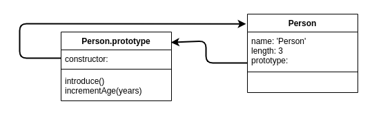
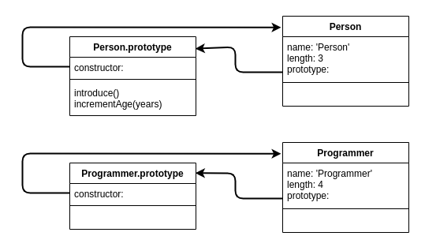
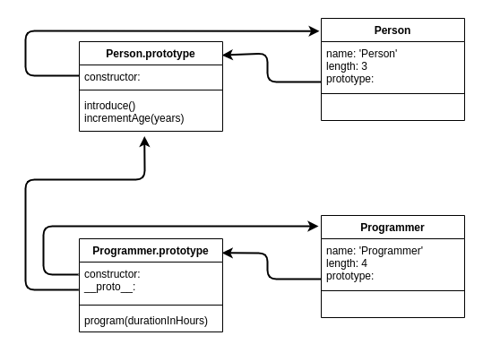

# **JavaScript Object Oriented Programming**
 

## **Table Of Contents**
 

- [**JavaScript Object Oriented Programming**](#javascript-object-oriented-programming)
  - [**Table Of Contents**](#table-of-contents)
  - [**Core Principles Of Object Orientated Programming**](#core-principles-of-object-orientated-programming)

 
 
 
 

## **Core Principles Of Object Orientated Programming**

Step 1:

 

 
 

Step 2:

 

 
 

Step 3:

 

 
 

Step 4:

 

 
 

Step 1:

 

 
 

Step 6:

 

 
 

[Resource To Check Feature Availability](https://kangax.github.io/compat-table/es2016plus/)

<!--

Principles Of Object Oriented Programming

1. Abstraction
   - abstract behavior into classes or prototypes

2. Data Encapsulation
   - attributes and methods are encapsulated by classes or prototypes

3. Inheritance
   - objects can inherit attributes and methods of other objects

4. Polymorphism
   - objects can have different types in different contexts

----------------------------------------------------

JavaScript is object-based: objects are created based on other objects (prototype)
    -> JavaScript is prototype-based

-----------------------------------------------------

Object-orientation in JavaScript

1. prototype object-orientation

2. pseudoclass object-orientation

3. object-orientation with class syntax

---------------------------------------------------

===== prototype object-orientation =====

- every object is based on a prototype (except _Object_ object)
- every object can be used ad a prototype for other objects
- object inherits all properties and methods from prototype
  
- access prototype of objectA with: 
  - objectA.__proto__  (do not use)
  - objectA.getPrototypeOf()

- check if objectB is prototype of objectA
  - objectB.isPrototypeOf(objectA)

- create objectB with prototype objectA
  - objectB = Object.create(objectA)

- overwrite prototype methods:
  - objectB = Object.create(objectA);
    objectB.methodFromA = function() { ... }

- call prototype methods:
  - objectB = Object.create(objectA);
  - objectB.getPrototypeOf().methodOfObjectA().call(this, argument);
  - ( alternative: objectB.__proto__.methodObjectA().call(this, argument) )

- prototype chaining:
  1. search called method on caller object
  2. if method does not exist, search on prottype
  3. if method does not exist and object <> root _Object_: go to 2

! No prototype possible for object literals !

Object-orientation Principles:

1. Abstraction: check, abstracted into prototypes
2. Data encapsulation: No, only with specific design patterns
3. Inheritance: check, prototype chaining
4. polymorphism: check, javascript is dynamically typed

-----------------------------------------------------------------------------

===== pseudoclass object-orientation =====

- based on constructor functions

- constructor function
  - function ConstructorFunctionName(param1) { this.property1 = param1; };

- instantiate object with constructor function
  - object = new ConstructorFunctionName('argument')

- define methods for all instances of constructor function 
  - ConstructorFunctionName.prototype.methodName = function() { ... }

- inheritance:

    1.) function Person(name, age) {
            this.name = name;
            this.age = age;
        };

    2.) Person.prototype.sleep = function(duration) {
            console.log('sleep for ', duration);
        };

    3.) function Teacher(name, age, subject) {
            Person.call(this, name, age);
            this.subject = subject;
        };

    4.) Teacher.prototype = new Person();

    5.) Teacher.prototype.constructor = Teacher;

    6.) Teacher.prototype.teach() = function() {
            console.log('Teaching...');
        }

- call constructor of super prototype
  - function Teacher(name, age, subject) {
        Person.call(this, name, age);
        this.subject = subject;
    };

- overwrite methods
  - ObjectA.prototype.methodName = function(param){ ... }

- call methods of super object
  - superObjectB.prototype.methodName.call(this, argument);

Object-orientation Principles:

1. Abstraction: check, abstracted into prototypes
2. Data encapsulation: No, only with specific design patterns
3. Inheritance: check, but a bit complex
4. polymorphism: check, javascript is dynamically typed

-----------------------------------------------------------------------------

===== object-orientation with class syntax =====

- class syntax reduces complexity of pseudoclass object-orientation
- realizes no class-based programming! JavaScript stays object-based

--- class declaration ---

    class ClassName {

        property1 = 'value1';       // instance properties (ES2022)
        property2 = 'value2'

        constructor(param1, param2, param3) {
            this.property1 = param1 ? param2 : this.property1;
            this.property2 = param2 ? param2 : this.property2;
            this.property3 = param3;
        }

        method1() { /* implementation */ }
    }

--- class expression ---

    const ClassName = class {

        property1 = 'value1';       // instance properties (ES2022)
        property2 = 'value2'

        constructor(param1, param2, param3) {
            this.property1 = param1 ? param2 : this.property1;
            this.property2 = param2 ? param2 : this.property2;
            this.property3 = param3;
        }

        method1() { /* implementation */ }
    };

- instantiate new object
  - const newInstance = new ClassName('value1', 'value2', 'value3');

- define Getter and Setter
  - write keywords get or set in front of method
  - CAUTION: name of getter- / setter-method must not equal a property name (-> infinity loop)
    -> typically: add underscore in front of property name

    class ClassName {

        constructor(param1, param2, param3) {
            this._property1 = param1 ? param2 : this.property1;
            this._property2 = param2 ? param2 : this.property2;
            this._property3 = param3;
        }

        get property1() {
            return this._property1;
        }

        set property1(param) {
            this._property1 = param;
        }

        get property2() {
            return this._property2;
        }

        set property2(param) {
            this._property2 = param;
        }

        method1() { /* implementation */ }

    }  

- define private properties and methods (since ES2022)
  - underscore is only a convention and does not prevent external access
  - add # in front of private properties 

    class ClassName {

        constructor(param1, param2, param3) {
            this.#property1 = param1;
            this.#property2 = param2;
            this.#property3 = param3;
        }

        get property1() {
            return this.#property1;
        }

        set property1(param) {
            this.#property1 = param;
        }

        get property2() {
            return this.#property2;
        }

        set property2(param) {
            this.#property2 = param;
        }

        #method1() { /* implementation */ }

    }  

- inheritance of classes
    - keyword extends
    - call of superclass constructor with keyword super

    class SuperClass {
        
        constructor(param1, param2) {
            this.property1 = param1;
            this.property2 = param2;
        }

        method1(param) { /* implementation */ }
    }

    class SubClass extends SuperClass {

        constructor(param1, param2, param3) {
            super(param1, param2);                  // superclass constructor must to be called BEFORE any use of keyword _this_
            this.property3 = param3;
        }
    }

- overwrite methods of superclasses
  - add method with same name to subclass

  class SuperClass {
        
        constructor(param1, param2) {
            this.property1 = param1;
            this.property2 = param2;
        }

        method1(param) { /* implementation */ }
    }

    class SubClass extends SuperClass {

        constructor(param1, param2, param3) {
            super(param1, param2);                  // superclass constructor must to be called BEFORE any use of keyword _this_
            this.property3 = param3;
        }

        method1(param) { /* implementation */ }     // overwrites SuperClass.method1()
    }

- call methods of superclass
  - super.methodName(param)

- static methods
  - static methodName(param) { /* implementation */ }

- static properties
  - static propertyName = 'value';
-->