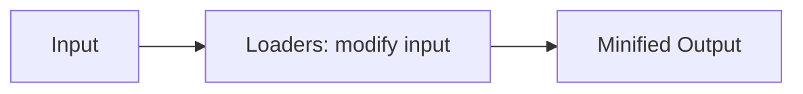

# **WebPack Basics**
 

## **Table Of Contents**
 

- [**WebPack Basics**](#webpack-basics)
  - [**Table Of Contents**](#table-of-contents)
  - [**General**](#general)
  - [**Basic Setups**](#basic-setups)
    - [**React Setup**](#react-setup)

 
 
 
 

## **General**
 

WebPack is a tool for bundling, building and minifying JavaScript projects for production.

 

**Pipeline**

 
 
 
 

## **Basic Setups**
 
 

### **React Setup**
 

See [Webpack React Setup](./webpack_react_setup.md).