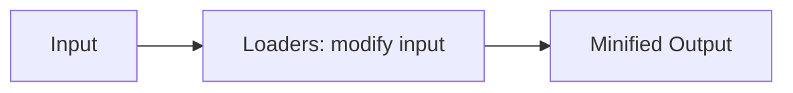

# **WebPack Basics**
<br>

## **Table Of Contents**
<br>

- [**WebPack Basics**](#webpack-basics)
  - [**Table Of Contents**](#table-of-contents)
  - [**General**](#general)
  - [**Basic Setup**](#basic-setup)
    - [**1. Installation Of Essential Packages**](#1-installation-of-essential-packages)
    - [**2. Configuration**](#2-configuration)
    - [**3. Create Required Directories**](#3-create-required-directories)
    - [**4. Add Script Aliases**](#4-add-script-aliases)
    - [**5. Add index.html**](#5-add-indexhtml)
    - [**6. Add CSS**](#6-add-css)
    - [**7. Add Support For React JSX (Optional)**](#7-add-support-for-react-jsx-optional)
      - [**7.1 Install Babel Loader**](#71-install-babel-loader)
      - [**7.2 Configurate Babel**](#72-configurate-babel)
      - [**7.3 Add Babel Loader to webpack.config.js**](#73-add-babel-loader-to-webpackconfigjs)
      - [**7.4 Install React Packages**](#74-install-react-packages)
      - [**7.5 Add Extensions To webpack.config.js**](#75-add-extensions-to-webpackconfigjs)
      - [**7.6 Change File Extension To .jsx For All JavaScript Files Using JSX**](#76-change-file-extension-to-jsx-for-all-javascript-files-using-jsx)

<br>
<br>
<br>
<br>

## **General**
<br>

WebPack is a tool for bundling, building and minifying JavaScript projects for production.

<br>

**Pipeline**



<br>
<br>
<br>
<br>

## **Basic Setup**
<br>
<br>
<br>

### **1. Installation Of Essential Packages**
<br>

```bash
npm install webpack webpack-cli webpack-dev-server html-webpack-plugin css-loader style-loader --save-dev
```
<br>

|Dependency          |Description
|:-------------------|:---------------
|webpack             |logic for module bundling
|webpack-cli         |allows interacting with webpack via command line
|webpack-dev-server  |developement server for webpack
|html-webpack-plugin |plugin for serving html files
|css-loader          |resolves css imports and url()
|style-loader        |inject css into DOM

<br>
<br>
<br>

### **2. Configuration**
<br>

Add `webpack.config.js`:

```javascript
const path = require('path');
const HtmlWebPackPlugin = require('html-webpack-plugin');


module.exports = {
    mode: 'development',
    entry: path.resolve('src', 'index.js'),
    output: {
        path: path.resolve(__dirname, 'dist'),
        filename: 'bundle.js'
    },
    module: {
        rules: [
            {
                test: /\.css$/i,
                exclude: /node_modules/,
                use: ['style-loader', 'css-loader']
            }
        ]
    },
    plugins: [
        new HtmlWebPackPlugin({
            template: path.join(__dirname, 'src', 'index.html'),
            filename: 'index.html'
        })
    ]
};
```

<br>
<br>
<br>

### **3. Create Required Directories**
<br>

```bash
mkdir src dist
```

<br>
<br>
<br>

### **4. Add Script Aliases**
<br>

Add to `package.json`:

```json
...

"scripts": {
    "start": "webpack-dev-server",
    "compile": "webpack"
},

...
```

<br>
<br>
<br>

### **5. Add index.html**
<br>

**Note:** We do not need to explicitly link `bundle.js`:

<br>

`src/index.html`

```html
<!DOCTYPE html>
<html lang="en">
    <head>
        <meta charset="UTF-8">
        <meta http-equiv="X-UA-Compatible" content="IE=edge">
        <meta name="viewport" content="width=device-width, initial-scale=1.0">
        <title>Test</title>
    </head>
    <body>
        <p>Some Content</p>
    </body>
</html>
```

<br>

gets packed to `dist/index.html`

```html
<!DOCTYPE html>
<html lang="en">
    <head>
        <meta charset="UTF-8">
        <meta http-equiv="X-UA-Compatible" content="IE=edge">
        <meta name="viewport" content="width=device-width, initial-scale=1.0">
        <title>Test</title>
        <script defer src="bundle.js"></script>
    </head>
    <body>
        <p>Some Content</p>
    </body>
</html>
```

<br>
<br>
<br>

### **6. Add CSS**
<br>

1. Add css files to `src` directory
2. Link css files to javascript files via `import ./someFileName.css`

<br>
<br>
<br>

### **7. Add Support For React JSX (Optional)**
<br>
<br>
<br>

#### **7.1 Install Babel Loader**
<br>

```bash
npm install babel-loader @babel/preset-react --save-dev
```

<br>
<br>

#### **7.2 Configurate Babel**
<br>

Add file `babel.config.json`:

```json
{
    "presets": [
        "@babel/preset-react"
    ]
}
```

<br>
<br>

#### **7.3 Add Babel Loader to webpack.config.js**
<br>

Add rule to `webpack.config.js`:

```javascript
    // ...

    module: {
        rules: [
            {
                test: /\.(js|jsx)$/,
                exclude: /node_modules/,
                use: {
                    loader: 'babel-loader'
                }
            },
            { 
                /* already existing rules */
            }
        ]
    },

    // ...
```

<br>
<br>

#### **7.4 Install React Packages**
<br>

```bash
npm install react react-dom
```

<br>
<br>

#### **7.5 Add Extensions To webpack.config.js**
<br>

Add to `webpack.config.js`:

```javascript
    // ...

    resolve: {
        extensions: ['.js', '.jsx']
    },

    // ...
```

<br>
<br>

#### **7.6 Change File Extension To .jsx For All JavaScript Files Using JSX**
<br>