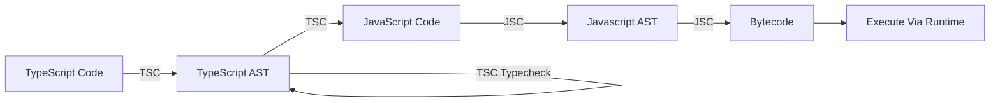

# **TypeScript Basics**
<br>

## **Table Of Contents**
<br>

- [**TypeScript Basics**](#typescript-basics)
  - [**Table Of Contents**](#table-of-contents)
  - [**Installation and Initialization**](#installation-and-initialization)
  - [**Compilation**](#compilation)
  - [**Downgrading**](#downgrading)
  - [**Strict**](#strict)
  - [**Type System**](#type-system)
    - [**Types**](#types)
  - [**Function**](#function)

<br>
<br>
<br>

## **Installation and Initialization**
<br>

Prerequisite: Node.js is installed

1. Navigate to project folder
2. Install TypeScript compiler as developer dependency via npm

```bash
npm install -g typescript
```

3. Generate and configure file _tsconfig.json_

```bash
npx tsc --init
```

<br>
<br>
<br>

## **Compilation**
<br>

TypeScript allows quick recompilation after every change (incremental compilation).
<br>



**_AST_** = Abstract Syntax Tree

**_TSC_** = TypeScript Compiler

**_JSC_** = JavaScript Compiler

<br>
<br>
<br>

## **Downgrading**
<br>

The TypeScript compiler translates the code to JavaScript code of a specific version. This way we can use the latest JavaScript version and downgrade it to older versions.

We can specify the target version in _tsconfig.json_:

```json
{
  "compilerOptions": {
    "target": "ES2015"
  }
}
```

<br>
<br>
<br>

## **Strict**
<br>

We can toggle various flags for strict type checking options in _tsconfig.json_. We can enable all these options with the _strict_ flag.

```json
{
  "compilerOptions": {
    "strict": true
  }
}
```

<br>
<br>
<br>

## **Type System**
<br>
<br>

|                              |TypeScript          |JavaScript |
|:-----------------------------|:-------------------|:----------|
|Type Conversion               |Strong              |Weak       |
|Type Declaration              |Static (Structural) |Dynamic    |
|Type Errors are thrown during |Compilation         |Runtime    |

<br>

See [TypeScript Type System](./typescript_type_system.md).

See also [Type System](../../../LanguageTheory/language_theory_type_systems.md).

<br>
<br>

### **Types**
<br>

JavaScript Types:

|Type      |Description
|:---------|:----------
|boolean   |
|number    |
|bigint    |
|string    |
|object    |
|null      |missing value
|undefined |value not yet assigned

<br>

Additional TypeScript Types:

|Type    |Description
|:-------|:--------------------------------------------------------------------
|any     |represents _all_ types and prevents type checking (avoid if possible)
|unknown |like _any_ but more restrictive (avoid if possible)
|array   |\<type\>[]
|tupel   |subtype of array with fixed length and type per position
|void    |return type for function that does not explicitly returns a value
|never   |return type for function that never returns a value (e.g. infinity loop or always throws error)

<br>
<br>


## **Function**
<br>

* always explicitly annotate the parameters
* avoid explicitly annotating the return value
* anonymous functions can be typed in their context without explicit parameters

```
function <functionName>(<parameterName>: <parameterType, ...)[: <returnType>]
```

<br>

```typescript
function foo(param1: string, param2: number) {
	// implementation
}
```

<br>

See [TypeScript Functions](./typescript_functions.md).


<!--

Type Safety
- Use of types to prevent execution of invalid actions in a program

- JavaScript does try to prevent the throwing of exception even for clearly wrong inputs


Compilation:
    TypeScript Types are only checked at compilation, not at runtime of compilated JavaScript code!
    TypeScript Types are not included into of affect compilated JavaScript code at any time!


Type System
- is static (variables can not change types according to their assigned values)


Variadic Function = Function that accepts a variable amount of parameters

-->