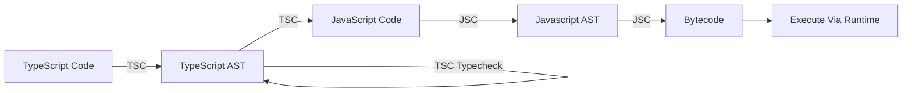

# **TypeScript Basics**
<br>

## **Table Of Contents**
<br>

- [**TypeScript Basics**](#typescript-basics)
  - [**Table Of Contents**](#table-of-contents)
  - [**General**](#general)
  - [**Installation and Initialization**](#installation-and-initialization)
  - [**Compilation**](#compilation)
  - [**Type System**](#type-system)
    - [**Type Declaration**](#type-declaration)
    - [**Literal Types**](#literal-types)
    - [**Types**](#types)

<br>
<br>
<br>

## **General**
<br>

<br>
<br>
<br>

## **Installation and Initialization**
<br>

Prerequisite: Node.js is installed

1. Navigate to project folder
2. Install TypeScript compiler as developer dependency via npm

```bash
npm install typescript --save-dev
```

3. Generate and configure file _tsconfig.json_

```bash
npx tsc --init
```

<br>
<br>
<br>

## **Compilation**
<br>

TypeScript allows quick recompilation after every change (incremental compilation).
<br>


_AST_ = Abstract Syntax Tree
_TSC_ = TypeScript Compiler
_JSC_ = JavaScript Compiler

<br>
<br>
<br>

## **Type System**
<br>
<br>

|                              |TypeScript          |JavaScript |
|:-----------------------------|:-------------------|:----------|
|Type Conversion               |Strong              |Weak       |
|Type Declaration              |Static (Structural) |Dynamic    |
|Type Errors are thrown during |Compilation         |Runtime    |

<br>

See also [Type System](../../../LanguageTheory/language_theory_type_systems.md).

<br>
<br>

### **Type Declaration**
<br>

In TypeScript Types can be explicitly declared or implicitly inferred from the assigned value.

We can explicitly declare a type using type annotations `<variable>: <type>`.

It is recommended to use implicit type declaration whenever possible.

Example:

```typescript
let foo: string = 'foo';    // explicitly declared type 

let bar = 3;                // implicitly declared type (number)
```

<br>
<br>

### **Literal Types**
<br>

We can use a specific type value as a type.

Example:

```typescript
const foo = 'bar';          // implicitly declared literal type via const (type: 'bar')

let bar : 'baz' = 'baz';    // explicitly declared literal type (type: 'baz')
```

<br>
<br>

### **Types**
<br>

|Type    |Description
|:-------|:--------------------------------------------------------------------
|any     |represents _all_ types and prevents type checking (avoid if possible)
|unknown |like _any_ but more restrictive
|boolean |
|number  |maximum integer: 2^53
|bigint  |
|string  |


<br>

See [Type List](./typescript_types.md)


<!--

Type Safety
- Use of types to prevent execution of invalid actions in a program

- JavaScript does try to prevent the throwing of exception even for clearly wrong inputs


Compilation:
    TypeScript Types are only checked at compilation, not at runtime of compilated JavaScript code!
    TypeScript Types are not included into of affect compilated JavaScript code at any time!


Type System
- is static (variables can not change types according to their assigned values)

-->