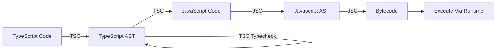

# **TypeScript Basics**
<br>

## **Table Of Contents**
<br>

- [**TypeScript Basics**](#typescript-basics)
  - [**Table Of Contents**](#table-of-contents)
  - [**General**](#general)
  - [**Installation and Initialization**](#installation-and-initialization)
  - [**Compilation**](#compilation)
  - [**Type System**](#type-system)
    - [**Type Declaration**](#type-declaration)
    - [**Literal Types**](#literal-types)
    - [**Type Aliases**](#type-aliases)
    - [**Union Type**](#union-type)
    - [**Types**](#types)
      - [**Object**](#object)
        - [**Basic Object Form Declaration**](#basic-object-form-declaration)
        - [**Define Optional Properties**](#define-optional-properties)
        - [**Readonly Properties**](#readonly-properties)
      - [**Array**](#array)
        - [**Readonly Array**](#readonly-array)
      - [**Tupel**](#tupel)
        - [**Optional Elements**](#optional-elements)
        - [**Readonly Tupel**](#readonly-tupel)
      - [**Enums**](#enums)
  - [**Function**](#function)

<br>
<br>
<br>

## **General**
<br>

<br>
<br>
<br>

## **Installation and Initialization**
<br>

Prerequisite: Node.js is installed

1. Navigate to project folder
2. Install TypeScript compiler as developer dependency via npm

```bash
npm install -g typescript
```

3. Generate and configure file _tsconfig.json_

```bash
npx tsc --init
```

<br>
<br>
<br>

## **Compilation**
<br>

TypeScript allows quick recompilation after every change (incremental compilation).
<br>



**_AST_** = Abstract Syntax Tree

**_TSC_** = TypeScript Compiler

**_JSC_** = JavaScript Compiler

<br>
<br>
<br>

## **Type System**
<br>
<br>

|                              |TypeScript          |JavaScript |
|:-----------------------------|:-------------------|:----------|
|Type Conversion               |Strong              |Weak       |
|Type Declaration              |Static (Structural) |Dynamic    |
|Type Errors are thrown during |Compilation         |Runtime    |

<br>

See also [Type System](../../../LanguageTheory/language_theory_type_systems.md).

<br>
<br>

### **Type Declaration**
<br>

Types can be explicitly declared or implicitly inferred from the assigned value.

We can explicitly declare a type using type annotations `<variable>: <type>`.

It is recommended to use implicit type declaration whenever possible.

<br>

Example:

```typescript
let foo: string = 'foo';    // explicitly declared type 

let bar = 3;                // implicitly inferred type (number)
```

<br>
<br>

### **Literal Types**
<br>

We can use a specific type value as a type.

<br>

Example:

```typescript
const foo = 'bar';          // implicitly inferred literal type via const (type: 'bar' instead of string)

let bar : 'baz' = 'baz';    // explicitly declared literal type (type: 'baz' instead of string)
```
<br>

Note: Avoid using empty object literal `{}`, because we can then assign every value except _null_ and _undefined_ !

<br>
<br>

### **Type Aliases**
<br>

* reuse of type definition
* block scoped
* not inferred by TypeScript
* every occurrence of alias can be replaced with its type definition

```
type <aliasName> = <typeDefinition>
```

<br>

```typescript
type Person = {
	firstName: string,
	lastName: string,
	age: number,
	nationality: string
};

let johnDoe: Person = {
	firstName: 'John',
	lastName: 'Doe',
	age: 43,
	nationality: 'USA'
}
```

<br>
<br>

### **Union Type**
<br>

* custom type that contains multiple existing types
* values can be any of the union types

```
<type1> | <type2> | ...
```

<br>

* operations are limited to operations defined on every type of the union (operation intersection)
* use _narrowing_ (type checks) to use operations specific to one type of the union

```typescript
function foo(input: string | number) {
	return input.trim();
}

foo('  bar  ');
// error TS2339: Property 'trim' does not exist on type 'string | number'.
```

```typescript
function foo(input: string | number) {
	if (typeof input === 'string') {
		return input.trim();
	}
	return input;
}

foo('  bar  ');
// bar
```

<br>

For object type unions:

* Values of object type unions
  * must contain all properties of at least type of the union
  * can contain additional properties from all other types of the union

```typescript
type Animal = {species: string, age: number};
type Pet = {name: string, owner: string}
type unionType = Animal | Pet;

const someAnimal: unionType = {
  species: 'mosquito',
  age: 1
};

const somePet: unionType = {
  name: 'Bello',
  owner: 'John Doe'
};

// both animal and pet properties
const bello: unionType = {
  species: 'dog',
  age: 3,
  name: 'Bello',
  owner: 'John Doe'
}

// Error because object must have all properties of at least one type of the union
const baxter: unionType = {
  species: 'dog',
  name: 'Baxter'
}
```

<br>
<br>

### **Types**
<br>

JavaScript Types:

|Type      |Description
|:---------|:----------
|boolean   |
|number    |
|bigint    |
|string    |
|object    |
|null      |missing value
|undefined |value not yet assigned

<br>

Additional TypeScript Types:

|Type    |Description
|:-------|:--------------------------------------------------------------------
|any     |represents _all_ types and prevents type checking (avoid if possible)
|unknown |like _any_ but more restrictive (avoid if possible)
|array   |
|tupel   |subtype of array with fixed length and type per position
|void    |return type for function that does not explicitly returns a value
|never   |return type for function that never returns a value (e.g. infinity loop or always throws error)

<br>
<br>

#### **Object**
<br>

* Objects are structurally typed
* Object form defines all properties and their types
* By default TypeScript blocks any attempt to add additional properties or remove defined properties
* We can declare an object form with an object literal or a class

<br>
<br>

##### **Basic Object Form Declaration**
<br>

Explicitly define form:

```typescript
let foo: {bar: string, baz: string} = {
	bar: 'Hello',
	baz: 'World'
}

// type: {bar: string, baz: string}
```

<br>

Implicitly define form:

```typescript
let foo = {
	bar: 'Hello',
	baz: 'World'
};

// type: {bar: string, baz: string}
```

<br>

Note: Declaring an object with the keyword `const` does not narrow the types of the attributes, because objects are mutable (see [literal Types](#literal-types)).

```typescript
const foo = {
	bar: 'Hello',
	baz: 'World'
};

// type: {bar: string, baz: string}
// NOT {bar: 'Hello', baz: 'World'} like literal types for primitive data types
```

<br>
<br>

##### **Define Optional Properties**
<br>

Single optional property:

```
<optionalPropertyName>?: <valueType>
```

```typescript
let foo: {
	bar: string,
	baz?: string
}
```
* object might have an optional property `baz` with value _string_ or _undefined_

<br>

Multiple optional properties of same type via _Index Signatures_:

```typescript
[<keyName>: <keyType>]: <valueType>
```

```typescript
let foo: {
	bar: string,
	[baz: number]: string
} = {
	bar: 'The',
	1: 'quick',
	2: 'brown',
	7: 'fox'
};
```

<br>
<br>

##### **Readonly Properties**
<br>

```typescript
let foo: {readonly bar: string} = {
	bar: 'baz'
};

foo.bar = 'test';
// error TS2540: Cannot assign to 'bar' because it is a read-only property.
```

<br>
<br>

#### **Array**
<br>


Explicitly define type:

```
let <arrayName>: <elementType>[] = [element1, ...]
```

Example:
```typescript
let foo: string[] = ['a', 'b', 'c'];
let bar: number[] = [1, 3, 13];
```

<br>

Implicitly define type:

```typescript
let foo = ['a', 'b', 'c'];	// string[]
let bar = [1, 3, 13];		// number[]
let baz = ['a', 1];			// (string | number)[]   (avoid mixed type arrays)
let tar = [];				// any[]
```

<br>

Note: Declaring an array with the keyword `const` does not narrow the types of the elements, because arrays are mutable (see [literal Types](#literal-types)).

<br>

Note: Avoid empty array declarationa like `let tar = []`, because it results in the type `any[]` and therefore allows every type as an element. The union type of the array is fixed when it is passed outside of its definition scope:

```typescript
function buildArray() {
    let a = [];
    a.push(1);      // number[]
    a.push('a');    // (number | string)[]
    return a;
  }
  
  let a = buildArray();
  a.push(true);     
  // error TS2345: Argument of type 'boolean' is not assignable to parameter of type 'string | number'.
```

<br>
<br>

##### **Readonly Array**
<br>

```
let <arrayName>: readonly <elementType>[] = [element1, ...]
```

Example:
```typescript
let foo: readonly string[] = ['a', 'b', 'c'];
```

<br>
<br>

#### **Tupel**
<br>

Tupel is a subtype of array with fixed length and type per position

Tupel can only be declared explicitly:

```
let <tupelName>: [typePosition1, typePosition2, ...] = [valuePosition1, valuePosition2, ...];
```

Example:

```typescript
let position: [number, number] = [23, 9132];
```

<br>
<br>

##### **Optional Elements**
<br>

```
let <tupelName>: [typePosition1, ... , <typeOptionalPosition>?] = [valuePosition1, ... , valueOptional];
```

Example:

```typescript
type positionTupel = [number, number, number?];

let position: positionTupel = [12, 45, 32];
let position: positionTupel = [123, 732];
```

<br>
<br>

##### **Readonly Tupel**
<br>

```
let <tupelName>: readonly [typePosition1, typePosition2, ...] = [valuePosition1, valuePosition2, ...];
```

Example:

```typescript
let position: readonly [number, number] = [23, 9132];
```

<br>
<br>

#### **Enums**
<br>

* fixed key-value structure that is known at compilation
* avoid using Enums

```
enum <EnumName> {
	value1 [= <integer | string>],
	value2 [= <integer | string>],
	...
}
```

Example:

```typescript
enum Rivers {
	Amazon = 1,
	Nile = 2,
	Yangtze = 3,
	Mississippi = 4
}

Rivers.Nile;            // 2
```

<br>
<br>

## **Function**
<br>

* always explicitly annotate the parameters
* avoid explicitly annotating the return value

```
function <functionName>(<parameterName>: <parameterType, ...)[: <returnType>]
```

<br>

```typescript
function foo(param1: string, param2: number) {
	// implementation
}
```

<br>

See [TypeScript Functions](./typescript_functions.md).


<!--

Type Safety
- Use of types to prevent execution of invalid actions in a program

- JavaScript does try to prevent the throwing of exception even for clearly wrong inputs


Compilation:
    TypeScript Types are only checked at compilation, not at runtime of compilated JavaScript code!
    TypeScript Types are not included into of affect compilated JavaScript code at any time!


Type System
- is static (variables can not change types according to their assigned values)


Variadic Function = Function that accepts a variable amount of parameters

-->