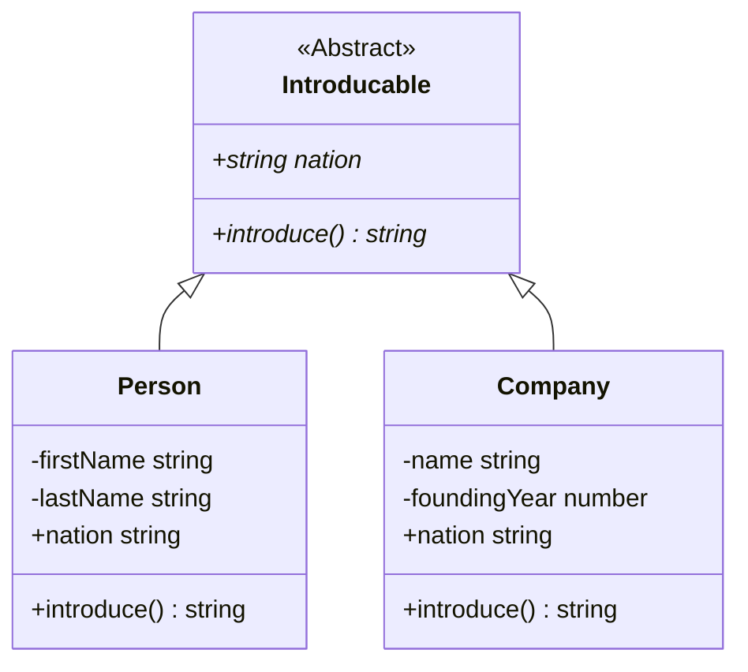

# **TypeScript Classes And Interfaces**
<br>

## **Table Of Contents**
<br>

- [**TypeScript Classes And Interfaces**](#typescript-classes-and-interfaces)
  - [**Table Of Contents**](#table-of-contents)
  - [**Classes**](#classes)
    - [**General**](#general)
    - [**Basic Class**](#basic-class)
    - [**Subclass**](#subclass)
    - [**Abstract Class**](#abstract-class)
  - [**Visibility And Access Modificators**](#visibility-and-access-modificators)
    - [**private**](#private)
      - [**Soft Private**](#soft-private)
      - [**Hard Private**](#hard-private)
    - [**protected**](#protected)
    - [**public**](#public)
    - [**readonly**](#readonly)

<br>
<br>
<br>

## **Classes**
<br>
<br>

### **General**
<br>

```
[abstract] class <className>[ extends <SuperClassName>] {

    <private | # | public | protected> [readonly] <propertyName>: <propertyType> [= <DefaultValue>]

    constructor(<parameterName>: <parameterValue>, ...) {
        // Initialize properties...
    }

    <private | # | public | protected> <methodName>(<parameterName>: <parameterValue>, ...) {
        // Implementation
    }
}
```

<br>
<br>
<br>

### **Basic Class**
<br>

```
class <className> {

    <private | # | public | protected> [readonly] <propertyName>: <propertyType> [= <DefaultValue>]

    constructor(<parameterName>: <parameterValue>, ...) {
        // Initialize properties...
    }

    <private | # | public | protected> <methodName>(<parameterName>: <parameterValue>, ...) {
        // Implementation
    }
}
```

<br>

Example:

```typescript
class Person {
  
  private firstName: string;
  private lastName: string;

  constructor(firstName: string, lastName: string) {
      this.firstName = firstName;
      this.lastName = lastName;
  }

  introduce() : string {
    return `Hello, i am ${this.firstName} ${this.lastName}.`
  };

}
```

<br>
<br>
<br>

### **Subclass**
<br>

```
class <className> extends <SuperclassName> {

    <private | # | public | protected> [readonly] <propertyName>: <propertyType> [= <DefaultValue>]

    constructor(<parameterName>: <parameterValue>, ...) {
        super(signatureConstructorSuperClass);
        // Initialize properties...
    }

    <private | # | public | protected> <methodName>(<parameterName>: <parameterValue>, ...) {
        // Implementation
    }
}
```
<br>

Example:

```typescript
class Programmer extends Person {

  private language: string;

  constructor(firstName: string, lastName: string, language: string) {
    super(firstName, lastName);
    this.language = language;
  }

  // overwrite superclass method
  introduce() : string {
    return `${super.introduce()} My favorite language is ${this.language}`
  };

}
```

<br>
<br>
<br>

### **Abstract Class**
<br>

* abstract class can not be instantiated
* used to define a structur for its subclasses
* can define abstract methods that subclasses have to implement

<br>

```
abstract class <className> {
    abstract <methodName>(<parameterName>: <parameterType>) : <returnType>
}
```

<br>

Example:



<br>

```typescript
abstract class Introducable {
  abstract nation : string;

  abstract introduce() : string;
}


class Person extends Introducable {
  private firstName;
  private lastName;
  nation = '';

  constructor(firstName: string, lastName: string, nation: string) {
    super();
    this.firstName = firstName;
    this.lastName = lastName;
    this.nation = nation;
  }

  introduce(): string {
    return `Hello, my name is ${this.firstName} ${this.lastName} and i am from ${this.nation}`;
  }
}


class Company extends Introducable {
  private name;
  private foundingYear;
  nation = '';

  constructor(name: string, foundingYear: number, nation: string) {
    super();
    this.name = name;
    this.foundingYear = foundingYear;
    this.nation = nation;
  }

  introduce() {
    return `Welcome to ${this.name}. We were founded in ${this.foundingYear} and are based in ${this.nation}`;
  }
}


const introducableList: Introducable[] = [
  new Person('John', 'Doe', 'USA'),
  new Company('Lewton', 1979, 'France'),
  new Person('Jane', 'Doe', 'Australia'),
];

introducableList.forEach(element => console.log(element.introduce()));
```

<br>
<br>
<br>

## **Visibility And Access Modificators**
<br>
<br>

### **private**
<br>
<br>

#### **Soft Private**

* properties and methods are not visible and accessible outside of their class _during compile time_

```
private <propertyName>

private <methodName>(<parameterName>: <parameterType>, ...): <resultType>
```

<br>

#### **Hard Private**

* properties and methods are not visible and accessible outside of their defining class _during compile time and during run time_

```
#<propertyName>

#<methodName>(<parameterName>: <parameterType>, ...): <resultType>
```

<br>
<br>

### **protected**

* properties and methods are only visible and accessible in their defining class and its subclasses _during compile time_

```
protected <propertyName>

protected <methodName>(<parameterName>: <parameterType>, ...): <resultType>
```

<br>
<br>

### **public**

* properties and methods are visible and accessible both inside and outside of their defining class

```
public <propertyName>

public <methodName>(<parameterName>: <parameterType>, ...): <resultType>
```

<br>
<br>

### **readonly**
<br>

* property can not be modified outside of _constructor_

```
readonly <PropertyName>
```