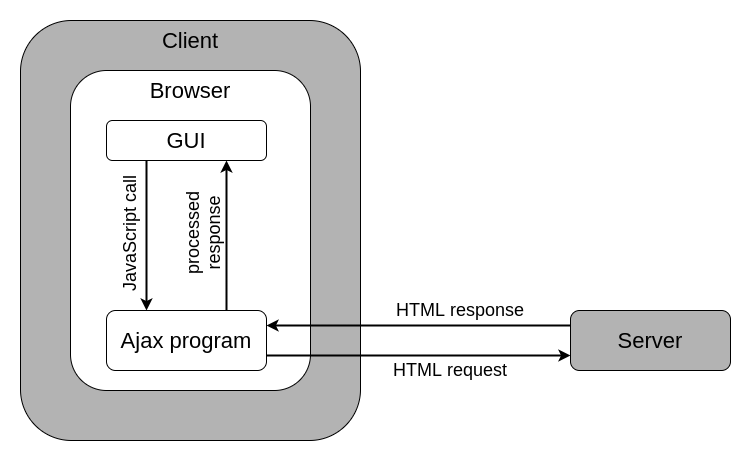
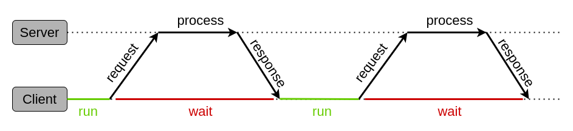
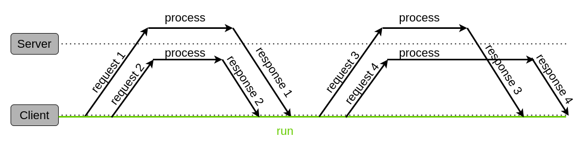

# **JavaScript Ajax**

<br>

## **Table Of Contents**
<br>

- [**JavaScript Ajax**](#javascript-ajax)
  - [**Table Of Contents**](#table-of-contents)
  - [**General**](#general)
  - [**Client Server Communication**](#client-server-communication)
    - [**Synchronous Communication**](#synchronous-communication)
    - [**Asynchronous Communication**](#asynchronous-communication)
  - [**Data Exchange Formats**](#data-exchange-formats)
    - [**HTML**](#html)
    - [**XML**](#xml)
      - [**Serialising**](#serialising)
      - [**Parsing**](#parsing)
    - [**JSON**](#json)
      - [**Difference Between JSON And JavaScript Objects**](#difference-between-json-and-javascript-objects)
      - [**Serialising**](#serialising-1)
      - [**Parsing**](#parsing-1)

<br>
<br>
<br>
<br>

## **General**
<br>
<br>

* **A**synchronous **J**avaScript **A**nd **X**ML
* allows to load content dynamically without reloading the entire page
* makes websites faster and more responsive

<br>



<br>
<br>
<br>
<br>

## **Client Server Communication**
<br>
<br>


### **Synchronous Communication**
<br>



<br>

1. Client sends request to the server
2. Client waits idle for response from the server
3. Server processes the incoming request
4. Server sends response to the client
5. Client receives response
6. Client resumes code execution

<br>
<br>
<br>

### **Asynchronous Communication**
<br>



<br>

1. Client sends request to the server
2. Client resumes code execution and can send additional requests to the server
3. Server meanwhile processes the incoming request
4. Server sends response to the client
5. Client receives response

Client does not have to wait for server response and can resume the code execution

<br>
<br>
<br>
<br>

<!-- 

use cases:
    - auto completion for user input
    - pagination
    - newsticker
    - editable ui components

-->

## **Data Exchange Formats**
<br>

Data can be exchanged between client and servers in various formats. The following formats are the most common.

<br>
<br>

### **HTML**
<br>

* used for loading gui components from the server

<br>
<br>
<br>

### **XML**
<br>

* E**x**tensible **M**arkup **L**anguage
* used for loading structured data from the server
* consists of user-defined elements and attributes
* XML-Tree can be used by the [DOM API](./javascript_document_object_model.md)

<br>

Example.xml
```xml
<?xml version="1.0" encoding="UTF-8"?>
<persons>
  <person>
    <firstName>John</firstName>
    <lastName>Doe</lastName>
  </person>
  <person>
    <firstName>Jane</firstName>
    <lastName>Doe</lastName>
  </person>
</persons>
```

<br>
<br>

#### **Serialising**
<br>

* conversion of xml object to string

```javascript
const xmlString = new XMLSerializer().serializeToString(xmlDocumentNode);
```

<br>
<br>

#### **Parsing**
<br>

* conversion of string to xml object

```javascript
const xmlDocumentObject = new DOMParser().parseFromString(xmlString, 'text/xml');
```


<br>
<br>
<br>

### **JSON**
<br>

* **J**ava**S**cript **O**bject **N**otation
* used for loading data from the server to generate content on a website
* can directly be used within javascript code

<br>

Example.json
```javascript
{
  "persons": [
    {
      "firstName": "John",
      "lastName": "Doe"
    },
    {
      "firstName": "Jane",
      "lastName": "Doe"
    }
  ]
}
```

<br>
<br>

#### **Difference Between JSON And JavaScript Objects**
<br>

|Component|JSON                                                     |JavaScript Objects
|:--------|:--------------------------------------------------------|:-------------------------
|keys     |double quotation                                         |no, single or double quotation
|values   |string, number, boolean, other JSON-objects, arrays, null|like JSON + functions, regex, other objects,...

<br>
<br>

#### **Serialising**
<br>

* conversion of javascript object to json string

```javascript
const jsonString = JSON.stringify(javascriptObject);
```

<br>
<br>

#### **Parsing**
<br>

* conversion of json string to javascript object

```javascript
const javascriptObject = JSON.parse(jsonString);
```