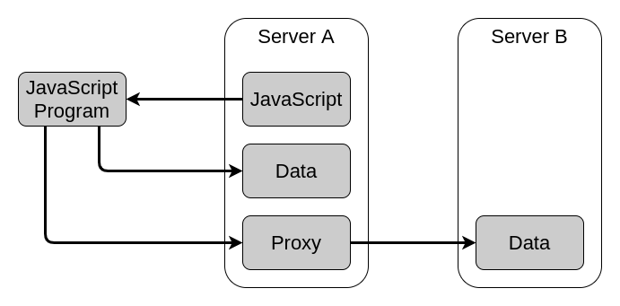
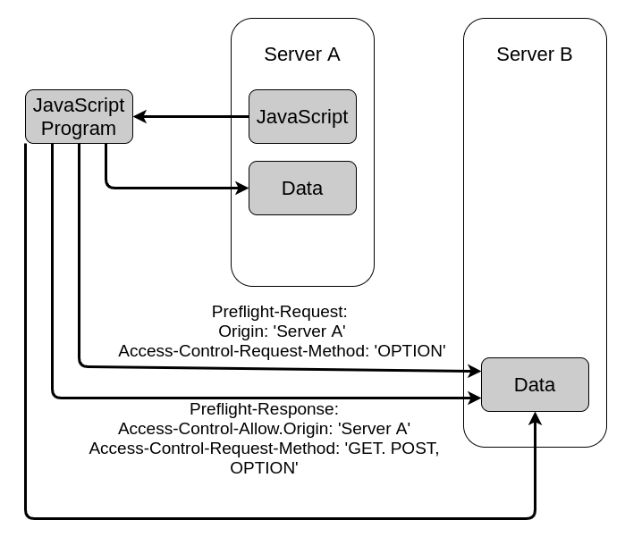

# **Ajax API (Asynchronous JavaScript And XML)**

<br>

## **Table Of Contents**
<br>

- [**Ajax API (Asynchronous JavaScript And XML)**](#ajax-api-asynchronous-javascript-and-xml)
  - [**Table Of Contents**](#table-of-contents)
  - [**General**](#general)
  - [**Client Server Communication**](#client-server-communication)
    - [**Synchronous Communication**](#synchronous-communication)
    - [**Asynchronous Communication**](#asynchronous-communication)
  - [**Data Exchange Formats**](#data-exchange-formats)
    - [**HTML**](#html)
    - [**XML**](#xml)
    - [**JSON**](#json)
  - [**Basic Request Procedure**](#basic-request-procedure)
  - [**Cross Origin Requests**](#cross-origin-requests)
    - [**Load Data Via Proxy**](#load-data-via-proxy)
    - [**Cross Origin Resource Sharing**](#cross-origin-resource-sharing)
  - [**XMLHttpRequest**](#xmlhttprequest)
    - [**Properties**](#properties)
      - [**readyState**](#readystate)
      - [**response**](#response)
      - [**responseText**](#responsetext)
      - [**responseType**](#responsetype)
      - [**responseURL**](#responseurl)
      - [**responseXML**](#responsexml)
      - [**status**](#status)
      - [**statusText**](#statustext)
      - [**timeout**](#timeout)
      - [**upload**](#upload)
      - [**withCredentials**](#withcredentials)
    - [**Methods**](#methods)
      - [**abort()**](#abort)
      - [**getAllResponseHeaders()**](#getallresponseheaders)
      - [**getResponseHeader(headerName)**](#getresponseheaderheadername)
      - [**open()**](#open)
      - [**overrideMimeType(mimeType)**](#overridemimetypemimetype)
      - [**send([body])**](#sendbody)
      - [**setRequestHeader(headerName, value)**](#setrequestheaderheadername-value)
    - [**Events**](#events)
      - [**abort**](#abort-1)
      - [**error**](#error)
      - [**load**](#load)
      - [**loadend**](#loadend)
      - [**loadstart**](#loadstart)
      - [**progress**](#progress)
      - [**readystatechange**](#readystatechange)
      - [**timeout**](#timeout-1)
  - [**Examples**](#examples)
    - [**Load HTML Data From Server**](#load-html-data-from-server)
    - [**Load XML Data From Server**](#load-xml-data-from-server)
    - [**Load JSON Data From Server**](#load-json-data-from-server)
    - [**Send JSON Data To Server**](#send-json-data-to-server)
    - [**Send Form Data To Server**](#send-form-data-to-server)

<br>
<br>
<br>
<br>

## **General**
<br>
<br>

* **A**synchronous **J**avaScript **A**nd **X**ML
* allows to load content dynamically without reloading the entire page
* makes websites faster and more responsive

<br>


<br>
<br>
<br>
<br>

## **Client Server Communication**
<br>
<br>


### **Synchronous Communication**
<br>


<br>

1. Client sends request to the server
2. Client waits idle for response from the server
3. Server processes the incoming request
4. Server sends response to the client
5. Client receives response
6. Client resumes code execution

<br>
<br>
<br>

### **Asynchronous Communication**
<br>


<br>

1. Client sends request to the server
2. Client resumes code execution and can send additional requests to the server
3. Server meanwhile processes the incoming request
4. Server sends response to the client
5. Client receives response

Client does not have to wait for server response and can resume the code execution

<br>
<br>
<br>
<br>

<!-- 

use cases:
    - auto completion for user input
    - pagination
    - newsticker
    - editable ui components

-->

## **Data Exchange Formats**
<br>

Data can be exchanged between client and servers in various formats. The following formats are the most common.

<br>
<br>

### [**HTML**](../Frontend/html/html_basics.md)

* used for loading gui components from the server

<br>

### [**XML**](../../../FileFormats/xml/xml_basics.md)

* used for loading structured data from the server

<br>

### [**JSON**](../../../FileFormats/json/json_basics.md)

* used for loading data from the server to generate content on a website

<br>
<br>
<br>
<br>

## **Basic Request Procedure**
<br>

1. instantiate XMLHttpRequest object
2. register response listener for event _load_
3. prepare request for specified HTTP method
4. configurate request
5. send request

<br>

```javascript
const request = new XMLHttpRequest();                                               // (1)
request.addEventListener('load', function(event) { /* response handling */ });      // (2)
request.open('GET', 'url');                                                         // (3)
request.setRequestHeader('Accept', 'text/html');                                    // (4)
request.send();                                                                     // (5)
```

<br>
<br>
<br>
<br>

## **Cross Origin Requests**
<br>

Loading resources from servers other than the origin of the JavaScript code is gererally not allowed.

To load resources from other servers you can use the following techniques:

<br>
<br>

### **Load Data Via Proxy**
<br>

Origin server is used as a proxy to access data from other server.

<br>



<br>
<br>

### **Cross Origin Resource Sharing**
<br>

1. Client sends _Preflight-Request_ to non origin server
2. Server accepts access and sends _Preflight-Response_
3. Client requests resource
4. Server sends resource

<br>




<br>
<br>
<br>
<br>

## **XMLHttpRequest**
<br>

* used to retrieve various types of data from a server via HTTP request without reloading the website 

<br>
<br>

### **Properties**
<br>
<br>

#### **readyState**
* returns progress value of the request

|Value|State Name      |Descripition
|:---:|:---------------|:--------------
|0    |UNSENT          |method _open()_ not called
|1    |OPENED          |method _open()_ called
|2    |HEADERS_RECEIVED|method _send()_ called and headers are available
|3    |LOADING         |download in progress
|4    |DONE            |download complete

<br>
<br>

#### **response**
* returns body content of response as an object specified by the property _responseType_
* returns null while the request is not completed or failed

<br>
<br>

#### **responseText**
* returns server response as text
* returns empty string if request is not sent yet
* returns null if request failed

<br>
<br>

#### **responseType**
* sets type for server response as an enumerated string (default: 'text')

|Type         |Description
|:------------|:----------
|''           |empty string is interpreted as 'text'
|'arraybuffer'|ArrayBuffer object with binary data
|'blob'       |Blob object with binary data
|'document'   |HTMLDocument or XMLDocument
|'json'       |JSON parsed into JavaScript object
|'text'       |string

<br>
<br>

#### **responseURL**
* returns serialized URL of response
* returns empty string if url is _null_

<br>
<br>

#### **responseXML**
* returns _document_ with the html or xml of the response
* returns _null_ if request or parsing failed 

<br>
<br>

#### **status**
* returns http status code of response
* returns 0 if request is not complete

<br>
<br>

#### **statusText**
* returns response status message as string
* returns empty string if request is in state unsent or opened

<br>
<br>

#### **timeout**
* sets timeout limit of the request as number of milliseconds (default: 0)

<br>
<br>

#### **upload**
* returns XMLHttpRequestUpload object to track upload progress

<br>
<br>

#### **withCredentials**
* boolean indicating whether cross-site Access-Control request should use credentials


<br>
<br>
<br>

### **Methods**
<br>
<br>

#### **abort()**
* aborts already sent request and changes properties _readyState_ and _status_ to 0

<br>
<br>

#### **getAllResponseHeaders()**
* returns string representing all response headers or _null_

<br>
<br>

#### **getResponseHeader(headerName)**
* returns string representing specified response header

<br>
<br>

#### **open()**
* (re-) initialize  request

<br>

```javascript
const request = new XMLHttpRequest();
request.open(method, url, [async], [user], [password]);
```

<br>

|Parameter|Description                                                                |Optional
|:--------|:--------------------------------------------------------------------------|:-------
|method   |http request method like GET, POST, PUT, DELETE                            |No
|url      |destination url                                                            |No
|async    |boolean indicating wheter request should be asynchronously (default: true) |Yes
|user     |user for authentication                                                    |Yes
|password |password for authentication                                                |Yes


<br>
<br>

#### **overrideMimeType(mimeType)**
* override mime type of the server response
* must be called before call of method _send()_

<br>
<br>

#### **send([body])**
* send request to server

<br>
<br>

#### **setRequestHeader(headerName, value)**
* set value of specified request header
* must be called after method _open()_ but before method _send()_

<br>
<br>
<br>
<br>

### **Events**

The following event listeners can be registered at the XMLHttpRequest object.

<br>

```javascript
xmlHttpRequestObject.addEventListener('eventListenerName', event => { /* implementation */ })
```

<br>
<br>

#### **abort**


<br>
<br>

#### **error**

<br>
<br>

#### **load**
* transaction successfully completed

<br>
<br>

#### **loadend**
* request completed regardless whether successfull or not

<br>
<br>

#### **loadstart**
* loading of data started

<br>
<br>

#### **progress**
* request receives more data (fired periodically)

<br>
<br>

#### **readystatechange**
* property readystatechange changes

<br>
<br>

#### **timeout**
* request is timeouted

<br>
<br>
<br>
<br>

## **Examples**
<br>
<br>

### **Load HTML Data From Server**
<br>

We have the following file in the content directory of our webserver.

<br>

demoSnippet.html
```html
<ul>
    <li>person 1</li>
    <ul>
        <li>John</li>
        <li>Doe</li>
    </ul>
    <li>person 2</li>
    <ul>
        <li>Jane</li>
        <li>Doe</li>
    </ul>
</ul>
```

<br>

We now want to insert the content of _demoSnippet.html_ into a div in another html file on the same webserver via ajax.
The div has the id _targetDiv_.

<br>

```javascript
const request = new XMLHttpRequest();
request.addEventListener('load', handleResponse);
request.open('GET', '/demoSnippet.html', true);
request.responseType = '';                          // expect response of type text
request.setRequestHeader('Accept', 'text/html');    // expect text of type html
request.send();


function handleResponse(event) {
  const response = event.target;
  const HTTPStatusCodeOk = 200;
  if (response.status === HTTPStatusCodeOk) {
    document.getElementById('targetDiv').innerHTML = response.responseText;
  } 
}
```

<br>
<br>
<br>

### **Load XML Data From Server**
<br>

We have the following file in the content directory of our webserver.

<br>

demoData.xml
```xml
<?xml version="1.0" encoding="UTF-8"?>
<persons>
  <person>
    <firstName>John</firstName>
    <lastName>Doe</lastName>
  </person>
  <person>
    <firstName>Jane</firstName>
    <lastName>Doe</lastName>
  </person>
</persons>
```

<br>

We now want to print the content of _demoData.xml_ into a div in another html file on the same webserver via ajax.
The div has the id _targetDiv_.

<br>

```javascript
const request = new XMLHttpRequest();
request.addEventListener('load', handleResponse);
request.open('GET', '/demoData.xml');
request.responseType = 'document';
request.setRequestHeader('Accept', 'text/xml');
request.send();


function handleResponse(event) {
  if (event.target.status === 200) {
    const xmlDocument = event.target.responseXML;
    const persons = xmlDocument.getElementsByTagName('person');
    let output = '';
    for (let i = 0; i < persons.length; i++) {
      const children = persons[i];
      output += `<p>${children.getElementsByTagName('firstName')[0].textContent}
                    ${children.getElementsByTagName('lastName')[0].textContent}</p>`
    }
    document.getElementById('targetDiv').innerHTML = output;
  }
}
```

<br>
<br>
<br>

### **Load JSON Data From Server**
<br>

We have the following file in the content directory of our webserver.

<br>

demoData.json
```json
{
  "persons": [
    {
      "firstName": "John",
      "lastName": "Doe"
    },
    {
      "firstName": "Jane",
      "lastName": "Doe"
    }
  ]
}
```

<br>

We now want to print the content of _demoData.json_ into a div in another html file on the same webserver via ajax.
The div has the id _targetDiv_.

<br>

```javascript
const request = new XMLHttpRequest();
request.addEventListener('load', handleResponse);
request.open('GET', 'demoData.json');
request.responseType = 'json';
request.setRequestHeader('Accept', 'application/json');
request.send();


function handleResponse(event) {
  const response = event.target;
  let output = '';
  if (response.status === 200) {
    let json = (response.responseType === 'json') ? response.response : JSON.parse(response.responseText);
    let output = `<p>${json.persons[0].firstName} ${json.persons[0].lastName}</p>
                  <p>${json.persons[1].firstName} ${json.persons[1].lastName}</p>`;
    document.getElementById('targetDiv').innerHTML = output;
  }
}
```

<br>
<br>
<br>

### **Send JSON Data To Server**
<br>

Send JSON object to serverside program _jsonObject/upload_ that processes the data.

<br>

```javascript
const jsonObject = {
  "persons": [
      {
          "firstName": "Max",
          "lastName": "Mustermann"
      },
      {
          "firstName": "Maxi",
          "lastName": "Musterfrau"
      }
  ]
};

const request = new XMLHttpRequest();
request.addEventListener('load', handleResponse);
request.open('POST', 'jsonObject/upload');                          // server side program to process sent data
request.setRequestHeader('Content-Type', 'application/json');
request.send(jsonObject);


function handleResponse(event) { /* implementation */ }
```

<br>
<br>
<br>

### **Send Form Data To Server**
<br>

Send data of form with id _formId_ to server via XMLHttpRequest object. Assume there is a serverside program _processFormData_.

<br>

```javascript
const form = document.getElementById('formId');
form.addEventListener('submit', 
    function(event) {
      event.preventDefault();
      const formData = new FormData(form);              // bind FormData object to form
      const request = new XMLHttpRequest();
      request.open('POST', 'processFormData');
      request.send(formData);
    }
);
```