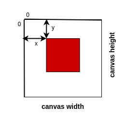
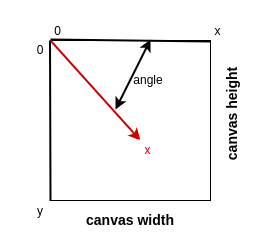
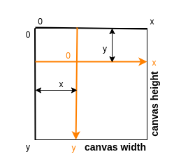

# **Canvas API**
<br>

## **Table Of Contents**
<br>

- [**Canvas API**](#canvas-api)
  - [**Table Of Contents**](#table-of-contents)
  - [**General**](#general)
  - [**HTMLCanvasElement**](#htmlcanvaselement)
    - [**Properties**](#properties)
      - [**height**](#height)
      - [**width**](#width)
    - [**Methods**](#methods)
      - [**getContext('2d')**](#getcontext2d)
  - [**CanvasRenderingContext2D**](#canvasrenderingcontext2d)
    - [**Properties**](#properties-1)
      - [**canvas**](#canvas)
      - [**fillStyle**](#fillstyle)
      - [**strokeStyle**](#strokestyle)
      - [**imageSmoothingEnabled**](#imagesmoothingenabled)
      - [**font**](#font)
      - [**textAlign**](#textalign)
    - [**Methods**](#methods-1)
      - [**Drawing Rectangles**](#drawing-rectangles)
        - [**fillRect(x, y, width, height)**](#fillrectx-y-width-height)
        - [**strokeRect(x, y, width, height**](#strokerectx-y-width-height)
        - [**clearRect(x, y, width, height)**](#clearrectx-y-width-height)
      - [**Drawing Paths**](#drawing-paths)
        - [**beginPath()**](#beginpath)
        - [**moveTo(x, y)**](#movetox-y)
        - [**lineTo(x, y)**](#linetox-y)
        - [**closePath()**](#closepath)
        - [**fill()**](#fill)
        - [**stroke()**](#stroke)
      - [**Drawing Text**](#drawing-text)
        - [**fillText(text, x, y, \[maxWidth\])**](#filltexttext-x-y-maxwidth)
        - [**strokeText(text, x, y, \[maxWidth\])**](#stroketexttext-x-y-maxwidth)
      - [**Draw Image**](#draw-image)
        - [**drawImage(image, x, y)**](#drawimageimage-x-y)
      - [**Transformations**](#transformations)
        - [**scale(x, y)**](#scalex-y)
        - [**rotate(angle)**](#rotateangle)
        - [**translate(x, y)**](#translatex-y)
      - [**Saving**](#saving)
        - [**save()**](#save)
        - [**restore()**](#restore)

<br>
<br>
<br>
<br>

## **General**
<br>

* enables JavaScript to draw 2d graphics within a \<canvas> element
* used for data visualisation, game graphics and animations

<br>

```html
<canvas id="canvas">
```

```javascript
const canvas = document.getElementById('canvas');
const context = canvas.getContext('2d');
```

<br>
<br>
<br>
<br>

## **HTMLCanvasElement**
<br>

* represents the \<canvas> element

<br>
<br>
<br>

### **Properties**
<br>
<br>

#### **height**
* height of element in logical pixels (default: 150)

<br>
<br>

#### **width**
* width of element in logical pixels (default: 300)

<br>
<br>
<br>

### **Methods**
<br>
<br>

#### **getContext('2d')**
* returns 2d drawing context (CanvasRenderingContext2D)

<br>
<br>
<br>
<br>

## **CanvasRenderingContext2D**
<br>

* used for drawing on the canvas grid
* drawing positions are relative to the reference point at (0, 0)
  * reference point can be moved with the method _translate()_

<br>



<br>
<br>
<br>

### **Properties**
<br>
<br>

#### **canvas**
* returns reference to associated \<canvas> element

<br>
<br>

#### **fillStyle**
* set and return color to fill shapes with

<br>
<br>

#### **strokeStyle**
* set and return color for outline of shapes

<br>
<br>

#### **imageSmoothingEnabled**
* set and return boolean indicating whether scaled images are smoothed (default _true_)
* values: left, right, center, start (default), end

<br>
<br>

#### **font**
* set and return css style for drawn text as string

<br>
<br>

#### **textAlign**
* set and return alignment of drawn text relative to the _x_ value of _fillText()_

<br>
<br>
<br>

### **Methods**
<br>
<br>
<br>

#### **Drawing Rectangles**
<br>
<br>

##### **fillRect(x, y, width, height)**
* draws rectangle filled with _fillStyle_

<br>
<br>

##### **strokeRect(x, y, width, height**
* draws rectangle stroked with _strokeStyle_

<br>
<br>

##### **clearRect(x, y, width, height)**
* erases rectangular area

<br>
<br>
<br>

#### **Drawing Paths**
<br>
<br>

##### **beginPath()**
* starts new path

<br>
<br>

##### **moveTo(x, y)**
* move start of path to specified coordinates

<br>
<br>

##### **lineTo(x, y)**
* add straight line from last point of current path to specified coordinates

<br>
<br>

##### **closePath()**
* add straight line from last to first point of current path

<br>
<br>

##### **fill()**
* fill current path with _fillStyle_

<br>
<br>

##### **stroke()**
* stroke current path with _strokeStyle_

<br>
<br>
<br>

#### **Drawing Text**
<br>
<br>

##### **fillText(text, x, y, \[maxWidth\])**
* draw text at specified coordinates with _fillStyle_

<br>
<br>

##### **strokeText(text, x, y, \[maxWidth\])**
* draw outline of text at specified coordinates

<br>
<br>
<br>

#### **Draw Image**
<br>
<br>

##### **drawImage(image, x, y)**

<br>
<br>
<br>

#### **Transformations**
<br>
<br>

##### **scale(x, y)**
* scales canvas horizontally and/or vertically 
* negative values flips across x and/or y axis

<br>
<br>

##### **rotate(angle)**
* rotates the axis of the reference point by clockwise angle in radians
* convert degree to radian: degree * Math.PI / 180

<br>



<br>
<br>

##### **translate(x, y)**
* move reference point of canvas to specified coordinate

<br>



<br>
<br>
<br>

#### **Saving**
<br>
<br>

##### **save()**
* save canvas settings to stack
* attributes:
  * strokeStyle
  * fillStyle
  * globalAlpha
  * font
  * textAlign
  * ... 

<br>
<br>

##### **restore()**
* restore most recent saved canvas setting from stack