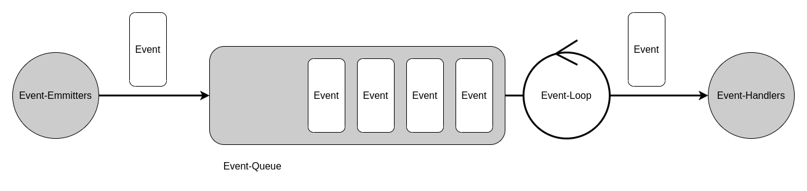
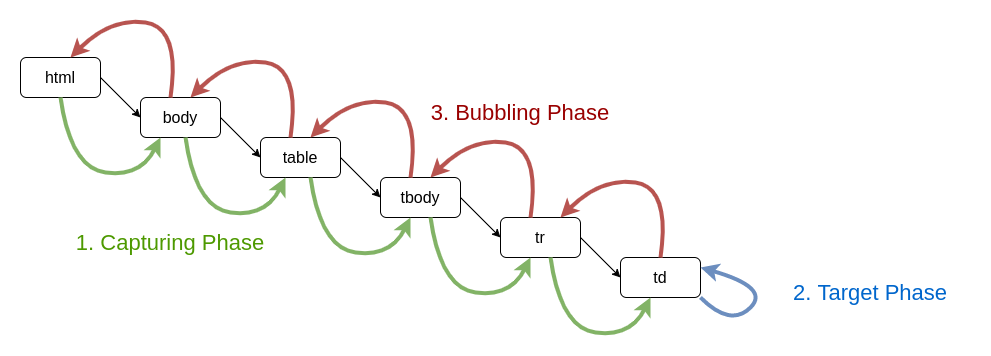

# **JavaScript Document Object Model Events**

<br>

## **Table Of Contents**
<br>

- [**JavaScript Document Object Model Events**](#javascript-document-object-model-events)
  - [**Table Of Contents**](#table-of-contents)
  - [**Basic Concept**](#basic-concept)
  - [**Ways To Create Event-Handlers**](#ways-to-create-event-handlers)
    - [**HTML-Event-Handler**](#html-event-handler)
    - [**DOM-Event-Handler**](#dom-event-handler)
    - [**DOM-Event-Listener**](#dom-event-listener)
  - [**Remove Event Handlers**](#remove-event-handlers)
    - [**removeEventListener()**](#removeeventlistener)
  - [**Initiate Events Via JavaScript**](#initiate-events-via-javascript)
    - [**Create Events**](#create-events)
      - [**Event**](#event)
      - [**CustomEvent**](#customevent)
    - [**Dispatch Elements**](#dispatch-elements)
  - [**Event Flow Interruption**](#event-flow-interruption)
    - [**stopPropagation()**](#stoppropagation)
    - [**stopImmediatePropagation()**](#stopimmediatepropagation)
    - [**preventDefault()**](#preventdefault)
  - [**Event Types**](#event-types)
    - [**Event**](#event-1)
    - [**MouseEvent**](#mouseevent)
    - [**KeyBoardEvent**](#keyboardevent)
    - [**FocusEvent**](#focusevent)
    - [**UIEvent**](#uievent)
    - [**Events For Forms**](#events-for-forms)
    - [**Events For Mobile Devices**](#events-for-mobile-devices)

<br>
<br>
<br>
<br>

## **Basic Concept**
<br>



<br>

* Event-emmitters are causing events
* Events are stored in a queue (FIFO)
* Event-loop checks queue for new events and forwards them to the event-handlers
* Event-Handlers are functions in javascript

<br>
<br>

Event Flow:

<br>



<br>

**1. Capturing Phase**
   - Event travels from root node of the dom tree towards the element for which it was triggered
   - Executes Event handlers specified for this phase at every node in its way

<br>

**2. Target Phase**
   - Event is handled at the target element

<br>

**3. Bubbling Phase**
   - Event travels from the element for which it was triggered towards the root node of the dom tree
   - Executes Event handlers specified for this phase at every node in its way

<br>
<br>
<br>
<br>

## **Ways To Create Event-Handlers**
<br>
<br>

### **HTML-Event-Handler**
<br>

* Define handler in HTML attribute
* _DO NOT USE! KEEP HTML AND JAVASCRIPT SEPARATED!_

<br>

```html
<button onclick='handleClickEvent()'>Click</button>
```

```javascript
function handleClickEvent() { /* implementation */ }
```

<br>
<br>
<br>

### **DOM-Event-Handler**
<br>

* Define handler for element at dom level
* Can register ONLY ONE handler for each event
  * Multiple handlers for the same event at the same element are not possible

<br>

```javascript
function handleClickEvent() { /* implementation */ }

element.onclick = handleClickEvent;
```

<br>
<br>
<br>

### **DOM-Event-Listener**
<br>

* Define handler for element at dom level
* Can register MULTIPLE handlers for each event and element
* _RECOMMENDED WAY TO REGISTER EVENT HANDLERS_

<br>

```javascript
element.addEventListener('eventName', functionName, [options])
element.addEventListener('eventName', functionName, [useCaptureFlag])


options = {
    capture: true,              // event will be dispatched to listener before any elements beneath (default: false)
    once: true,                 // listener will be called at most once and is removed afterwards (default: false)
    passive: true,              // listener will not call preventDefault() and if so the call is ignored (default: false)
    signal: abortSignalObject
}


// Example:

element.addEventListener('change', function(event) { console.log(event.target.value) });
```

<br>
<br>
<br>
<br>

## **Remove Event Handlers**
<br>
<br>

### **removeEventListener()**
<br>

* removes event listener registered by _addEventListener()_
* NOTE: If event listener is registered _both_ as capturing and non-capturing, it must be removed as _both_ capturing and non-capturing!

<br>

```javascript
element.removeEventListener('eventName', functionName, [options])
element.removeEventListener('eventName', functionName, [useCaptureFlag])


options = { capture: true}      // event will be dispatched to listener before any elements beneath (default: false)
```

<br>
<br>
<br>
<br>

## **Initiate Events Via JavaScript**
<br>
<br>

### **Create Events**
<br>
<br>

#### **Event**
<br>

```javascript
let event = new Event('eventName', [options])


options = {
    bubbles: true,          // indicates whether event bubbles up the dom tree (default: false)
    cancelable: true,       // indicates whether event can be canceled (default: false)
    composed: true          // indicates whether event will propagate across the shadow dom (default: false)
};
```

<br>
<br>
<br>

#### **CustomEvent**
<br>

* customEvent can have additional custom information in detail object for an event handler

<br>

```javascript
let customEvent = new CustomEvent('eventName', [options])


options = {
    bubbles: true,
    cancelable: true,
    composed: true,
    detail: {property1: 'value1',
             property2, 'value2'}
}
```

<br>
<br>
<br>

### **Dispatch Elements**
<br>

```javascript
element.dispatchEvent(event)
```

<br>
<br>
<br>
<br>

## **Event Flow Interruption**
<br>
<br>

### **stopPropagation()**
<br>

* use method within an event handler/listener
* prevents event from getting passed on to the next node
* all other event listener for the event on the same node get executed regardless whether one listener envokes stopPropagation()

<br>
<br>

### **stopImmediatePropagation()**
<br>

* use method within an event handler/listener
* prevents event from getting passed on to the next node
* prevents event from getting handled by any other event listener of the same node

<br>
<br>

### **preventDefault()**
<br>

* preventDefault()
* works only for event-listeners
* suppress default action of the browser for event

<br>
<br>
<br>
<br>

## **Event Types**
<br>
<br>

### **Event**
<br>

* Super type of all other event types

<br>

|Property        |Description
|:---------------|:----------------
|bubbles         |boolean indicating whether event bubbles up the dom tree
|cancelable      |boolean indicating whether event can be canceled
|currentTarget   |object that is the current target of the event
|defaultPrevented|boolean indicating whether method preventDefault() was called on the event
|eventPhase      |indicates the current event phase:
|                |0: Event.NONE
|                |1: Event.CAPTURING_PHASE
|                |2: Event.AT_TARGET
|                |3: Event.BUBBLING_PHASE
|target          |initial target of event
|timestamp       |time in milliseconds when the event was created
|type            |name of event
|isTrusted       |boolean indicating whether event was triggered by a user action (true) or by javascript code

<br>
<br>
<br>

### **MouseEvent**
<br>

|Property       |Description
|:--------------|:-------------------------------------------------------------------------------------------------------------
|altKey         |boolean indicating whether Alt-Key was pressed upon triggering MouseEvent
|button         |number of mouse button pressed upon triggering MouseEvent
|buttons        |sum of numbers of mouse buttons pressed upon triggering MouseEvent
|clientX        |x-coordinate of mouse position upon triggering MouseEvent
|clientY        |y-coordinate of mouse position upon triggering MouseEvent
|ctrlKey        |boolean indicating whether Ctrl-Key was pressed upon triggering MouseEvent
|metaKey        |boolean indicating whether meta key (Windows key, cmd key on macos...) was pressed upon triggering MouseEvent
|movementX      |x-coordinate relative to previous x-coordinate on last mousemove event
|movementY      |y-coordinate relative to previous y-coordinate on last mousemove event
|region         |id of region/element that event references
|relatedTarget  |    
|screenX        |x-coordinate of mouse position relative to the screen
|screenY        |y-coordinate of mouse position relative to the screen
|shiftKey       |boolean indicating whether Shift-Key was pressed upon triggering MouseEvent

<br>
<br>

|Event      |Description
|:----------|:----------------------------------------------------------------
|click      |mouse is pressed and released
|dblclick   |mouse is pressed twice and released
|contextmenu|context menu was opened via the right mousebutton
|mousedown  |mouse button is pressed over element
|mouseup    |mouse button is released over element
|mousemove  |mouse was moved
|mouseover  |mouse is over an element
|mouseout   |mouse is moved out of an element
|mouseenter |mouse entered over an element
|mouseleave |mouse is moved out of an element


<br>
<br>
<br>

### **KeyBoardEvent**
<br>

|Property|Description
|:-------|:-------------------
|altKey  |boolean indicating whether Alt-Key was pressed upon triggering KeyBoardEvent
|code    |code of pressed key
|ctrlKey |boolean indicating whether Ctrl-Key was pressed upon triggering KeyBoardEvent
|key     |value of pressed key with consideration of modifiers such as Shift
|metaKey |boolean indicating whether meta key (Windows key, cmd key on macos...) was pressed upon triggering KeyBoardEvent
|shiftKey|boolean indicating whether Shift-Key was pressed upon triggering KeyBoardEvent

<br>
<br>

|Event   |Description
|:-------|:---------------------------------------------------------------------------------
|keydown |key was pressed. If hold pressed, event is triggered multiple times
|keyup   |key was released
|keypress|character is addded by keyboard

<br>
<br>
<br>

### **FocusEvent**
<br>

|Event   |Description
|:-------|:-----------------
|focus   |element gained focus
|blur    |element lost focus
|focusin |element gained focus (event is bubbling)
|focusout|element lost focus (event is bubbling)

<br>
<br>
<br>

### **UIEvent**
<br>

|Event           |Description
|:---------------|:-------------------------------------
|load            |website and all external resources are loaded
|unload          |new website was loaded in same tab
|abort           |loading of a resource was aborted
|error           |loading of a website resulted in an error
|select          |text on a website was selected
|resize          |size of browser window changed
|scroll          |scrolling up or down
|beforeunload    |new website is loaded in same tab
|DOMContentLoaded|DOM tree is completely loaded (use for initialization code)
|cut             |content was cut from form field
|copy            |content was copied from form field
|paste           |content was pasted into form field
|select          |content was selected in form field


<br>
<br>
<br>

### **Events For Forms**
<br>

|Event   |Type    |Description
|:-------|:-------|:----------
|input   |Event   |value of \<input> or \<textarea> element was changed
|change  |Event   |value of selection list, checkbox or group of radio buttons was changed
|submit  |Event   |form was submitted
|reset   |Event   |form was reset

<br>
<br>
<br>

### **Events For Mobile Devices**
<br>

|Event            |Type                  |Description
|:----------------|:---------------------|:----------
|orientationchange|Event                 |orientation of input device changed
|deviceorientation|DeviceOrientationEvent|new data about device orientation is available
|devicemotion     |DeviceMotionEvent     |regularly triggered and returns motion force of the device
|touchstart       |TouchEvent            |input device (e.g. a finger) made contact with display
|touchend         |TouchEvent            |input device (e.g. a finger) lost contact with display
|touchmove        |TouchEvent            |input device (e.g. a finger) is moved across the display
|touchcancel      |TouchEvent            |tracking of the input device is interrupted


