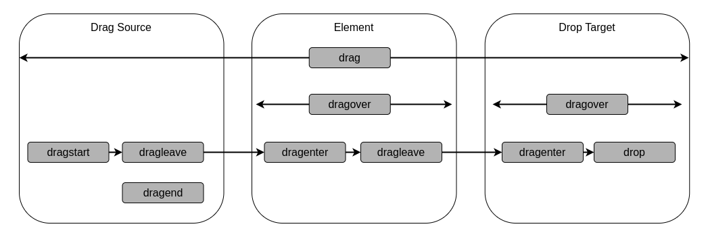
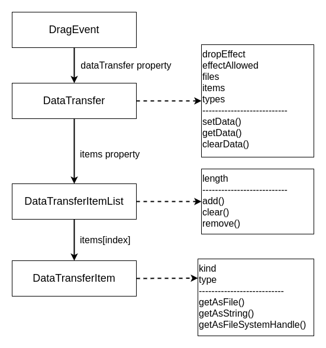

# **HTML Drag And Drop API**
<br>

## **Table Of Contents**
<br>

- [**HTML Drag And Drop API**](#html-drag-and-drop-api)
  - [**Table Of Contents**](#table-of-contents)
  - [**General**](#general)
  - [**Basic Implementation Steps**](#basic-implementation-steps)
    - [**1. Make Elements Draggable**](#1-make-elements-draggable)
    - [**2. Define Drop Element**](#2-define-drop-element)
  - [**Events**](#events)
  - [**Interfaces**](#interfaces)
    - [**DataTransfer**](#datatransfer)
      - [**Properties**](#properties)
        - [**dropEffect**](#dropeffect)
        - [**effectAllowed**](#effectallowed)
        - [**files**](#files)
        - [**items**](#items)
        - [**types**](#types)
      - [**Methods**](#methods)
        - [**setData(format, data)**](#setdataformat-data)
        - [**getData(format)**](#getdataformat)
        - [**clearData([format])**](#cleardataformat)
    - [**DataTransferItemList**](#datatransferitemlist)
      - [**Properties**](#properties-1)
        - [**length**](#length)
      - [**Methods**](#methods-1)
        - [**add(data, type) / add(file)**](#adddata-type--addfile)
        - [**remove(index)**](#removeindex)
        - [**clear()**](#clear)
    - [**DataTransferItem**](#datatransferitem)
      - [**Properties**](#properties-2)
        - [**kind**](#kind)
        - [**type**](#type)
      - [**Methods**](#methods-2)
        - [**getAsFile()**](#getasfile)
        - [**getAsString((data) => {...})**](#getasstringdata--)
        - [**getAsFileSystemHandle()**](#getasfilesystemhandle)

<br>
<br>
<br>
<br>

## **General**
<br>

Enables drag and drop functionality in browser.

<br>

1. Select _draggable_ element
2. Drag selected element to _droppable_ element
3. Release selected element

<br>
<br>
<br>
<br>

## **Basic Implementation Steps**
<br>
<br>

### **1. Make Elements Draggable**
<br>

- add property _draggable_ 
- add _dragstart_ event listener and set drag data within listener

<br>

```html
<div id="dragContainer">
  <div class="dragItem" draggable="true">
    <p>Drag Item 1</p>
  </div>
  <div class="dragItem" draggable="true">
    <p>Drag Item 2</p>
  </div>
</div>
```

<br>

```javascript
const dragItems = document.getElementsByClassName('dragItem');


for (let i = 0; i < dragItems.length; i++) {
  dragItems[i].addEventListener('dragstart', (event) => {
    event.dataTransfer.setData('text/html', event.target.outerHTML);
  });
}
```

<br>
<br>
<br>

### **2. Define Drop Element**
<br>

- add _dragenter_ event listener
- add _dragover_ event listener
- add _drop_ event listener, get and process drag data within listener

<br>

```html
<div id="dropArea">
  <p>Drop Items here</p>
</div>
```

<br>

```javascript
const dropArea = document.getElementById('dropArea');


dropArea.addEventListener('dragenter', (event) => {
  event.stopPropagation();
  event.preventDefault();
});


dropArea.addEventListener('dragover', (event) => {
  event.stopPropagation();
  event.preventDefault();
});


dropArea.addEventListener('drop', (event) => {
  event.stopPropagation();
  event.preventDefault();
  const dragData = event.dataTransfer.getData('text/html');

  /* handle drag data */
  event.srcElement.innerHTML = dragData;
});
```

<br>
<br>
<br>
<br>

## **Events**
<br>

|Event      |Description
|:----------|:------------------------------------------------------------------------
|dragstart  |fired when dragging of element starts
|drag       |continuously fired during drag operation
|dragend    |fired when dragged element is released
|dragenter  |fired for each element that is entered during drag operation
|dragover   |continuously fired for each element the drag operation is currently over
|dragleave  |fired for each element that is left during drag operation
|drop       |fired when dragged element is dropped to a valid drop element

<br>
<br>



<br>
<br>
<br>
<br>

## **Interfaces**
<br>
<br>



<br>
<br>
<br>

### **DataTransfer**
<br>

Hold one or more drag data items

<br>
<br>

#### **Properties**
<br>
<br>

##### **dropEffect**
* controls which cursor is displayed during drag and drop operation
* values: ['copy', 'move', 'link', 'none']

<br>
<br>

##### **effectAllowed**
* specifies effect allowed for drag operation
* property specified in _dragstart_ event
* values: ['copy', 'copyLink', 'copyMove', 'link', 'linkMove', 'move', 'all', 'none']

<br>
<br>

##### **files**
* list of files of drag operation

<br>
<br>

##### **items**
* _DataTransferItemList_ object

<br>
<br>

##### **types**
* array of drag data formats

<br>
<br>
<br>

#### **Methods**
<br>
<br>

##### **setData(format, data)**
* add or replace drag data of specified format  

<br>
<br>

##### **getData(format)**
* get drag data of specified format

<br>
<br>

##### **clearData([format])**
* remove all or drag data of specified format
* usable only in _dragstart_ event handler
* does not remove files

<br>
<br>
<br>

### **DataTransferItemList**
<br>

List of _DataTransferItem_ objects

<br>
<br>
<br>

#### **Properties**
<br>
<br>

##### **length**
* number of drag data items in list

<br>
<br>
<br>

#### **Methods**
<br>
<br>

##### **add(data, type) / add(file)**
* add and return new _DataTransferItem_ object to list with specified data

<br>
<br>

##### **remove(index)**
* remove _DataTransferItem_ object at index

<br>
<br>

##### **clear()**
* remove all _DataTransferItem_ object from list

<br>
<br>
<br>

### **DataTransferItem**
<br>
<br>

#### **Properties**
<br>
<br>

##### **kind**
* return kind of data
* values: ['file', 'string']

<br>
<br>

##### **type**
* return format of data

<br>
<br>
<br>

#### **Methods**
<br>
<br>

##### **getAsFile()**
* return drag data _File_ object
* return _null_ if data is not a file

<br>
<br>

##### **getAsString((data) => {...})**
* invoke callback function with drag data

<br>
<br>

##### **getAsFileSystemHandle()**
* return _FileSystemFileHandle_ or _FileSystemDirectoryHandle_